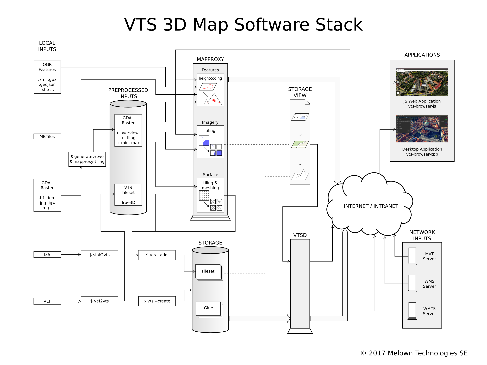

.. _architecture-overivew:

*********************
Architecture Overview
*********************

VTS 3D Stack uses client-server architecture. The backend consists of two streaming servers :ref:`mapproxy` and :ref:`vtsd`, a commandline data management tool suite including encoders and the :ref:`registry <vts-registry>`. The frontend consist of WebGL based :ref:`vts-browser-js` with JavaScript API and :ref:`vts-browser-cpp` with C++ API. The main point of contact between backend and frontend is a :ref:`map-configuration` represented by ``mapConfig.json`` file which is the first file the client asks for and which contains complete configuration needed to render given map.

Streaming Servers
=================

Mapproxy
--------

The :ref:`mapproxy` is an HTTP server that performs on the fly conversion of non-VTS GIS formats (GDAL rasters, OGR vectors, Mapbox vector tiles) to VTS streaming formats like :ref:`surfaces <surface>`, :ref:`bound layers <bound-layer>` and :ref:`geodata <geodata>` that are directly usable by clients. Part of mapproxy that deals with imagery can be viewed a powerful SRS transforming TMS server.

The mapproxy be configured to provide a streamable VTS :ref:`map configurations <map-configuration>`, thus removing need for :ref:`vtsd <vtsd>` and :ref:`storage <storage>` for very simple setups which is leveraged in few tutorials.

VTSD
----

The :ref:`vtsd <vtsd>` (aka VTS-Daemon) is a thin HTTP server with nginx-like configuration streaming static :ref:`tilesets <tileset>` as :ref:`surfaces <surface>` and :ref:`free layers <free-layer>`. Usually, the only static tilesets are 3D models and corresponding :ref:`glues <glue>` from :ref:`storage <storage>`. To read the static tilesets, vtsd implements TILeARchive - an efficient format for 3D tile hierarchy storage.

Furthermore, vtsd translates :ref:`storage views <storage-view>` (and even single tilesets or whole storages) into streamable VTS :ref:`map configurations <map-configuration>`.

Generally, if you intend to work with 3D models or you want to create some complex map configurations, you will always need the vtsd and a storage.

.. note::

  It is expected that streamed resources (especially dynamically generated ones) are cached somewhere in the network layer. Both mapproxy and VTSD serve configurable caching headers for this purpose. We recommend setting up the VTS Backend using :ref:`vts-backend <vts-backend>` package which takes care of that by inserting thin nginx caching proxy in front of both mapproxy and VTSD.

Data Management Tools
=====================

Vts
---

The :ref:`vts <vts-cmdline>` is referred to as a Swiss army knife of VTS storage management. The :ref:`storage <storage>` is a filesystem-based datatabase that contains all :ref:`tilesets <tileset>` (both static and dynamic) and all :ref:`glues <glue>` between those tilesets. The glues ensure that any combination of tilesets can be displayed together in seamless fashion. The vts command line tool takes care of all operations around storage, such as storage creation, tileset adding with corresponding glue creation, tileset removal and many others.

Mapproxy tools
--------------

Mapproxy tools take care of raster preprocessing for mapproxy. This includes
overview generation (:ref:`generatevrtwo <generatevrtwo>`), dataset measurement
(:ref:`mapproxy-calipers <mapproxy-calipers>`) and creation of tiling metainformation (:ref:`mapproxy-tiling <mapproxy-tiling>`). There are also helper scripts that shrink
data preparation for mapproxy in a single command.

Encoders
--------

Encoders are used to convert external hierarchical mesh formats (VEF, I3S/SLPK, LODTree) into VTS :ref:`tilesets <tileset>`. Currently, there are :ref:`vef2vts <vef2vts>`, :ref:`slpk2vts <slpk2vts>` and :ref:`lodtree2vts <lodtree2vts>`. There is also :ref:`vts2vts <vts2vts>` that can be used to convert tilesets from one :ref:`reference frame <reference-frame>` to another if there is a need but this practice is discouraged because of
possible quality loss.

..
    Registry
    ========

    :ref:`VTS Registry <vts-registry>` holds the definitions of :ref:`coordinate systems <srs>` and :ref:`reference frames <reference-frame>` known to VTS. 

Rendering Libraries
===================

All rendering libraries consume the same data from the backend, provide
sample browser and API allowing them to be plugged into existing
(web)applications or build applications on top of them.

vts-browser-js
--------------

The :ref:`vts-browser-js <vts-browser-js>` is all encompassing WebGL-based VTS client-side implementation with `comprehensive API <https://github.com/Melown/vts-browser-js/wiki>`_ and very small footprint - currently about 176 kB gzipped and minified.
It works in all modern browsers with rudimentary mobile support.

libvts-browser
--------------

The :ref:`libvts-browser <libvts-browser>` is a multiplatform lightweight C++ client library that is separate from actual rendering layer. The thin rendering layer is called :ref:`libvts-renderer <libvts-renderer>` and while still multiplatform, it may be used when building full-fledged VTS based applications form scratch. There are currently two sample applications :ref:`vts-browser-desktop <vts-browser-desktop>` for Linux desktop and Mac and :ref:`vts-browser-ios <vts-browser-ios>` for iOS mobile.

Sample production setup
=======================

Typical production setup of the whole stack may look like the following:

.. _vts-architecture-schema:

    VTS 3D Stack architecture

