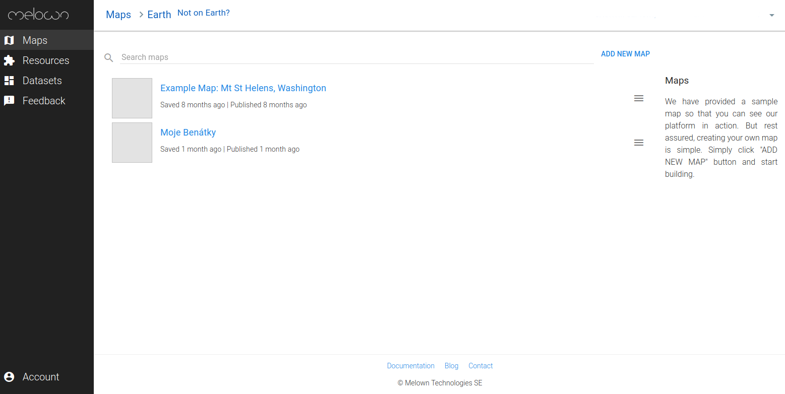

############
Melown Cloud
############

`Melown Cloud <https://melown.com/console>`_ service is a 3D map development cloud platform operated by Melown Technologies and implemented atop of VTS 3D geospatial software stack. Users are encouraged (after registering) to upload their dataset and
publish on Melown's servers.

    Melown cloud

==============
Cloud REST API
==============

Beside HTML user interface, there is `Cloud REST API
<https://github.com/melowntech/mario-cloud-api>`_ being developed, so that advanced
users (programmers), can integrate the service in their applications.

The `API is documented using Swagger <http://editor.swagger.io/?url=https%3A%2F%2Fraw.githubusercontent.com%2FMelown%2Fmario-cloud-api%2Fmaster%2Fdocs%2Fapi%2Findex.yaml#>`_. 

There are also code samples, using Python, in `the tests directory
<https://github.com/melowntech/mario-cloud-api/blob/master/tests/test_mario.py>`_.

Please, `refer to the documentation
<https://github.com/melowntech/mario-cloud-api/tree/master/docs>`_ for more
informations.
