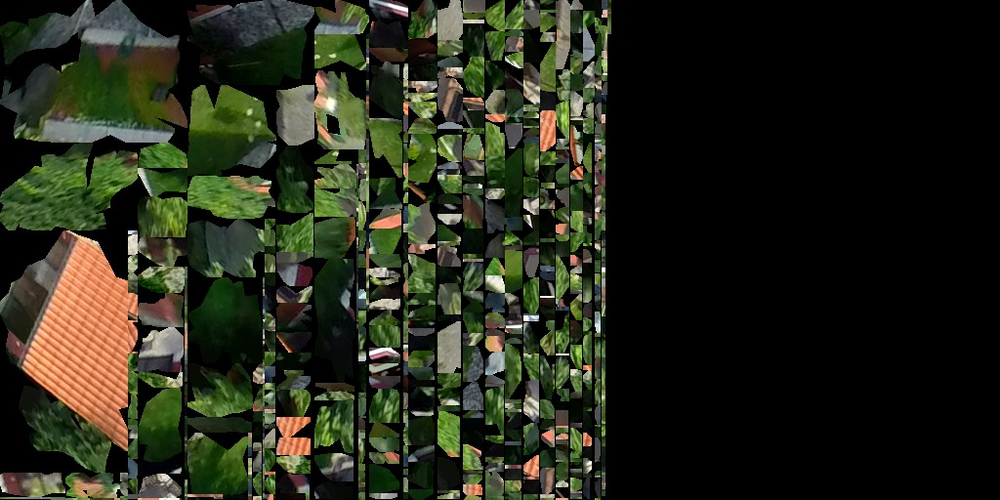

.. index::
   single: bound layer
   single: reference frame
   single: tileset
   pair: level of detail; lod
   single: glue
   single: credits
   single: storge
   single: storge view
   pair: srs; spatial reference system
   single: mask
   single: texture
   single: mesh
   single: attribution

-- reference frame

-- tileset

surface

tile index

storage

storage view

map configuration

bound layer

free layer

**************
Basic Concepts
**************

The page describes concepts used in VTS.

There are two ways to onlook on VTS: either from the client side (interpreting
existing data), or from the server side (composing or creating data). We call
the first perspective *analysis* and the second perspective *synthesis*. Both
perspectives are addressed in this document. For FE development, analytical
concepts may suffice, however for work with backend, concepts both from
analysis and synthesis are important.

.. note::
  Notes like this will contain purely practical remarks for dealing with the
  concepts as a VTS beginner, without diving too much into the theory.

Analysis
========

.. _srs:

Spatial Reference System (SRS)
------------------------------

To maintain consistency across the whole system, the SRSes in VTS are defined
in one central place in `VTS Registry <https://github.com/Melown/vts-registry/blob/master/registry/registry/srs.json>`_ and then referenced by their
``id`` wherever needed. In case of frontend, definitions of all needed SRSes
will be present in :ref:`map-configuration`.

Here is an example of SRS definitions with explanation below:

.. code:: javascript

  {
    "utm33n": {
        "comment": "Projected, UTM 33N",
        "srsDef": "+proj=utm +zone=33 +datum=WGS84 +no_defs",
        "type" : "projected",
    },
    "geographic-wgs84-egm96": {
        "comment": "Geodetic, WGS84 with EGM96 vertical (epsg:4326+5773)",
        "srsDef": "+proj=longlat +datum=WGS84 +geoidgrids=egm96_15.gtx +vunits=m +no_defs",
        "type" : "geographic",
        "geoidGrid": {
            "extents": {"ll": [-180,-90], "ur": [180,90]},
            "valueRange" : [-107, 85.4],
            "definition": "srs/geographic-wgs84-egm96/geoidgrid.jpg",
            "srsDefEllps": "+proj=longlat +datum=WGS84 +no_defs",
        }
    },
    "utm33n-va": {
        "comment": "Projected, UTM 33N, vertical adjusted",
        "srsDef": "+proj=utm +zone=33 +datum=WGS84 +geoidgrids=egm96_15.gtx +vunits=m +no_defs",
        "srsModifiers": [ "adjustVertical" ],
        "type" : "projected",
        "geoidGrid": {
            "extents": {"ll": [-2009979, 3000861], "ur": [2999421, 8260731]},
            "valueRange": [-17.6, 67.3],
            "definition": "srs/utm33n-va/geoidgrid.jpg",
            "srsDefEllps" : "+proj=utm +zone=33 +datum=WGS84 +no_defs"
        }
    }
  }

Definition of ``geographic-wgs84`` should be easily understandable to anyone
familiar with the ​`proj4 <https://trac.osgeo.org/proj/>`_ library. In fact, a
PROJ4 string in this case amounts to the entire definition. The type attribute
(which can take one of values ``projected``, ``geographic`` or ``cartesian``) is
in fact redundant, since these characteristics follow directly from the PROJ4
definition.

Definition of ``geographic-wgs84-egm96`` is an example of a compound coordinate
system containing a combination of horizontal and vertical datum. It is fully
described by a PROJ4 string, yet the applicability of this definition relies on
availability of the EGM96 vertical datum grid. This grid is not directly
available to the web browser (for good reason, as it is 4 megabytes in size).
For usage in analytical contexts, SRSes with orthometric (gravity model based)
vertical datums are thus provided with a simplified mechanism defined in the
``geoidGrid`` attribute: there is a definition of an ellipsoidal version of the
same SRS, a URL to a vertical datum grid, and georeferencing information for
that grid. Geoid grids used in this context are compressed and have lower
precision than datum grids used in synthesis; this is an acceptable trade-off
for their small size and usability in web rendering context (note that grid, not
pixel registration is used for georeferencing geoid grid extents for practical
reasons).

``utm33n-va`` is the most complex definition. It is a coordinate system with well
known definition and a nonstandard modifier, named "adjustVertical", applied to
it. This modifier is applicable to conformal SRSes and means that the Z
coordinate (which would represent orthometric height without modification) is
scaled proportionally to the local scale in XY plane to make the system
conformal in all three coordinates. There is no way to represent this modifier
in PROJ4, hence the SRS definition needs an extra attribute.

.. note::
  Unless you choose to :ref:`define your own reference frame <reference-frame-note>`,
  you should not need to define any new SRS.

.. _reference-frame:

Reference Frame
---------------
The concept of reference frames is of crucial importance in VTS design. In order
to create and use 3D map data, we need answers to questions such as:

In which coordinate system (or more precisely spatial reference) are geometries
within polygonal :ref:`meshes <mesh>` and :ref:`metatiles <surface-metatile>`? When the
user navigates the map, what is logic of motion? For example, what does pan
motion mean, geometrically? When we rotate around and object, what is the axis
of rotation?  When we report spatial coordinates to the user, how do they relate
to the coordinate system used for geometries?  There is a tile hierarchy within
the map. How is the map split into tiles? Is there a way to tell the physical
extents of a tile with given indices on a given :ref:`LOD <lod>`?

For this reason, reference frames defines following:

#. **Physical** spatial reference system, employed by mesh and free layer geometries
#. **Navigational** spatial reference system, whose XY plane defines tangential
   movement (pan) and objective rotational movement (orbit) as movement along
   the plane and rotation around axis perpendicular to the plane, respectively;
   its Z component is employed by navigation tiles and it is the system used in
   positioning, both to define position and orientation
#. **Public** spatial reference system, which is used when interfacing with the user
   (when informing user of current position in the map or of altitude or when
   handling user input)
#. **Spatial division**, which defines physical extents of the model and extents of
   every tile on every :ref:`LOD <lod>`, either explicitly (for a specific
   tile) or by setting out a rule by which tiles are split into subtiles. In case
   the tile is explicitly defined, it defines unique SRS and extents which it
   (and its complete subtree) occupies in that SRS. This SRS is then used in
   :ref:`metatile <metatile>` bounding boxes.

A reference frame is not the same thing as a :ref:`spatial reference system (SRS) <srs>`,
though the two are closely related. A reference frame defines multiple SRSes,
and each of these serves a different purpose.

The nature of physical SRS defines two basic categories of reference frames. If
the physical SRS is projected (such us ​
`UTM 33N <http://spatialreference.org/ref/epsg/wgs-84-utm-zone-33n/>`_ or ​
`Web Mercator <http://spatialreference.org/ref/sr-org/7483/>`_), we deal with a
planar 3D map, or a projected reference frame. If the physical SRS is geocentric
(such as ​`Geocentric WGS84 <http://spatialreference.org/ref/epsg/4978/>`_), we
deal with a physical depiction of the planet (or another object), or a
geocentric reference frame. This distinction is purely observational, since
the algorithmic processing is precisely the same in both cases.

Here is an example of a simple reference frame:

.. code:: javascript
  {
        "version" : 1,
        "id": "webmerc-unprojected",
        "description": "Earth, WGS84 spheroid based on Pseudo/Web Mercator",

        "model": {

            "physicalSrs": "geocentric-wgs84",
            "navigationSrs": "geographic-wgs84",
            "publicSrs": "geographic-wgs84-egm96"
        },

        "division": {

            "extents" : {
                "ll": [-7500000,-7500000,-7500000],
                "ur": [7500000,7500000,7500000] },

            "heightRange" : [-12500,9000],

            "nodes": [
                {
                    "id": { "lod": 0, "position": [0,0] },
                    "srs": "pseudomerc",
                    "extents": {
                        "ll": [-20037508.342789,-20037508.342789],
                        "ur": [20037508.342789,20037508.342789] },
                    "partitioning": "bisection"
                }
            ]
        },

        "parameters" : {
            "metaBinaryOrder" : 5
        }
  }

With the corresponding SRS definitions:

.. code:: javascript

  {
    "geocentric-wgs84": {
        "comment": "Geocentric, WGS84 (epsg:4978)",
        "srsDef": "+proj=geocent +datum=WGS84 +units=m +no_defs",
        "type": "cartesian"
    },
    "geographic-wgs84": {
        "comment": "Geographic WGS84 (epsg:4326)",
        "srsDef": "+proj=longlat +datum=WGS84 +vunits=m +no_defs",
        "type" : "geographic"
    },
    "geographic-wgs84-egm96": {
        "comment": "Geodetic, WGS84 with EGM96 vertical (epsg:4326+5773)",
        "srsDef": "+proj=longlat +datum=WGS84 +geoidgrids=egm96_15.gtx +vunits=m +no_defs",
        "type" : "geographic",
        "geoidGrid": {
            "extents": {"ll": [-180,-90], "ur": [180,90]},
            "valueRange" : [-107, 85.4],
            "definition": "srs/geographic-wgs84-egm96/geoidgrid.jpg",
            "srsDefEllps": "+proj=longlat +datum=WGS84 +no_defs",
        }
    },
    "pseudomerc": {
        "comment": "Projected, Web/Pseudo Mecator (epsg:3857)",
        "srsDef": "+proj=merc +a=6378137 +b=6378137 +lat_ts=0.0 +lon_0=0.0 +x_0=0.0 +y_0=0 +k=1.0 +units=m +nadgrids=@null +wktext",
        "type": "projected",
        "periodicity" : { "type" : "X", "period": 40075016.685578 }
    }
  }

What we get here is a geocentric system where all mesh and free layer geometries
are represented in ​XYZ cartesian coordinates based on the WGS84 datum (with the
SRS origin at the ellipsoid centre XY plane corresponding to the equator and X
axis passing through zero longitude, with navigation controls based on the same
ellipsoid (tangential pan motion and rotation around axis perpendicular to the
ellipsoid surface), positioning given by the ellipsoid latitude and longitude,
public UI readings based on WGS84/EGM96, spatial division into tiles based on ​
`Pseudo/Web Mercator <https://en.wikipedia.org/wiki/Web_Mercator>`_. This is a full
blown, physical model of the Earth between roughly 85.05112878°S and 85.05112878°N.

Not only these extents, but the tetranary hierarchy of tiles exactly corresponds
to the one used by 2D maps on Here, Bing Maps, Google Maps, OSM and elsewhere,
meaning that a tile at given lod/x-index/-yindex combination has exactly the
same geographic extents in our reference frame as the Google Maps API tile with
the same lod and x and y index combination. This trait means, among other
things, that the public map services can play the role of external
:ref:`bound layers <bound-layer>`.

The working space is set to a cube centered at WGS84 center, with diameter of
15,000 kilometers - this even allows us to include some orbital phenomenons into
the model if we want to.

Note that we could achieve virtually identical results with a slightly different
reference frame. For example, our navigation SRS could use a spherical, as
opposed to ellipsoidal model of Earth. This would make no difference to the
user, and all of the above would still apply. The only difference would be that
the internal content of :ref:`navigation tiles <navigation-tiles>` would be
different, containing spherical height as apposed to ellipsoidal height, and
same would apply to :ref:`positioning <position>`. And the axis of orbital
motion would not point perpendicular to the (roughly ellipsoidal) Earth surface,
but straight to Earth centre (or even more precisely, very close to Earth centre).

Helas, this simple model of Earth is missing polar caps. This is merely a
limitation of our definition, or more precisely, of the spatial division we
employ. It is possible to define a reference frame with polar caps included and
`melown2015 <https://github.com/Melown/vts-registry/blob/master/registry/registry/referenceframes.json#L70>`_ reference frame does just that. Another interesting reference frame
covering whole planet is a `mars-qsc <https://github.com/Melown/vts-registry/blob/master/registry/registry/referenceframes.json#L225>`_ which
represents Mars as a folded-out cube.

The most important thing to remember about reference frames is that there exists
only one reference frame definition for each map configuration. Thus all
:ref:`surfaces <surface>`, :ref:`glues <glue>`, :ref:`bound <bound-layer>` and
:ref:`free layers <free-layer>` within the same configuration need to stick to
the same reference frame. The same principle, as we will see, applies to the
concepts in :ref:`synthesis <synthesis>`. This is a basic requirement of
homogeneity: combining map resources with different frames of reference is not
possible, either resource has to be defined in both reference frames (for dynamically
generated resources) or a conversion has to be performed.

.. _reference-frame-note:

.. note::
  Whenever on Earth, use ``melown2015`` reference frame. It contains WebMercator
  subtree for bulk of the Earth and StereN and StereS subtrees for polar caps.
  Due to geocentric physical system, it gives nice round Earth including polar
  caps while most of existing WMTS and other services can be used directly with it
  thanks to its WebMercator subtree.

  The reasonable incentive for using or defining different reference frame is
  modeling of a different celestial object or the situation when many external
  services are available only in specific SRS. Then it may be reasonable to tailor
  the reference frame for that SRS.

.. position:

Position
--------

In VTS, the position is defined to accommodate the following requirements:
* independence of surface information and thus immediately usable
* orthogonality with respect to the vertical field of view (FOV), which is part
  of the position
* intuitive, and adaptable to multiple semantic contexts in which positioning is
  performed

The general position format is called an *objective position*. Simply said, it
describes where is the point you look at and from where you look. Presuming you
work in :ref:`melown2015 reference frame <reference-frame>` with lat-long
navigation SRS, the objective position may look like:

.. code::javascript
  [ "obj", 14.401364, 50.090839, "fix", 295.77, -31, -47, 0, 613, 45.00 ]

where
* element 0 is string "obj"
* elements 1-2 are XY components of the center of orbit in navigation SRS
* element 3 is either "fix" or "float"
* element 4 is either Z component of the center of orbit in navigation SRS (if
  element 3 is "fix") or its height AGL (if element 3 is "float")
* elements 5-7 are NED based Euler angles (yaw, pitch, and roll) of the
  direction of view, measured at the center of orbit
* element 8 is vertical extent of camera view, measured at the center of orbit
  in physical SRS units
* element 9 is a vertical FOV, measured in degrees.

As a special case, the value of element 8 may be 0, indicating that the
projection is orthographic.

A slightly less general position format, named *subjective position*, is defined
as a similar 10-tuple:

.. code::javascript
  [ "subj" ,14.404993 ,50.086954, "fix", 837.14, -31, -47, 0, 613, 45.00 ]

where
* element 0 is string "subj"
* elements 1-2 are XY components of the center of perspectivity in navigation SRS
* element 3 is either "fix" or "float"
* elements 4 is either Z component of the center of perspectivity in navigation
  SRS (if element 3 is "fix") or its AGL (if element 3 is "float")
* elements 5-7 are NED based Euler angles of the direction of view, measured at
  the center of perspectivity
* element 8 is vertical extent of camera view, measured at the center of orbit
  in physical SRS units
* element 9 is a vertical FOV, measured in degrees.

Under presumptions given, the example subjective and objective definitions are
identical up to rounding errors. They define a view pointed at the Prague
castle, oriented 31 degrees east of north and tilted 47 degrees downwards with
observer at such distance from which a 613 meters long line perpendicular to the
viewing direction is seen at 45 vertical degrees.

Fixed positions, both subjective and objective, meet the criterion of immediate usability (they directly translate to projection matrices in absence of surface information). There intuitiveness is limited by reliance on navigation altitude (which is typically geodetic height). Floating positions rely on intuitive concept of ground level altitude, which makes them surface dependent and not usable until surface geodetic altitude at given XY coordinates is available. Both positions meet the criterion of FOV orthogonality.

Objective positions are generic in the sense that they can describe all possible projection matrix definitions, including the orthographic projection. Subjective positions lack the ability to express orthographic projections as they are based on the center of perspectivity. Any subjective position may be converted into an objective position, and any objective position with a non-zero FOV may be converted into a subjective position. In a geographic navigation SRS this conversion is non-trivial, since Euler angles are based on local tangential planes and these planes differ in the center of perspective and in the center of orbit - this phenomenon is not manifested in the trivial example above, but it will become profound at larger scale orbits.

.. attribution:

Attributions (credits)
----------------------

The attributions in VTS are data driven, meaning that each resource will supply
its own copyright information at data level. When browser displays a map, it
will assemble all this information into a single attribution notice.

A claim of attribution may be associated with any VTS resource. An example follows:

..code:: javascript
  {
    "melown":       { "id": 1, "notice": "{copy}{Y} Melown Technologies SE" },
    "basemap-at":   { "id": 2, "notice": "Data source: [http://www.basemap.at/ www.basemap.at]" },
    "seznamcz":     { "id": 3, "notice": "{copy} Seznam.cz, a.s." },
  }

In VTS terminology, this is called an *expanded claim of attribution* (or expanded credits definition). Each attribution has a compulsory string id and numerical id. Both may be used for referencing outside the place where the credit was defined. String ids and numerical ids *need to be unique across the entire map configuration* regardless of where they appear, hence an expanded claim of attribution is in fact a combination of claim of attribution and at the same time its globally applicable definition. The notice is a template for the actual text presented to the user. It allows for wiki-like syntax for external links (as in case of ``basemap-at`` in the example above) and may contain the following macros (in curly braces):

* ``{copy}`` expands into the copyright symbol U00A9
* ``{Y}`` expands into current year in four digits

A *compact claim of attribution* makes use only of attributions defined elsewhere and thus is not self-containing. The expanded claim above may be written as:

..code:: javascript
  ["citationtech", "basemap-at", "seznamcz"]

Finally, a *specific claim of attribution* is present within :ref:`surface metatiles <surface-metatiles>`. It uses numerical id to identify the claimed attribution.

Scopes of attribution
^^^^^^^^^^^^^^^^^^^^^

There are two scopes under which the attribution may be displayed:
* **Imagery**: attributions from visible :ref:`surfaces <surface>` and
  :ref:`bound layers <bound-layer>`
* **Map data**: attributions from visible :ref:`free geodata layers <geodata-layer>`

Attribution ``Powered by MELOWN`` is always included.

Suppose we are looking at Earth modeled using Viewfinder Panoramas DEM by Jonathan de Ferranti covered by Bing Maps aerial imagery and OSM based geodata drawn from Mapzen server. The complete attribution displayed will go as follows:

.. code::
  Imagery: ©2017 Microsoft Corporation, ©2005-16 Jonathan de Ferranti | Map Data: ©OpenStreetMap contributors, ©Mapzen | Powered by MELOWN

The more specific (higher :ref:`LOD <lod>`) attributions always go first. If
there is not enough room to include all attributions, we put hyperlink with text
"and others" after the first attribution, pointing to a tooltip containing all
the attributions.

.. _bound-layer:

Bound layers
------------

Synthesis
=========

.. _tileset:

Tileset
-------
Tileset is a tiled surface, set of meshes with metadata bound to one given
:ref:`reference-frame`. Meshes may or may not be textured. If not textured,
meshes still have *external texture coordinates* to allow them being textured by
e.g. :ref:`bound-layer`. :ref:`credit` information (copyrights, attributions) is
bound to the tileset.

For implementation reasons, there are more types of tilesets with the same
interface. While practically indistinguishable, it is good to know about them
for reference:
* **plain tileset**: basic tileset with all data stored within tileset location
* **local tileset**: tileset whose data are elsewhere on the disk, functionally
  behaves as symlink. Used to prevent copying large amounts of data while working
  with :ref:`storage`
* **remote tileset**: tileset for which the :ref:`tileindex` is known but the
  tiles themselves are accessible at specified URL and are usually dynamically
  generated. Tilesets derived from DEMs and DSMs are usually remote.
* **aggregated tileset**: tileset acting as a proxy for part of storage or whole
  storage. Allows to handle groups of tilesets as a single entity.

.. _storage:

Storage
-------
Storage is a stack of :ref:`tileset`\s sharing the same :ref:`reference-frame`.
It also contains :ref:`glue`\ s between it's constituent tilesets. Due to its
stack nature it is always clear which tileset is on top if two or more tilesets
overlap and are glues to be created. The storage is managed by :ref:`vts-cmdline`.

.. _storage-view:

Storage view
-------------
Storage view is subset of :ref:`storage`, with selected :ref:`tileset`\ s, so
that you are not going to render all your data in final application.

===========
Basic terms
===========

There are two ways to onlook on Melown VTS: either from the client side
(interpreting existing data), or from the server side (composing or creating
data). We call the first perspective *analysis* and the second perspective
*synthesis*. In this part, we are focusing on *analysis*, since we are will be
describing, how the backe-end part works.

Typical analytical concepts in VTS are that of configuration, surface and
layers.

.. _bound-layer:

Bound layer
-----------
Bound layers are tiled datasets which may complement a :ref:`surface`. The
adjective *bound* (as opposed to :ref:`free-layer`\s) means that for any tile
used from a bound layer, there is the corresponding tile from the active
surface, having the same :ref:`lod`, and indices.  For this reason, bound layers
**do not**, in essence, **require any metatile information**, as they take it
from the active surface. Bound layers are usually used as texture overlays for
surfaces (e.g. aerial photos).

.. _credit:

Credits
-------
Each data source can have credits, or *attributions* defined. See
:ref:`mapproxy-configuration` for more details.

.. _free-layer:

Free layer
----------

Free layers are collections of three dimensional information capable of
independent rendering. There are two facets to this independence: unlike bound
layers, free layers do not require the active surface to determine their
position. And unlike surfaces, they do not exclude other surfaces from
rendering. As many free layers as needed may be rendered at a given position in
the reference frame's node hierarchy.

If a free layer is tiled, or organized in a tile hierarchy, it holds also an
independent hierarchy of metatiles to achieve its independence on the active
surface. In format and semantics, free layer metatiles are precisely identical
to surface metatiles. Their usage in the rendering pipeline is largely identical
as with surfaces. Each free layer, however, forms its own independent,
single-entity rendering stack.

For configuration options, have a look at :ref:`geodata` resources configuration
section.

.. _geogrid:

Geogrid
-------
Usually raster representation of height differences between used ellipsoid and
real Earth surface `Geoid <https://en.wikipedia.org/wiki/Geoid>`_ heights.

.. figure:: images/geoid-grid.png

.. _glue:

Glue
----

A glue is synthetised :ref:`tileset` from two or more original tilesets, to minimize
data transfare and rendering time of final representation. Glues are
pre-rendered on the server, so that client does not have to do the work multiple
times.

.. figure:: images/glue1.png
    :scale: 25%

    Green and white tiles are representing *glue* tiles between two tilesets,
    with representing different surfaces. Gray tiles "in the center" and gray
    tiles "on the permiter" are taken from original tilesets during final
    rendering.

.. figure:: images/glue-mesh.png
    :scale: 25%

    Final "glue mesh", used for one :ref:`lod` to represent tiles, which are
    both covered by two tilesets.

.. _lod:

Level of detail (LOD)
---------------------

Level of detail. In traditional GIS this might be similar to zoom scale. It can
be displayed as the "pyramid" in the upper picture.

.. _mask:

Mask
----
Mask is special file, which can be used as standard binary mask, which "masks
out" pixels out of region of interest.

.. figure:: images/GUID-51C6597B-FC21-4C25-B133-F01B589405E8-web.gif

    Raster mask, source: http://pro.arcgis.com/en/pro-app/tool-reference/environment-settings/mask.htm

.. _metatile:

Meta tile
---------
Tile, holding *meta informations* needed to construct 3D model from input
:ref:`mesh` and :ref:`texture` tiles.

.. _mesh:

Polygon mesh
------------
`Polygon mesh <https://en.wikipedia.org/wiki/Polygon_mesh>`_ is collection of
vertices, edges and faces that defines the shape of a polyhedral object in 3D
computer graphics and solid modeling. The faces usually consist of triangles
(triangle mesh), quadrilaterals, or other simple convex polygons, since this
simplifies rendering, but may also be composed of more general concave polygons,
or polygons with holes.

In VTS, meshes are used to construct final 3D surface, covered with
:ref:`texture`\s.

.. figure:: images/mesh-flatshade.png
    :scale: 50%

    Flatshaded mesh, rendered as surface

.. figure:: images/mesh-wireframe.png
    :scale: 50%

    Image mesh filled with :ref:`texture`\s

.. _texture:

Texture
-------

`Texture map <https://en.wikipedia.org/wiki/Texture_mapping>`_
is a method for defining high frequency detail, surface texture, or color
information on a computer-generated graphic or 3D model. In VTS, each surface
tile contains also reference to metainformation-tile, which further contains
reference to textures applied to the :ref:`mesh`. Textures are stored as simple
JPEG images.

    Image containing mesh textures

.. _resource:

Resource
--------

Data sources defined in ``JSON`` encoded file, used in :ref:`mapproxy`. The data
sources can be DEMs or :ref:`bound-layer`\s with map.

.. _srs:

Spatial reference system
------------------------
`Spatial reference system
<https://en.wikipedia.org/wiki/Spatial_reference_system>`_ (SRS) is a
coordinate-based local, regional or global system used to locate geographical
entities. A spatial reference system defines a specific map projection, as well
as transformations between different spatial reference systems. In GIS, usually
use `EPSG <https://www.epsg-registry.org/>`_ datase, however, EPSG codes are
not used in VTS* tools. SRS is stored in internal :ref:`registry` database.

.. _storage:

Storage
-------
Storage is a stack of :ref:`tileset` sharing the same :ref:`reference-frame`.
Surface display priority is defined by tileset stacking order (first in, last
out). It also contains :ref:`glue`\ s between it's constituent tilesets.
contains :ref:`glue`\ s. It's basicaly a database of all your tilesets.

.. _storage-view:

Storage view
-------------
Storage view is subset of :ref:`storage`, with selected :ref:`tileset`\ s, so
that you are not going to render all your data in final application.

.. _surface:

Surface
-------

Surfaces are a client side notion of tilesets. More precisely, they are

* a geometrical definition of the modeled object's surface,
* with optional textures and/or information on how to map external textures to object's surface
* with information on terrain, allowing to map map XY navigation SRS coordinates to their Z compoment.

Our current webexport format is, under our new terminology, a representation of
a single surface. It is a surface which is tiled (organized in a tile hierarchy)
and sampled (described as a set of polygonal meshes, as opposed to using
analytical and implicit functions). We shall preserve this properties in the new
surface format.
