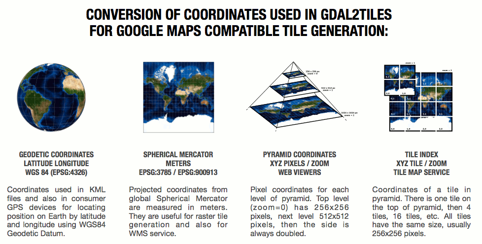

.. index::
   single: bound layer
   single: reference frame
   single: tileset
   pair: level of detail; lod
   single: glue
   single: credits
   single: storge
   single: storge view
   pair: srs; spatial reference system
   single: mask
   single: texture
   single: mesh
   single: attribution

************
Introduction
************

Melown 3D technology stack uses server-client architecture. There are two server
applications :ref:`mapproxy` and :ref:`vtsd` and there are more client
applications too, namely the :ref:`vts-browser-js` and :ref:`vts-browser-cpp`
for now, but we do plan to add more in the future.

As already said, there are two server-side applications, :ref:`mapproxy` and
:ref:`vtsd`. The :ref:`mapproxy` is responsible for serving 3D data and bound
layers to client apps, while :ref:`vtsd` is responsible for creating the 3D data
meshes and *glueing* them together on edges.  

The javascript-based :ref:`vts-browser-js` client is then consuming data from
Mapproxy and visualizing them using WebGL in the window of web browser. It also
provides API, to help users create their own applications.

==============================
Getting data for this tutorial
==============================
This documentation/tutorial comes with basic VTS-Mapproxy configuration set,
which can be downloaded from `our GitHub
<https://github.com/melown/mapproxy-project/>`_.

===========
Basic terms
===========

There are two ways to onlook on Melown VTS: either from the client side
(interpreting existing data), or from the server side (composing or creating
data). We call the first perspective *analysis* and the second perspective
*synthesis*. In this part, we are focusing on *analysis*, since we are will be
describing, how the backe-end part works.

Typical analytical concepts in VTS are that of configuration, surface and
layers. 

.. _bound-layer:

Bound layer
-----------
Bound layers are tiled datasets which may complement a :ref:`surface`. The
adjective *bound* (as opposed to :ref:`free-layer`\s) means that for any tile
used from a bound layer, there is the corresponding tile from the active
surface, having the same :ref:`lod`, and indices.  For this reason, bound layers
**do not**, in essence, **require any metatile information**, as they take it
from the active surface. Bound layers are usually used as texture overlays for
surfaces (e.g. aerial photos).

.. _credit:

Credits
-------
Each data source can have credits, or *attributions* defined. See
:ref:`credits-configuration` for more details.

.. _free-layer:

Free layer
----------

Free layers are collections of three dimensional information capable of
independent rendering. There are two facets to this independence: unlike bound
layers, free layers do not require the active surface to determine their
position. And unlike surfaces, they do not exclude other surfaces from
rendering. As many free layers as needed may be rendered at a given position in
the reference frame's node hierarchy.

If a free layer is tiled, or organized in a tile hierarchy, it holds also an
independent hierarchy of metatiles to achieve its independence on the active
surface. In format and semantics, free layer metatiles are precisely identical
to surface metatiles. Their usage in the rendering pipeline is largely identical
as with surfaces. Each free layer, however, forms its own independent,
single-entity rendering stack.

For configuration options, have a look at :ref:`geodata` resources configuration
section.

.. _geogrid:

Geogrid
-------
Usually raster representation of height differences between used ellipsoid and
real Earth surface `Geoid <https://en.wikipedia.org/wiki/Geoid>`_ heights.

.. figure:: images/geoid-grid.png

.. _glue:

Glue
----

A glue is synthetised :ref:`tileset` from two or more original tilesets, to minimize
data transfare and rendering time of final representation. Glues are
pre-rendered on the server, so that client does not have to do the work multiple
times.

.. figure:: images/glue1.png
    :scale: 25%

    Green and white tiles are representing *glue* tiles between two tilesets,
    with representing different surfaces. Gray tiles "in the center" and gray
    tiles "on the permiter" are taken from original tilesets during final
    rendering.

.. figure:: images/glue-mesh.png
    :scale: 25%

    Final "glue mesh", used for one :ref:`lod` to represent tiles, which are
    both covered by two tilesets.

.. _lod:

Level od detail (LOD)
---------------------

Level of detail. In traditional GIS this might be similar to zoom scale. It can
be displayed as the "pyramid" in the upper picture.

.. _mask:

Mask
----
Mask is special file, which can be used as standard binary mask, which "masks
out" pixels out of region of interest.

.. figure:: images/GUID-51C6597B-FC21-4C25-B133-F01B589405E8-web.gif

    Raster mask, source: http://pro.arcgis.com/en/pro-app/tool-reference/environment-settings/mask.htm

.. _metatile:

Meta tile
---------
Tile, holding *meta informations* needed to construct 3D model from input
:ref:`mesh` and :ref:`texture` tiles.

.. _mesh:

Polygon mesh
------------
`Polygon mesh <https://en.wikipedia.org/wiki/Polygon_mesh>`_ is collection of
vertices, edges and faces that defines the shape of a polyhedral object in 3D
computer graphics and solid modeling. The faces usually consist of triangles
(triangle mesh), quadrilaterals, or other simple convex polygons, since this
simplifies rendering, but may also be composed of more general concave polygons,
or polygons with holes.

In VTS, meshes are used to construct final 3D surface, covered with
:ref:`texture`\s.

.. figure:: images/mesh-flatshade.png
    :scale: 50%
    
    Flatshaded mesh, rendered as surface

.. figure:: images/mesh-wireframe.png
    :scale: 50%

    Image mesh filled with :ref:`texture`\s

.. _reference-frame:

Reference Frame
---------------
Definition of a fixed `spatial reference
<https://en.wikipedia.org/wiki/Spatial_reference_system>`_ for all data within a
map defines how the space is split in a tile hierarchy provides geometrical
surface used for navigation within a map defines a spatial reference used for
the maps public (user facing) interface.

    
    Source: `Maptiler <http://www.maptiler.org/img/poster-coordinates.gif>`_

.. _texture:

Texture
-------
`Texture map <https://en.wikipedia.org/wiki/Texture_mapping>`_ is a method for
defining high frequency detail, surface texture, or color information on a
computer-generated graphic or 3D model. In VTS, earch surface tile contains also
ference to metainformation-tile, which further contains reference to textures
applied to the :ref:`mesh`. Textures are stored as simple JPEG images.

.. figure:: images/internal-texture.jpg
    :scale: 50%

    Image containing mesh textures

.. _tileset:

Tileset
-------
A tiled surface (set of meshes with metadata) meshes are textured: usually, but
not necessarily corresponding to a given reference frame possibly taking
advantage of external texture layers containing :ref:`credit`\s (copyrights,
attributions)

.. _resource:

Resource
--------

Data sources defined in ``JSON`` encoded file, used in :ref:`mapproxy`. The data
sources can be DEMs or :ref:`bound-layer`\s with map.

.. _srs:

Spatial reference system
------------------------
`Spatial reference system
<https://en.wikipedia.org/wiki/Spatial_reference_system>`_ (SRS) is a
coordinate-based local, regional or global system used to locate geographical
entities. A spatial reference system defines a specific map projection, as well
as transformations between different spatial reference systems. In GIS, usually
use `EPSG <https://www.epsg-registry.org/>`_ datase, however, EPSG codes are
not used in VTS* tools. SRS is stored in internal :ref:`registry` database.

.. _storage:

Storage
-------
Storage is a stack of :ref:`tileset` sharing the same :ref:`reference-frame`.
Surface display priority is defined by tileset stacking order (first in, last
out). It also contains :ref:`glue`\ s between it's constituent tilesets.
contains :ref:`glue`\ s. It's basicaly a database of all your tilesets.

.. _storage-view:

Storage view
-------------
Storage view is subset of :ref:`storage`, with selected :ref:`tileset`\ s, so
that you are not going to render all your data in final application.

.. _surface:

Surface
-------

Surfaces are a client side notion of tilesets. More precisely, they are

* a geometrical definition of the modeled object's surface,
* with optional textures and/or information on how to map external textures to object's surface
* with information on terrain, allowing to map map XY navigation SRS coordinates to their Z compoment.

Our current webexport format is, under our new terminology, a representation of
a single surface. It is a surface which is tiled (organized in a tile hierarchy)
and sampled (described as a set of polygonal meshes, as opposed to using
analytical and implicit functions). We shall preserve this properties in the new
surface format.
