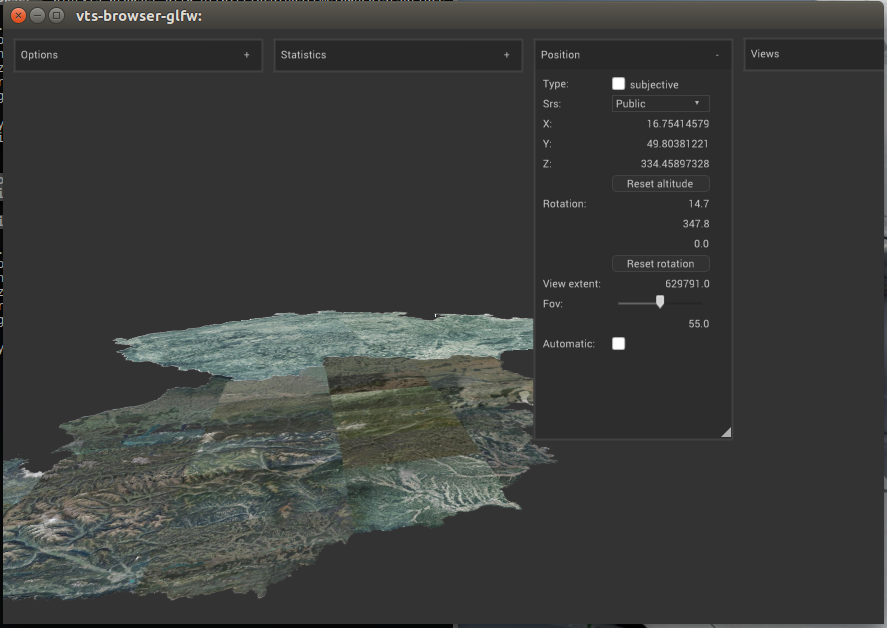

Usage
=====

As being mentioned, ``VTS-Browser-CPP`` is rather a library, than fully
stand-alone software package.

Still, if you compile the browser from the source, you should have two binaries
available at your service:

* vts-browser-glfw
* vts-browser-qt

They are demo applications, showing what is possible to do with the library and
how to deal with it.

To get it up and running, you need ``mapConfig.json`` file available. You can
grab one of the public once, published at https://melown.com or you can use the
one published by your local copy, e.g. using the project :ref:`freelayer-example`.

Once you have the file, just run::

    vts-browser-glfw http://localhost/melown2015/surface/melown/dem/mapConfig.json

    VTS-Browser-CPP client running as desktop application

