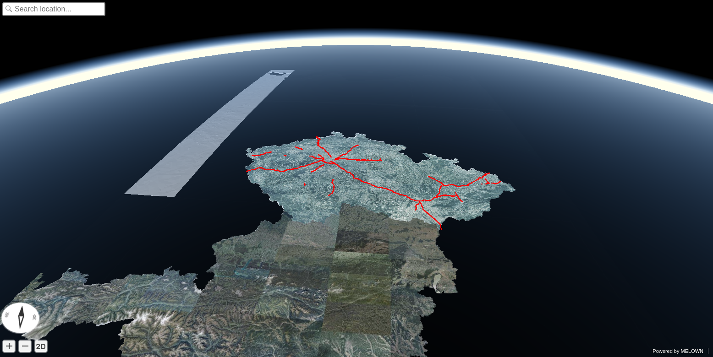

.. index::
    single: free layer
    single: vector layer

.. _freelayer-example:

Publishing vector data
----------------------

Vector data as we know them in GIS, are called :ref:`free-layer` in terms of
VTS ecosystem. They do have their own  coordinate reference system definition,
and are not tided to specific tiling schema. For configuration details, have a
look at :ref:`geodata-vector` configuration.

.. note:: Mapproxy currently supports just lines and points. Polygons are not
    yet available for rendering.

In our example, we will continue with the :ref:`srtm-example` project, where we
have `SRTM <https://www2.jpl.nasa.gov/srtm/>`_ elevation data along with Czech
and Austrian WMTS aerial image layers.

We may now add some vector layers.

.. note:: If you do not have ``resources.json`` and ``mapproxy.conf`` files yet,
    go to the :ref:`srtm-example` project and come back, after you have working
    project.

We may now add new resource of type :ref:`geodata-vector`.

Download the data
^^^^^^^^^^^^^^^^^
We have downloaded popular OpenStreetMap dataset from the `GeoFabrik.de <https://www.geofabrik.de/>`_, we used ESRI Shapefile format of the data from `The Czech Republic <http://download.geofabrik.de/europe/czech-republic.html>`_.

After downloading and unzipping, we needed to separate just highways from the
roads dataset.

.. note:: VTS Mapproxy is going to send the vector dataset **as is**. Data are
        note tiled or compressed anyhow on the server. Sending big vector
        datasets to the client is generally bad idea - the client will
        crash eventually. Therefore, simplier datasets have to be used. For
        distribution of big vector data sets, :ref:`geodata-vector-tiled` have
        to be used and they will be described in other example.

We are going to filter just motorways out of our linear Shapefile::

    $ ogr2ogr -where "fclass = 'motorway'" motorways.shp gis.osm_roads_free_1.shp

We can create directory and copy our motorways there::

    $ mkdir resources/roads
    $ mv motorways.* resources/roads/

Configure ``resources.json``
^^^^^^^^^^^^^^^^^^^^^^^^^^^^

We now have our input data and can add new resource to
:download:`mapproxy-wmts-vector.json`

.. literalinclude:: mapproxy-wmts-vector.json
    :linenos:
    :lines: 2-30

The first part should be clear already, with exception for reference frame
definition. Vector dataset is not tided to any :ref:`reference-frame`
definition. But we need to specify some, therefore the numbers are all zeros,
even if tat does not make much sense. 

Second part, the source ``definition`` is new. You should be familiar with most
of the values, for reference have a look to :ref:`geodata-vector` documentation.
The ``introspection`` part tells mapproxy, on which resource should the vector
files be "laid on".

.. note:: You can also add new ``"geodata"`` section to the ``introspection`` of
    ``surface``. See :ref:`introspection` configuration option.

Vector data styling
^^^^^^^^^^^^^^^^^^^
.. note:: Detailed reference for styling is behind scope of this example, please
    check `official styling documentation
    <https://github.com/Melown/vts-browser-js/wiki/VTS-Geodata-Format#geo-layer-styles-structure>`_.

Vector data styles are stored in JSON format. Let's have an example:

.. literalinclude:: mystyle.json

The structure of the file is obvious::

    {
        "constants": ...,
        "bitmaps: ...,

        "layers": {
            @layerId: { layer-definition }
        }
    }

The ``@layerId`` has no relation to ``resources.json`` configuration file. It's
used just as internal reference in the styling file. For styling just subset of
vector data, check the
`Filters <https://github.com/Melown/vts-browser-js/wiki/VTS-Geodata-Format#filters`, they
should be similar to `mapbox filter format
<https://www.mapbox.com/mapbox-gl-js/style-spec/#types-filter>`_.

.. note:: styleUrl is not mandatory parameter - the vector data are going to be
    displayed anyhow.

Running
^^^^^^^
Once set, you can re-run ``mapproxy`` and see your vector map::

    $ mapproxy --config mapproxy.conf

    Vector layer as :ref:`free-layer` displayed on surface with default style.
