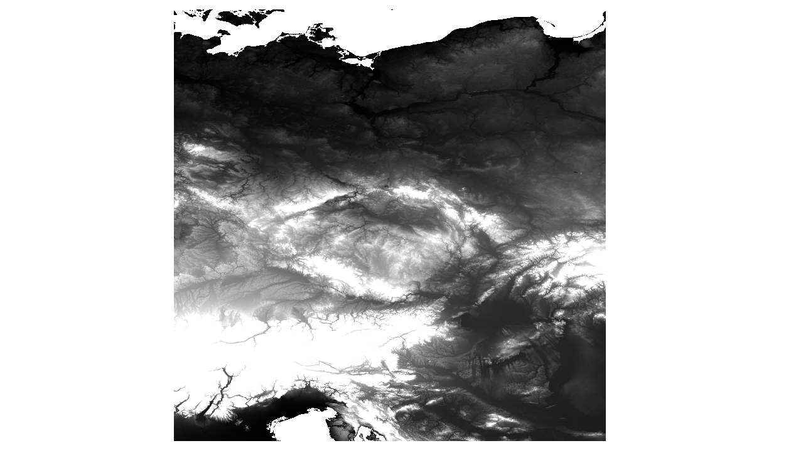

.. index::
    single: tutorial

.. _mapproxy-tutorial:

Tutorial
========

Publishing North Carolina dataset
---------------------------------

In this little tutorial, we are going to publish data from `North Carolina dataset`_
which is distributed along with `The Open Source GIS: A GRASS GIS Approach`_ book.

Download sample data
^^^^^^^^^^^^^^^^^^^^
First we have to download the sample data and unzip them. You can find them
under description *Data in common GIS formats (NC data set)*::

    $ mkdir nc-project
    $ cd nc-project
    $ wget http://grass.osgeo.org/sampledata/north_carolina/nc_rast_geotiff.tar.gz
    $ tar -xzf nc_rast_geotiff.tar.gz

Create datasets for publishing
^^^^^^^^^^^^^^^^^^^^^^^^^^^^^^
For each raster file, 3 steps need to be performed, in order to get them
published:

#. Create `GDAL Virtual Format`_
#. Get :ref:`lod` range and tile ranges for given :ref:`reference-frame`
#. Generate tiles for the :ref:`lod` range and tile ranges.

We also have to make the decision: in which :ref:`reference-frame` are we going
to prepare the data? VTS (see :ref:`registry`) is distributed along with
some pre-defined :ref:`reference-frame`\s. We try to publish the data in two of
them:: ``melown2015``, which is represented as sphere of Earth's shape and
``webmerc-projected``, which is the popular web mapping projection.

Once we have this, we can finally ad the tiled dataset to the
:file:`resources.json` configuration file.

First we create ``datasets`` directory, where all *to-be-published data* will be
stored. We will copy :file:`elevlid_D792_6m.tif`, :file:`elevlid_D793_6m.tif` and
:file:`ortho_2001_t792_1m.tif` to the ``datasets`` directory::

    $ mkdir datasets
    $ cp ../ncrast/ortho_2001_t792_1m.tif .
    $ cp ../ncrast/elevlid_D792_6m.tif .
    $ cp ../ncrast/elevlid_D793_6m.tif

Step 1. Create virtual datasets
"""""""""""""""""""""""""""""""

Next, we will create virtual overviews (step nr. 1.) using `GDAL Virtual
Format`_. Let's start with the ortho photo, we will use :ref:`generatevrtwo`
program for that::

    $ mkdir ortho
    $ generatevrtwo ortho_2001_t792_1m.tif ortho/ortho_2001_t792_1m --resampling texture --tileSize 1023x1024

New directory ``ortho`` was created.

Next we first join the two elevation raster files together using GDAL::

    $ gdalbuildvrt elevlid_6m.vrt elevlid_D7*_6m.tif

New file :file`elevlid_6m.vrt` was created and can be used as input to
:ref:`generatevrtwo`.

For elevation maps, 3 maps have to created: The DEM, it's minimums and
maximums, they are supposed to be stored in common directory::

    $ mkdir elev
    $ generatevrtwo elevlid_6m.vrt elev/elevlid_6m --tileSize 1024x1024 --resampling dem
    $ generatevrtwo elevlid_6m.vrt elev/elevlid_6m.min --tileSize 1024x1024 --resampling min
    $ generatevrtwo elevlid_6m.vrt elev/elevlid_6m.max --tileSize 1024x1024 --resampling max

It is expected, that there will be files called ``dem``, ``dem.min`` and
``dem.max`` in the target surface directory. It is also expected, that there
will be file called ``ophoto`` for the aerial image overlay. We will create
symlinks in the next step, pointing to the :file:`dataset` file in each virtual
dataset::

    $ ln -s elevlid_6m/dataset elev/dem
    $ ln -s elevlid_6m.min/dataset elev/dem.min
    $ ln -s elevlid_6m.max/dataset elev/dem.max
    $ ln -s ortho_2001_t792_1m/dataset ortho/ophoto

So as result, we should have following files in the ``datasets/elev``
directory::

    dem -> elevlid_6m/dataset
    dem.max -> elevlid_6m.max/dataset
    dem.min -> elevlid_6m.min/dataset
    elevlid_6m
    elevlid_6m.max
    elevlid_6m.min

Same for ``datasets/ortho``::

    ophoto -> ortho_2001_t792_1m/dataset
    ortho_2001_t792_1m
    

Step 2. Get LOD and Tile Ranges
"""""""""""""""""""""""""""""""

For this :ref:`mapproxy-calipers` is intended to be used. We have to run the
program twice, since need tile ranges and LOD ranges for two reference frames::

    $ mapproxy-calipers ortho/ophoto --referenceFrame melown2015
    gsd: 1.00009
    range<pseudomerc>: 14,20 20/147533,206320:147582,206369
    range: 14,20 2305,3223:2305,3224
    position: obj,-78.679859,35.741618,float,0.000000,0.000000,-90.000000,0.000000,3976.856825,55.000000

    $ mapproxy-calipers ortho/ophoto --referenceFrame webmerc-projected
    gsd: 1.00116
    range<pseudomerc>: 13,19 19/147533,206320:147582,206369
    range: 13,19 2305,3223:2305,3224
    position: obj,-8758601.820640,4265126.500780,float,0.000000,0.000000,-90.000000,0.000000,4914.944902,55.000000

Same applies for the elevation map::
    
    $ mapproxy-calipers elev/dem --referenceFrame melown2015
    2017-05-27 00:51:04 I3 [13965(main)]: [mapproxy-calipers] Config:
    gsd: 6.09655
    range<pseudomerc>: 13,17 17/18441,25783:18447,25796
    range: 13,17 1152,1611:1152,1612
    position: obj,-78.679784,35.755369,float,0.000000,0.000000,-90.000000,0.000000,7942.408707,55.000000
        
    $ mapproxy-calipers elev/dem --referenceFrame webmerc-projected
    gsd: 6.10308
    range<pseudomerc>: 12,16 16/18441,25783:18447,25796
    range: 12,16 1152,1611:1152,1612
    position: obj,-8758593.532230,4267013.234048,float,0.000000,0.000000,-90.000000,0.000000,9819.071479,55.000000
    
Step 3. Generate tiling information
"""""""""""""""""""""""""""""""""""
For tiling files generation :ref:`mapproxy-tiling` is used. As input, we need
:ref:`reference-frame`, :ref:`lod` and input dataset defined. As already pointed
out it is expected, that there is either `ophoto` or `dem` files in target
dataset directory.

Now we can tile the data for the reference frames, we will start with the
orthophoto. The ``--lodRange`` and ``--tileRange`` parameters are taken from the
output from :ref:`mapproxy-calipers` from the **Step 2** before.::

    $ mapproxy-tiling ortho --referenceFrame melown2015 --lodRange 13,19 --tileRange 19/147533,206320:147582,206369
    $ mapproxy-tiling ortho --referenceFrame webmerc-projected --lodRange 14,20 --tileRange 20/147533,206320:147582,206369

Same for our DEM::

    $ mapproxy-tiling elev --referenceFrame melown2015 --lodRange 13,17 --tileRange 17/18441,25783:18447,25796
    $ mapproxy-tiling elev --referenceFrame webmerc-projected --lodRange 12,16 --tileRange 16/18441,25783:18447,25796
    

Configure VTS-Mapproxy
^^^^^^^^^^^^^^^^^^^^^^
Two files have to be created: the :file:`resources.json` and :file:`maproxy.conf` (the names do not
have to be like this, but we will stick to those names in frame of this
tutorial).

First, let's create :file:`nc-project/mapproxy.conf` with following content:

.. literalinclude:: mapproxy-nc.conf

.. note:: You can download the file directly :download:`mapproxy-nc.conf`

The configuration values should be self-explaining. For more configuration
options, you can have a look at ``mapproxy --help-all`` output. Just few
comments:

    * Resources will be loaded from :file:`resources.json`
    * It is assumed, that all the data are loaded from ``datasets`` directory
    * Generated cache tiles are stored in ``store`` directory
    * Since ``max-age`` is set to -1, nothing will be cached in the browser.

Next, we have to create :file:`resources.json` file. It's an JSON file. There
will be 2 resources defined: the one with ``ortho`` data input and the other with
``elev`` data input. Let's start with ``ortho`` data input.

.. note:: You can download the file directly :download:`resources-nc.json`

.. literalinclude:: resources-nc.json
    :lines: 1-27
    :linenos:

``comment``, ``group``, ``id``
    options should be clear. 
``driver``
    is set to ``tms-raster`` value (for tiled-layer)
``credits``
    (or attributions) are not defined (but have to be present)
``referenceFrames``
    the values are output from :ref:`mapproxy-calipers` used previously
``definition``
    points to the directory name, where the data re stored (within ``datasets``
    directory configured in ``mapproxy.conf`` file previously)

Next, we add our ``elev`` data source:

.. literalinclude:: resources-nc.json
    :lines: 28-
    :lineno-start: 28
    :linenos:

``type``
    is ``surface`` here
``referenceFrames``
    are again result from :ref:`mapproxy-calipers` used earlier
``definition``
    is more tricky part. Beside to ``dataset``, there is ``geoidGrid`` file
    reference. It's the grid definition file, which should be applied on the
    spheroid to get better output.

    ``introspection``
        we can define initial viewer position for each :ref:`reference-frame`
        and again, this is the output from :ref:`mapproxy-calipers` earlier. In
        our case, we are assuming the ``melown2015`` reference frame is used.
    ``tms``
        is telling to mapproxy, that the surface layer should be covered by our
        ``ortho`` layer.

Running mapproxy
^^^^^^^^^^^^^^^^

It should be possible to run ``mapproxy --config mapproxy.conf`` and go to
http://localhost:3070::

        $ mapproxy --config mapproxy.conf 
        2017-05-27 20:23:11 I3 [23429(main)]: Loaded configuration from <mapproxy.conf>. {program.cpp:configureImpl():410}
        2017-05-27 20:23:11 I3 [23429(main)]: [mapproxy] Config:
            store.path = "/tmp/melown/store/"
            http.listen = 0.0.0.0:3070
            http.threadCount = 4
            http.client.threadCount = 1
            http.enableBrowser = true
            core.threadCount = 4
            gdal.processCount = 4
            gdal.tmpRoot = "tmp/"
            resource-backend.updatePeriod = 300
            resource-backend.root = "/tmp/melown/datasets/"
            resource-backend.type = conffile
            resource-backend.path = "resources.json"
         {main.cpp:configure():259}
        2017-05-27 20:23:11 I4 [23429(main)]: [mapproxy] Service mapproxy/test starting. {service.cpp:operator()():476}
        2017-05-27 20:23:11 I3 [23429(updater)]: Ready to serve. {generator.cpp:update():745}
    
.. figure:: north-carolina.png

    North Carolina dataset displayed as 3D using :ref:`mapproxy`. The map is reachable at
    http://localhost:3070/melown2015/surface/surface/dem/

Publishing Aster data along with WMTS aerial images
---------------------------------------------------

In this example, we are going to demonstrate, how to add two different WMTS
services for overlaying aerial pictures used as :ref:`bound-layer`\s. We are
going to use WMTS from Czech  .... and Austrian ... (both central Europe).

Start the project
^^^^^^^^^^^^^^^^^

::

    $ mkdir mapproxy-wmts
    $ cd mapproxy-wmts
    $ make datasets
    $ cd datasets

Download the SRTM data
^^^^^^^^^^^^^^^^^^^^^^
http://srtm.csi.cgiar.org/SELECTION/inputCoord.asp

::
    $ wget http://srtm.csi.cgiar.org/SRT-ZIP/SRTM_V41/SRTM_Data_GeoTiff/srtm_40_03.zip
    $ wget http://srtm.csi.cgiar.org/SRT-ZIP/SRTM_V41/SRTM_Data_GeoTiff/srtm_40_02.zip
    $ wget http://srtm.csi.cgiar.org/SRT-ZIP/SRTM_V41/SRTM_Data_GeoTiff/srtm_39_02.zip
    $ wget http://srtm.csi.cgiar.org/SRT-ZIP/SRTM_V41/SRTM_Data_GeoTiff/srtm_39_03.zip

Unzip the data::

    $ for i in *.zip; do unzip -o $i; done

Create virtual raster file with GDAL::

    $ gdalbuildvrt srtm.vrt srtm*.tif

    Centeral Europe SRTM DEM data, put together using ``gdalbuildvrt`` downloaded from http://srtm.csi.cgiar.org/SELECTION/inputCoord.asp

Prepare WMTS configuration XML files for GDAL
^^^^^^^^^^^^^^^^^^^^^^^^^^^^^^^^^^^^^^^^^^^^^

We want to use two WMTS layers as overlay aerial photos over the aster data. For
this, we need to preare `GDAL XML WMTS configuration file`_. You can either do
this manually, or using some GDAL magic.

The WMTS URLs are

* Czech aerial images:
    * Publisher: `Czech State Administration of Land Surveying and Cadastre <http://cuzk.cz/>`_
    * URL: http://geoportal.cuzk.cz/WMTS_ORTOFOTO/WMTService.aspx
    * Metadata: http://geoportal.cuzk.cz/(S(13swjjuewvlepzz40nl443ao))/Default.aspx?mode=TextMeta&side=wmts.uvod&metadataID=CZ-CUZK-WMTS-ORTOFOTO-P&metadataXSL=metadata.sluzba&head_tab=sekce-03-gp&menu=3151

* Austrian aerial images:
    * Publisher: `The Geoportal of the nine Austrian Provinces <http://geoland.at/site/about.html>`_
    * URL: http://maps.wien.gv.at/basemap/1.0.0/WMTSCapabilities.xml
    * Metadata: https://www.data.gv.at/katalog/dataset/orthofoto/resource/58a76d2b-58c7-4c08-af17-2ccbac4d1463

First, we need list supported ``TileSetMatrix`` and supported layers for each
service::

    $ gdalinfo "WMTS:http://geoportal.cuzk.cz/WMTS_ORTOFOTO/WMTService.aspx?service=wmts&request=getcapabilities"

The output seems a bit too messy, but, if we look for Web Mercator projection
(EPSG:3857), we might get the right spot::

    $ gdalinfo "WMTS:http://geoportal.cuzk.cz/WMTS_ORTOFOTO/WMTService.aspx?service=wmts&request=getcapabilities" | grep 3857

    SUBDATASET_29_NAME=WMTS:http://geoportal.cuzk.cz/WMTS_ORTOFOTO/WMTService.aspx?service=wmts&request=getcapabilities,layer=orto,tilematrixset=wgs84:pseudomercator:epsg:3857,style=default
    SUBDATASET_29_DESC=Layer Ortofoto ČR, tile matrix set wgs84:pseudomercator:epsg:3857, style default
    SUBDATASET_30_NAME=WMTS:http://geoportal.cuzk.cz/WMTS_ORTOFOTO/WMTService.aspx?service=wmts&request=getcapabilities,layer=orto,tilematrixset=wgs84:pseudomercator:epsg:3857,style=inspire_common:DEFAULT
    SUBDATASET_30_DESC=Layer Ortofoto ČR, tile matrix set wgs84:pseudomercator:epsg:3857, style inspire_common:DEFAULT

Now, we can continue with the ``SUBDATASET_29`` or ``SUBDATASET_30`` (they
should be both the same).

We now use GDAL to create the final XML configuration file::

    $ gdal_translate -of WMTS "WMTS:http://geoportal.cuzk.cz/WMTS_ORTOFOTO/WMTService.aspx?service=wmts&request=getcapabilities,layer=orto,tilematrixset=wgs84:pseudomercator:epsg:3857,style=default" cuzk.xml

You may now see simple XML configuration file :download:`cuzk.xml`

Same approach applies for Austrian Luftbilder::

    $ gdalinfo "WMTS:http://maps.wien.gv.at/basemap/1.0.0/WMTSCapabilities.xml"

    ...
          SUBDATASET_5_NAME=WMTS:http://maps.wien.gv.at/basemap/1.0.0/WMTSCapabilities.xml,layer=bmaporthofoto30cm
          SUBDATASET_5_DESC=Layer Geoland Basemap Orthofoto
    ...    

    $ gdal_translte -of WMTS "WMTS:http://maps.wien.gv.at/basemap/1.0.0/WMTSCapabilities.xml,layer=bmaporthofoto30cm" geolandat.xml

Again, the file should look limilar to :download:`geolandat.xml`

We now have WMTS from two sources and digital elevation model from SRTM source.
Let's check our data in QGIS:

.. figure:: cz-au-srtm.png

    WMTS layers along with SRTM DEM

Creating Mask
^^^^^^^^^^^^^
The issue we have now is, that the both WMTSes are overlapping one another. We
need to create :ref:`mask`.

First we need input data with vector file representing boundaries from Czech
republic and Austria. One of possible sources is `Mapzen borders
<https://mapzen.com/data/borders/>`_ (based on OpenStreetMap).

First, get and untar the data::

    $ wget https://s3.amazonaws.com/osm-polygons.mapzen.com/czech-republic_geojson.tgz
    $ wget https://s3.amazonaws.com/osm-polygons.mapzen.com/austria_geojson.tgz
    $ tar -xzf austria_geojson.tgz
    $ tar -xzf czech-republic_geojson.tgz

The data we are looking for - state boundaries - are
:file:`admin_level_2.geojson`.

To make the mask, we need to know biggest :ref:`lod` nad :ref:`reference-frame`.
You use maximum LOD - e.g. 21, but the calculation will take probably whole
night. Since the SRTM dataset does "make sense" at LOD 13, I'm going to use this
number (I've used :ref:`mapproxy-calipers` to find out, more about this
lower).::

    $ mapproxy-rf-mask --dataset czech-republic/admin_level_2.geojson --output czech.mask.melown2015 --referenceFrame melown2015 --lod 13
    $ mapproxy-rf-mask --dataset austria/admin_level_2.geojson --output czech.mask.melown2015 --referenceFrame melown2015 --lod 13

For LOD 13, this should be pretty fast.

Creating virtual overviews
^^^^^^^^^^^^^^^^^^^^^^^^^^
We need to create ``dem``, ``min`` and ``max`` virtual overviews for DEM and
``texture`` overview for the aerial photos::

    $ mkdir elev # create target dir
    $ generatevrtwo srtm.vrt elev/srtm --tileSize 1024x1024 --resampling dem
    $ generatevrtwo srtm.vrt elev/srtm.min --tileSize 1024x1024 --resampling min
    $ generatevrtwo srtm.vrt elev/srtm.max --tileSize 1024x1024 --resampling max
    $ ln -s srtm/dataset elev/dem
    $ ln -s srtm.min/dataset elev/dem.min
    $ ln -s srtm.max/dataset elev/dem.max

Same could we do for the czech and austrian aerial images, BUT to
``generatevrtwo`` for Czech republic, it would take 8010114 tiles and some disk
space. So we are going to ommit this and relay on the original services.

Generate tiling information
^^^^^^^^^^^^^^^^^^^^^^^^^^^
Again, since we are going to consume WMTS directly, we are just pre-calculating
the tiles for SRTM DEM file.

First, we need to know LOD and reference frame::

    $ mapproxy-calipers elev/srtm/dataset --referenceFrame melown2015

    gsd: 74.4174
    range<pseudomerc>: 5,13 13/2161,1295:2275,1473
    range: 5,13 8,5:8,5
    position: obj,15.000209,50.000209,float,0.000000,0.000000,-90.000000,0.000000,1458214.909081,55.000000

Then we can run :ref:`mapproxy-tiling`::

    $ mapproxy-tiling elev --referenceFrame melown2015 --lodRange 5,13 --tileRange 13/2161,1295:2275,1473
    ...

Configuring VTS-Mapproxy
^^^^^^^^^^^^^^^^^^^^^^^^

.. note:: You will probably have to ``cd ../`` to get out of ``dataset``
        dictionary.

First, configuration file, it will be simple and straight forward:

.. literalinclude:: mapproxy-wmts.cfg

Next, we configure resources. We are going to stick to ``melown2015``
:ref:`reference-frame`. For this, we need to know LOD ranges and tile ranges::

    # Czech WMTS
    $ mapproxy-calipers datasets/cuzk.xml --referenceFrame melown2015

    range<pseudomerc>: 6,22 22/1118067,698674:1159139,724909
    range: 6,22 17,10:17,11
    position: obj,15.454248,49.917026,float,0.000000,0.000000,-90.000000,0.000000,521048.959428,55.000000

    # Austrian WMTS
    $ mapproxy-calipers datasets/geolandat.xml --referenceFrame melown2015

    gsd: 0.100476
    range<pseudomerc>: 6,22 22/1099737,719871:1148712,743068
    range: 6,22 16,10:17,11
    position: obj,12.985956,47.698322,float,0.000000,0.000000,-90.000000,0.000000,646443.652001,55.000000

    # SRTM files
    $ mapproxy-calipers datasets/elev/dem --referenceFrame melown2015

    gsd: 74.4174
    range<pseudomerc>: 5,13 13/2161,1295:2275,1473
    range: 5,13 8,5:8,5
    position: obj,15.000209,50.000209,float,0.000000,0.000000,-90.000000,0.000000,1458214.909081,55.000000

We can now start with the configuration of data sources and use output from
``mapproxy-calipers`` to layer configurations: Let's start with the Czech WMTS layer:

.. literalinclude:: resources-wmts.json
    :linenos:
    :lines: 1-20

Note: tile ranges and LOD ranges are taken from the previous
``mapproxy-calipers`` output. Note also, that the generated **mask** is
referenced by the name ``czech.mask``. The ``.melown2015`` suffix will be add
automatically.

Continue with Austrian WMTS layer

.. literalinclude:: resources-wmts.json
    :linenos:
    :lineno-start: 20
    :lines: 20-39

And finally, we add SRTM dataset with both WMTS layers overlayed:

.. literalinclude:: resources-wmts.json
    :linenos:
    :lineno-start: 40
    :lines: 40-

We can now start the server and see the result::

    $ mapproxy --config mapproxy-wmts.cfg
    ...
    2017-05-29 13:28:27 I3 [27261(updater)]: Ready to serve.

    Czech republic and Austria on ``melown2015`` reference frame using SRTM
    digital elevation model.

.. figure:: austria.png

    Alps region in Austria

.. figure:: palava.png

    Palava, look from behind Austrian borders

.. _North Carolina dataset: https://grassbook.org/datasets/datasets-3rd-edition/
.. _The Open Source GIS\: A GRASS GIS approach: https://grassbook.org/
.. _GDAL Virtual Format: http://www.gdal.org/gdal_vrttut.html
.. _GDAL XML WMTS configuration file: http://www.gdal.org/frmt_wmts.html
