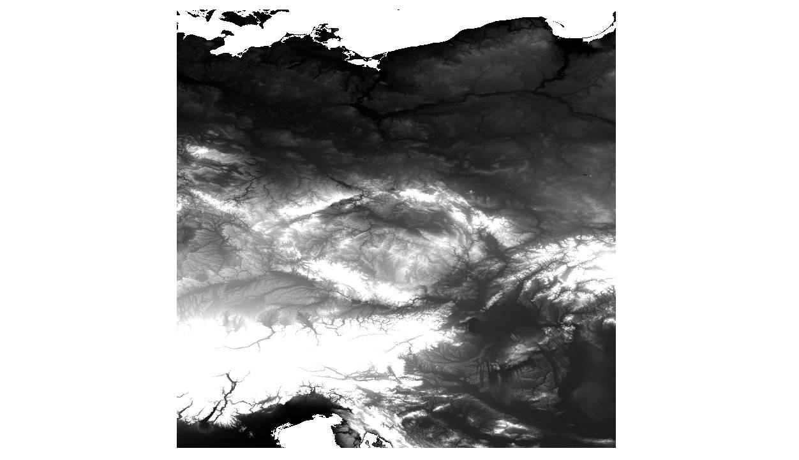
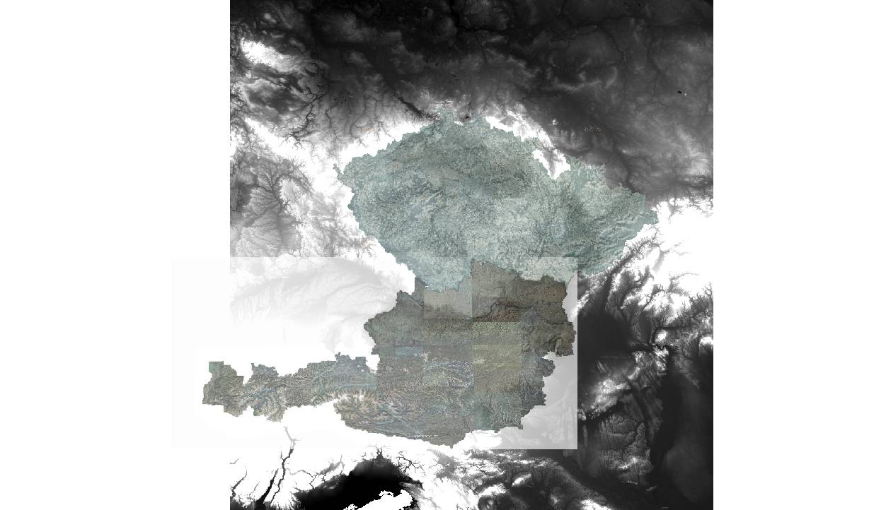
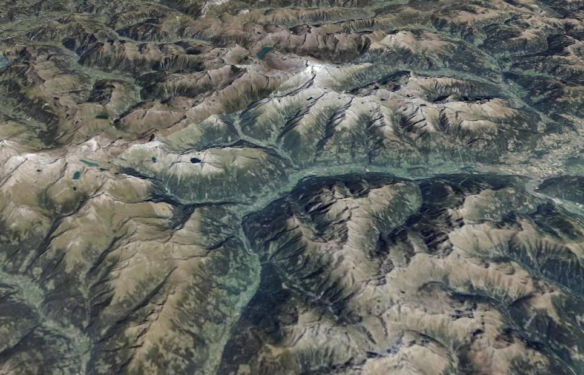
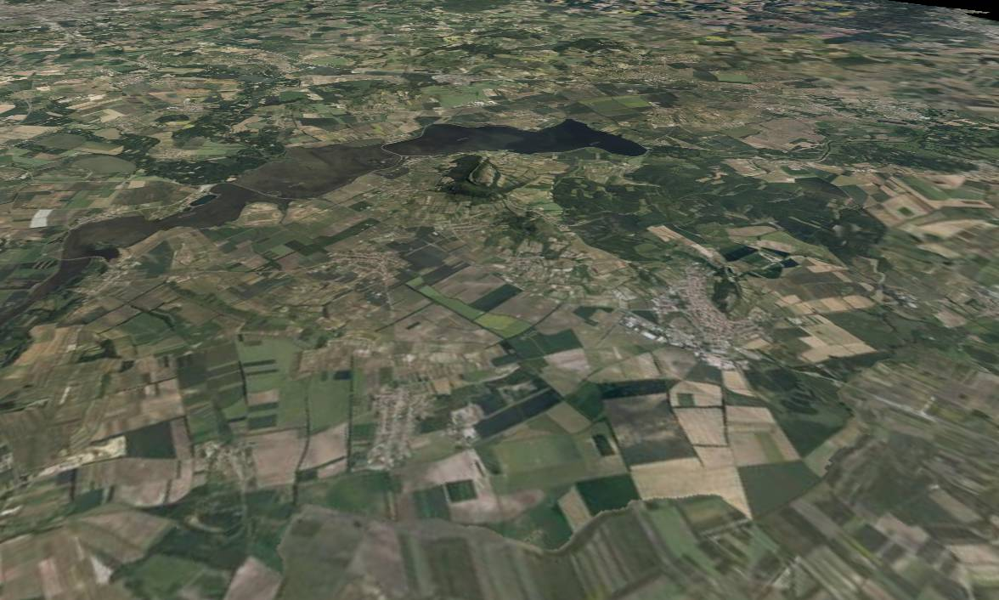

.. index::
    single: SRTM
    single: WMTS
    single: tutorial
    single: example
    single: mask

.. _srtm-example:

Publishing SRTM data along with WMTS aerial images
--------------------------------------------------

In this example, we are going to demonstrate, how to add two different WMTS
services for overlaying aerial pictures used as :ref:`bound-layer`\s. We are
going to use WMTS from Czech State Administration of Land Surveying and Cadastre
and the free geodata portal of Austria (both central Europe).

Start the project
^^^^^^^^^^^^^^^^^
First we need to create project directory and datasets directory::

    $ mkdir -p wmts/datasets
    $ cd wmts/datasets

Download the SRTM data
^^^^^^^^^^^^^^^^^^^^^^
We will use the `CGIAR-CSI <http://srtm.csi.cgiar.org/>`_ `NASA's Shuttle Radar
Topography Mission (SRTM) <https://www2.jpl.nasa.gov/srtm/>`_. The links to
GeoTIFF files can be found at http://srtm.csi.cgiar.org/SELECTION/inputCoord.asp

::

    $ wget http://srtm.csi.cgiar.org/SRT-ZIP/SRTM_V41/SRTM_Data_GeoTiff/srtm_40_03.zip
    $ wget http://srtm.csi.cgiar.org/SRT-ZIP/SRTM_V41/SRTM_Data_GeoTiff/srtm_40_02.zip
    $ wget http://srtm.csi.cgiar.org/SRT-ZIP/SRTM_V41/SRTM_Data_GeoTiff/srtm_39_02.zip
    $ wget http://srtm.csi.cgiar.org/SRT-ZIP/SRTM_V41/SRTM_Data_GeoTiff/srtm_39_03.zip

Unzip the data::

    $ for i in *.zip; do unzip -o $i; done

Create virtual raster file with GDAL::

    $ gdalbuildvrt srtm.vrt srtm*.tif

This will create single data files, which is covering all 4 underlaying GeoTIFF
files.

    Centeral Europe SRTM DEM data, put together using ``gdalbuildvrt``
    downloaded from http://srtm.csi.cgiar.org/SELECTION/inputCoord.asp

Prepare WMTS configuration XML files for GDAL
^^^^^^^^^^^^^^^^^^^^^^^^^^^^^^^^^^^^^^^^^^^^^
We want to use two WMTS layers as overlay aerial photos over the aster data. For
this, we need to preare `GDAL XML WMTS configuration file`_. You can either do
this manually, or using some GDAL magic.

The WMTS URLs are

* Czech aerial images:
    * Publisher: `Czech State Administration of Land Surveying and Cadastre <http://cuzk.cz/>`_
    * URL: http://geoportal.cuzk.cz/WMTS_ORTOFOTO/WMTService.aspx
    * Metadata: http://geoportal.cuzk.cz/(S(13swjjuewvlepzz40nl443ao))/Default.aspx?mode=TextMeta&side=wmts.uvod&metadataID=CZ-CUZK-WMTS-ORTOFOTO-P&metadataXSL=metadata.sluzba&head_tab=sekce-03-gp&menu=3151

* Austrian aerial images:
    * Publisher: `The Geoportal of the nine Austrian Provinces <http://geoland.at/site/about.html>`_
    * URL: http://maps.wien.gv.at/basemap/1.0.0/WMTSCapabilities.xml
    * Metadata: https://www.data.gv.at/katalog/dataset/orthofoto/resource/58a76d2b-58c7-4c08-af17-2ccbac4d1463

First, we need list supported ``TileSetMatrix`` and supported layers for each
service::

    $ gdalinfo "WMTS:http://geoportal.cuzk.cz/WMTS_ORTOFOTO/WMTService.aspx?service=wmts&request=getcapabilities"

The output seems a bit too messy, but, if we look for Web Mercator projection
(EPSG:3857), we might get the right spot::

    ...
    SUBDATASET_29_NAME=WMTS:http://geoportal.cuzk.cz/WMTS_ORTOFOTO/WMTService.aspx?service=wmts&request=getcapabilities,layer=orto,tilematrixset=wgs84:pseudomercator:epsg:3857,style=default
    SUBDATASET_29_DESC=Layer Ortofoto ČR, tile matrix set wgs84:pseudomercator:epsg:3857, style default
    SUBDATASET_30_NAME=WMTS:http://geoportal.cuzk.cz/WMTS_ORTOFOTO/WMTService.aspx?service=wmts&request=getcapabilities,layer=orto,tilematrixset=wgs84:pseudomercator:epsg:3857,style=inspire_common:DEFAULT
    SUBDATASET_30_DESC=Layer Ortofoto ČR, tile matrix set wgs84:pseudomercator:epsg:3857, style inspire_common:DEFAULT
    ...

Now, we can continue with the ``SUBDATASET_29`` or ``SUBDATASET_30`` (they
should be both the same).

We now use GDAL to create the final XML configuration file::

    $ gdal_translate -of WMTS "WMTS:http://geoportal.cuzk.cz/WMTS_ORTOFOTO/WMTService.aspx?service=wmts&request=getcapabilities,layer=orto,tilematrixset=wgs84:pseudomercator:epsg:3857,style=default" cuzk.xml

You may now see simple XML configuration file :download:`projects/wmts/cuzk.xml`

Same approach applies for Austrian Luftbilder::

    $ gdalinfo "WMTS:http://maps.wien.gv.at/basemap/1.0.0/WMTSCapabilities.xml"

    ...
          SUBDATASET_5_NAME=WMTS:http://maps.wien.gv.at/basemap/1.0.0/WMTSCapabilities.xml,layer=bmaporthofoto30cm
          SUBDATASET_5_DESC=Layer Geoland Basemap Orthofoto
    ...    

    $ gdal_translte -of WMTS "WMTS:http://maps.wien.gv.at/basemap/1.0.0/WMTSCapabilities.xml,layer=bmaporthofoto30cm" geolandat.xml

Again, the file should look limilar to :download:`projects/wmts/geolandat.xml`

We now have WMTS from two sources and digital elevation model from SRTM source.
Let's check our data in QGIS:

    WMTS layers along with SRTM DEM

Creating Mask
^^^^^^^^^^^^^
The issue we have now is, that the both WMTSes are overlapping one another. We
need to create :ref:`mask`.

First we need input data with vector file representing boundaries from Czech
republic and Austria. One of possible sources is `Mapzen borders
<https://mapzen.com/data/borders/>`_ (based on OpenStreetMap).

First, get and untar the data::

    $ wget https://s3.amazonaws.com/osm-polygons.mapzen.com/czech-republic_geojson.tgz
    $ wget https://s3.amazonaws.com/osm-polygons.mapzen.com/austria_geojson.tgz
    $ tar -xzf austria_geojson.tgz
    $ tar -xzf czech-republic_geojson.tgz

The data we are looking for - state boundaries - are
:file:`admin_level_2.geojson`.

To make the mask, we need to know biggest :ref:`lod` nad :ref:`reference-frame`.
You use maximum LOD - e.g. 21, but the calculation will take probably whole
night. Since the SRTM dataset does "make sense" at LOD 13, I could use this
level of detail. But I would like to get little bit finer mask resolution,
therefore I go with nr. 17 (21 would be even more nicer, but would take lifetime
to get it generated).::

    $ mapproxy-rf-mask --dataset czech-republic/admin_level_2.geojson --output czech.mask.melown2015 --referenceFrame melown2015 --lod 17
    $ mapproxy-rf-mask --dataset austria/admin_level_2.geojson --output czech.mask.melown2015 --referenceFrame melown2015 --lod 17

For LOD 17, this should be relatively fast (a couple of minutes).

Creating virtual overviews
^^^^^^^^^^^^^^^^^^^^^^^^^^

.. note:: Following 3 steps - tiling virtual overviews, tiling information and
        adding layer definition to ``resources.json`` file, can be done with
        only one helper script ``mapproxy-dem2daset``

We need to create ``dem``, ``min`` and ``max`` virtual overviews for DEM and
``texture`` overview for the aerial photos::

    $ mkdir elev # create target dir
    $ generatevrtwo srtm.vrt elev/srtm --tileSize 1024x1024 --resampling dem
    $ generatevrtwo srtm.vrt elev/srtm.min --tileSize 1024x1024 --resampling min
    $ generatevrtwo srtm.vrt elev/srtm.max --tileSize 1024x1024 --resampling max
    $ ln -s srtm/dataset elev/dem
    $ ln -s srtm.min/dataset elev/dem.min
    $ ln -s srtm.max/dataset elev/dem.max

Same could we do for the czech and austrian aerial images, BUT to
``generatevrtwo`` for Czech republic, it would take 8010114 tiles and some disk
space. So we are going to ommit this and use the WMTS data on-the-fly (download
them from WMTS servers on demand).

Generate tiling information
^^^^^^^^^^^^^^^^^^^^^^^^^^^
Again, since we are going to consume WMTS directly, we are just pre-calculating
the tiles for SRTM DEM file.

First, we need to know :ref:`lod` range and reference frame::

    $ mapproxy-calipers elev/srtm/dataset --referenceFrame melown2015

    gsd: 74.4174
    range<pseudomerc>: 5,13 13/2161,1295:2275,1473
    range: 5,13 8,5:8,5
    position: obj,15.000209,50.000209,float,0.000000,0.000000,-90.000000,0.000000,1458214.909081,55.000000

Then we can run :ref:`mapproxy-tiling`::

    $ mapproxy-tiling elev --referenceFrame melown2015 --lodRange 5,13 --tileRange 13/2161,1295:2275,1473
    ...

Configuring VTS-Mapproxy
^^^^^^^^^^^^^^^^^^^^^^^^

.. note:: You will probably have to ``cd ../`` to get out of ``dataset``
        dictionary.

First, configuration file, it will be simple and straight forward:

.. literalinclude:: projects/wmts/mapproxy-wmts.cfg

Next, we configure resources. We are going to stick to ``melown2015``
:ref:`reference-frame`. For this, we need to know LOD ranges and tile ranges::

    # Czech WMTS
    $ mapproxy-calipers datasets/cuzk.xml --referenceFrame melown2015

    range<pseudomerc>: 6,22 22/1118067,698674:1159139,724909
    range: 6,22 17,10:17,11
    position: obj,15.454248,49.917026,float,0.000000,0.000000,-90.000000,0.000000,521048.959428,55.000000

    # Austrian WMTS
    $ mapproxy-calipers datasets/geolandat.xml --referenceFrame melown2015

    gsd: 0.100476
    range<pseudomerc>: 6,22 22/1099737,719871:1148712,743068
    range: 6,22 16,10:17,11
    position: obj,12.985956,47.698322,float,0.000000,0.000000,-90.000000,0.000000,646443.652001,55.000000

    # SRTM files
    $ mapproxy-calipers datasets/elev/dem --referenceFrame melown2015

    gsd: 74.4174
    range<pseudomerc>: 5,13 13/2161,1295:2275,1473
    range: 5,13 8,5:8,5
    position: obj,15.000209,50.000209,float,0.000000,0.000000,-90.000000,0.000000,1458214.909081,55.000000

We can now start with the configuration of data sources and use output from
``mapproxy-calipers`` to layer configurations: Let's start with the Czech WMTS layer:

.. literalinclude:: projects/wmts/resources-wmts.json
    :linenos:
    :lines: 1-29

Note: tile ranges and LOD ranges are taken from the previous
``mapproxy-calipers`` output. Note also, that the generated **mask** is
referenced by the name ``czech.mask``. The ``.melown2015`` suffix will be add
automatically.

Continue with Austrian WMTS layer

.. literalinclude:: projects/wmts/resources-wmts.json
    :linenos:
    :lineno-start: 30
    :lines: 30-48

And finally, we add SRTM dataset with both WMTS layers overlayed:

.. literalinclude:: projects/wmts/resources-wmts.json
    :linenos:
    :lineno-start: 49
    :lines: 49-

Here you can download the whole resources file :download:`projects/wmts/resources-wmts.json`.

We can now start the server and see the result::

    $ mapproxy --config projects/wmts/mapproxy-wmts.cfg
    ...
    2017-05-29 13:28:27 I3 [27261(updater)]: Ready to serve.

.. figure:: images/cz-au.jpg

    Czech republic and Austria on ``melown2015`` reference frame using SRTM
    digital elevation model.

    Alps region in Austria

    `Pálava <https://mapy.cz/zakladni?x=16.64174&y=48.81627&z=17&base=ophoto&m3d=1&height=602.1&yaw=-28.662&pitch=-30&source=area&id=26568>`_, look from behind Austrian borders

The final file structure::

    wmts/
        mapproxy-wmts.cfg
        resources-wmts.json
        datasets/
            austria/
            czech-republic/
            elev
            cuzk.xml
            austria.mask.melown2015
            cuzk.mask.melown2015
            srtm_*.tif
            ...

.. _GDAL XML WMTS configuration file: http://www.gdal.org/frmt_wmts.html
