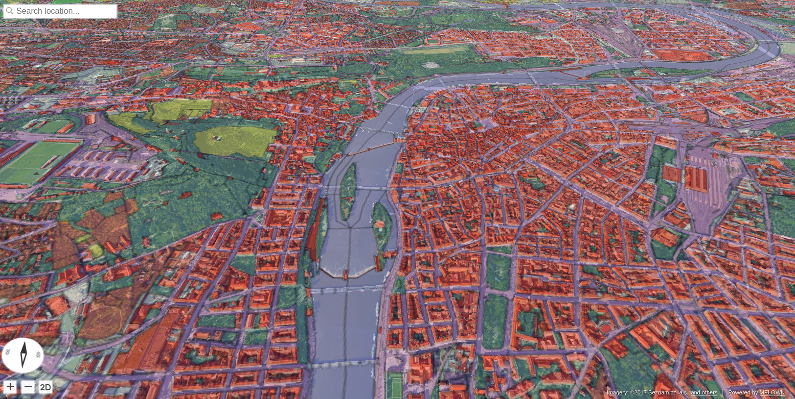

.. _urbanatlas-cities-tutorial:

Displaying Open Landuse map over 3D data
----------------------------------------

In this tutorial we combine 3D data of Czech cities and the Corine Land Cover
/ Open Landuse datasets from the :ref:`corine-example`.

.. note:: Czech Cities 3D is proprietary dataset, provided by `Melown Technologies <https://melown.com>`_. Please contact Melown Technologies in order to get permission for the dataset usage.

Pre-requirements 
^^^^^^^^^^^^^^^^
  
#. This tutorial expects that you have already set up your VTS backend, as
   described in :ref:`setting-vts-backend`.
#. It is assumed, that your Mapproxy resources are set up and that your Mapproxy
   instance is up and running, just as shown in the example :ref:`corine-example`.
#. It is also expected, that you do start with clean VTS installation (the
   Storage is empty).

Filling the storage
^^^^^^^^^^^^^^^^^^^

To work with static True3D data and/or fuse various surfaces together, we must
add them to the storage.  Storage is administered by tool ``vts`` that
takes care of adding tilesets to storage. The :ref:`glue`\s will not be
generated, since we are using just one surface.

Now we are ready to add our cities 3D
tileset as remote tileset to the Storage. The tiles will be eventually
downloaded from URL specified in ``vts --add`` command.

.. code-block:: bash

  vts /var/vts/store/stage.melown2015 --add \
      --tileset http://[SERVER]/store/melown2015/stage/tilesets/melown-cities-cz --bottom

Creating a storage view
"""""""""""""""""""""""

As the final step we need to create a :ref:`storage-view` that
combines tilesets from our storage and free and bound layer from the mapproxy.

Go to ``/var/vts/store/map-config`` directory and create a file ``cities`` with the
following contents.

.. literalinclude:: projects/corine/cities

For commented configuration file, have a look at the :ref:`cadastre-tutorial`
example.

.. code-block:: bash

  cd /var/vts/store/map-config
  vts --map-config cities

If everything is all right, a large JSON with client side map configuration will
be printed.::

        {
            "boundLayers" : 
            {
                "urbanatlas" : "//localhost:3070/melown2015/tms/openlanduse/urbanatlas/boundlayer.json"
            },
            "credits" : 
            {
                "seznamcz" : 
                {
                    "id" : 103,
                    "notice" : "{copy}{Y} Seznam.cz, a.s."
                },
                "topgis" : 
        ...

You may now restart the ``vtsd`` program::

    $ sudo /etc/init.d/vts-backend-vtsd restart

.. figure:: images/urban-atlas-cities.png
  :width: 800px

  Urban atlas layer "draped" over the 3D cities map

.. figure:: images/urban-atlas-cities-2.png
  :width: 800px

  Corine DEM as **Free layer** with texture from Open Landuse service, layed
  over 3D cities with texture - using 50% transparency.

  Corine DEM as **Free layer** with texture from Open Landuse service, layed
  over 3D cities with texture - using 50% transparency.

