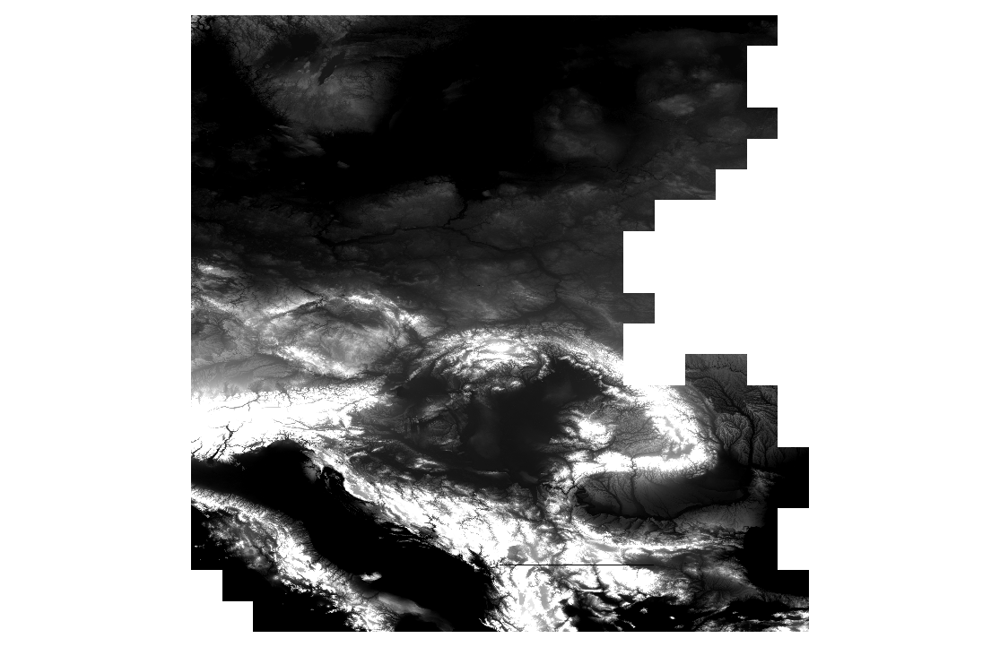
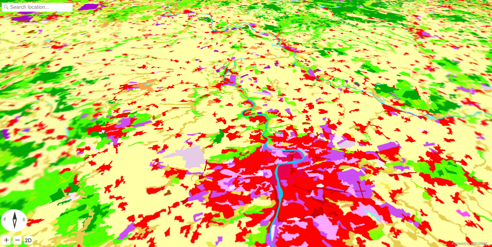

.. index::
    single: Corine
    single: WMS
    single: tutorial
    single: example

.. _corine-example:

Publishing WMS long with Corine digital elevation model
-------------------------------------------------------

In this example, standard cartography map (Urban atlas) is lied over digit
elevation model, for better representation of the data in space.

Preparing workspace
^^^^^^^^^^^^^^^^^^^

First we create project directory::

    mkdir openlanduse

Then, we shell create datasets directory::

    mkdir openlanduse/datasets

Input DEM data
^^^^^^^^^^^^^^
In frame of the `Copernicus programme <http://www.copernicus.eu>`_, `Digital
Elevation Model over Europe (EU-DEM)
<https://www.eea.europa.eu/data-and-maps/data/eu-dem>`_ are published. The
EU-DEM is a 3D raster dataset with elevations captured at 1 arc second postings
(2.78E-4 degrees) or about every 30 metre.

Data can be downloaded from `EU-DEM
<https://www.eea.europa.eu/data-and-maps/data/eu-dem#tab-gis-data>`_ page. In
this example we are going to use again the CEE (central and east Europe)
region:

* eudem_dem_5deg_n40e010.tif
* eudem_dem_5deg_n40e015.tif
* eudem_dem_5deg_n40e020.tif
* eudem_dem_5deg_n40e025.tif
* eudem_dem_5deg_n45e010.tif
* eudem_dem_5deg_n45e015.tif
* eudem_dem_5deg_n45e020.tif
* eudem_dem_5deg_n45e025.tif
* eudem_dem_5deg_n50e010.tif
* eudem_dem_5deg_n50e015.tif
* eudem_dem_5deg_n50e020.tif
* eudem_dem_5deg_n50e025.tif
* eudem_dem_5deg_n55e010.tif
* eudem_dem_5deg_n55e015.tif
* eudem_dem_5deg_n55e020.tif
* eudem_dem_5deg_n55e025.tif

You should download the data you need and save them in the
``openlanduse/datasets/copernicus/rasters`` directory.

Input Open landuse data
^^^^^^^^^^^^^^^^^^^^^^^
`Open Land-Use Map <http://sdi4apps.eu/open_land_use/>`_ is a composite map that
is intended to create detailed
land-use maps of various regions based on certain pan-Europen datasets such as
CORINE Landcover, UrbanAtlas enriched by available regional data.

Data are published as `OGC WMS <http://opengeospatial.org/standards/wms>`_
services.

Setting up DEM dataset
^^^^^^^^^^^^^^^^^^^^^^

First thing you have to do, after downloading the data, is to create virtual
datasource with help of GDAL::

    $ cd openlanduse/datasets/copernicus/rasters
    $ ls 

    eudem_dem_5deg_n40e010.tif  eudem_dem_5deg_n45e020.tif  eudem_dem_5deg_n55e010.tif
    eudem_dem_5deg_n40e015.tif  eudem_dem_5deg_n45e025.tif  eudem_dem_5deg_n55e015.tif
    eudem_dem_5deg_n40e020.tif  eudem_dem_5deg_n50e010.tif  eudem_dem_5deg_n55e020.tif
    eudem_dem_5deg_n40e025.tif  eudem_dem_5deg_n50e015.tif  eudem_dem_5deg_n55e025.tif
    eudem_dem_5deg_n45e010.tif  eudem_dem_5deg_n50e020.tif
    eudem_dem_5deg_n45e015.tif  eudem_dem_5deg_n50e025.tif

Let's create virtual dataset::

    $ gdalbuildvrt eudem_dem.vrt *.tif

And have a look at the data in QGIS

.. note:: In this example, we are going to process major part of Europe. This is
    usually very time and resources demanding operation. For some simple
    project, make sure, your dataset is reasonable big, e.g. just one country.
    For "cutting out" just country borders, use ``gdalwarp``::

        gdalwarp -cutline COUNTRY.shp -crop_to_cutline -dstalpha eudem_dem.vrt eudem_COUNTRY.tiff
    

Next, we have to create virtual overviews::

    $ cd openlanduse/datasets/
    $ mkdir copernicus-dem
    $ generatevrtwo rasters/eudem_dem.tiff copernicus-dem/elev --tileSize 1024x1024 --resampling dem
    $ generatevrtwo rasters/eudem_dem.tiff copernicus-dem/elev.min --tileSize 1024x1024 --resampling min
    $ generatevrtwo rasters/eudem_dem.tiff copernicus-dem/elev.max --tileSize 1024x1024 --resampling max

And as final step, links of names ``dem``, ``dem.min`` and ``dem.max`` have to
be created::

    $ ln -s elev.max/dataset copernicus-dem/dem.max
    $ ln -s elev.min/dataset copernicus-dem/dem.min
    $ ln -s elev/dataset copernicus-dem/dem

And as last preparation step, is to create information about the tiling schema.
For this, first we need to know the tile extend of input dataset::

    $ mapproxy-calipers copernicus-dem/dem melown2015

    2017-08-08 14:43:57 I3 [28036(main)]: [mapproxy-calipers] Config:
        dataset = "/home/jachym/src/melown/projects/openlanduse/datasets/corine/copernicus-dem/dem"
        referenceFrame = melown2015
     {main.cpp:configure():158}
    gsd: 24.8558
    range<pseudomerc>: 7,15 15/8742,5480:9050,5657
    range: 7,15 34,21:35,22
    position: obj,15.474967,49.803826,float,0.000000,0.000000,-90.000000,0.000000,649246.827847,55.000000
    
Now we can run ``mapproxy-tiling`` to calculate the tiling schema for our input
data::

    mapproxy-tiling copernicus-dem --referenceFrame melown2015 --lodRange 7,15 --tileRange 15/8742,5480:9050,5657

.. note:: This step can take very long time, in order to get all the tiles
        calculated.

    
Setting up Urban atlas dataset
^^^^^^^^^^^^^^^^^^^^^^^^^^^^^^

We are going to relay on the OGC WMS, maintained  by `European Environment Agency <https://www.eea.europa.eu/>`_. The service URL is ``http://image.discomap.eea.europa.eu/arcgis/services/Corine/CLC2012/MapServer/WmsServer``. We use `GDAL <http://gdal.org>`_ to generate file needed for MapProxy input::

    $ gdalinfo "WMS:http://image.discomap.eea.europa.eu/arcgis/services/Corine/CLC2012/MapServer/WmsServer"

        Driver: WMS/OGC Web Map Service
        Files: none associated
        Size is 512, 512
        Coordinate System is `'
        Subdatasets:
          SUBDATASET_1_NAME=WMS:http://image.discomap.eea.europa.eu/arcgis/services/Corine/CLC2012/MapServer/WmsServer?SERVICE=WMS&VERSION=1.1.1&REQUEST=GetMap&LAYERS=Corine%20Land%20Cover%202012%20raster&SRS=EPSG:4326&BBOX=-81.765523,-29.197624,94.141697,72.664410
          SUBDATASET_1_DESC=Corine Land Cover 2012 raster
          SUBDATASET_2_NAME=WMS:http://image.discomap.eea.europa.eu/arcgis/services/Corine/CLC2012/MapServer/WmsServer?SERVICE=WMS&VERSION=1.1.1&REQUEST=GetMap&LAYERS=Corine%20Land%20Cover%202012%20vector&SRS=EPSG:4326&BBOX=-81.231079,-29.121654,93.489511,72.123059
          SUBDATASET_2_DESC=Corine Land Cover 2012 vector
        Corner Coordinates:
        Upper Left  (    0.0,    0.0)
        Lower Left  (    0.0,  512.0)
        Upper Right (  512.0,    0.0)
        Lower Right (  512.0,  512.0)
        Center      (  256.0,  256.0)

We can see, there are two subdatasets in the WMS - the ``Corine Land Cover 2012
raster`` and the ``Corine Land Cover 2012 vector``. Raster layer is used until
some scale level, then vectors are used, therefore we need to generate XML,
which will contain both subdatasets. We will take the first one as base for our
XML template file::

    $ gdal_translate -of WMS "WMS:http://image.discomap.eea.europa.eu/arcgis/services/Corine/CLC2012/MapServer/WmsServer?SERVICE=WMS&VERSION=1.1.1&REQUEST=GetMap&LAYERS=Corine%20Land%20Cover%202012%20vector&SRS=EPSG:4326&BBOX=-81.231079,-29.121654,93.489511,72.123059" corine-landcover.xml

In the file :download:`projects/corine/corine-landcover.xml`, only the ``Corine
Land Cover 2012 vector`` is stored. Let's open it with text editor and add the
``raster`` layer too, the result should look similar to this

.. literalinclude:: projects/corine/corine-landcover.xml
    :linenos:
    :lineno-start: 4
    :lines: 4-6

Note the ``<Layer>`` element, where both ``raster`` and ``vector`` layers are
listed.

Having the file at your hand, we can finally configure our datasets.

Configuring Open landuse layer
^^^^^^^^^^^^^^^^^^^^^^^^^^^^^^
The same approach we shall use for the Open Landuse layer, the input URL is
http://gis.lesprojekt.cz/cgi-bin/mapserv?map=/home/dima/maps/olu/european_openlandusemap.map
(provided by `SDI4Apps <http://sdi4apps.eu/>`_ project. The final XML can be
downloaded :download:`projects/corine/openlanduse.xml`.

Configuring resources
^^^^^^^^^^^^^^^^^^^^^

We can now create the ``resources.json`` file, containing DEM and cover Corine
Land Cover datasets. The file :download:`projects/corine/resources.json` should
be stored in ``openlanduse/`` directory:

.. literalinclude:: projects/corine/resources.json

Don't forget to use ``mapproxy-calipers`` to obtain tile ranges.

Configuring mapproxy
^^^^^^^^^^^^^^^^^^^^

For Mapproxy we use the same configuration file, we did in previous examples.
The configuration file should be stored in ``openlanduse/`` directory too:
:download:`projects/corine/mapproxy.cfg`

.. literalinclude:: projects/corine/mapproxy.cfg

Running Mapproxy
^^^^^^^^^^^^^^^^
Mapproxy can be run using::

    $ mapproxy --config mapproxy.cfg

And we should obtain result similar to the picture, at http://localhost:3070/melown2015/surface/openlanduse/dem/

Next steps
^^^^^^^^^^
Next we create :ref:`corine-javascript` html page, in the frontend tutorials
section.
