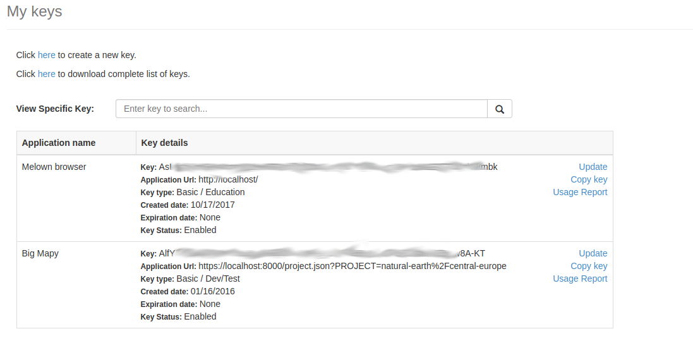
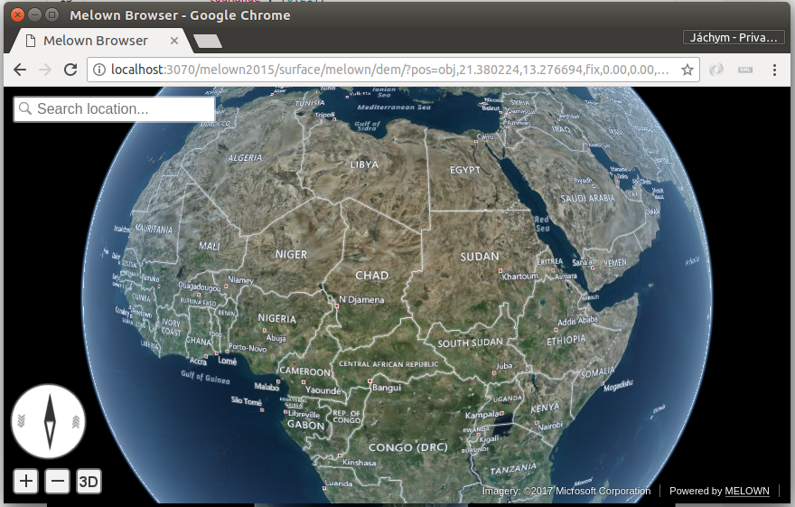
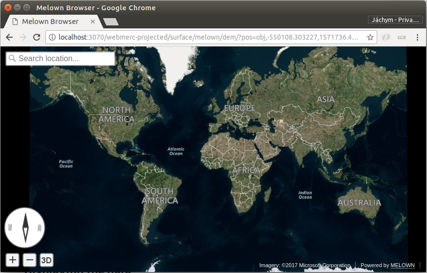

.. index::
    single: Bing

.. _bing-maps-tms:

Displaying Bing Map layers
--------------------------

`Microsoft Bing Maps <https://www.bing.com/maps>`_ is popular web mapping applications, which `license is less restrictive <https://www.microsoft.com/en-us/maps/licensing>`_ when
compared to other services. Therefore it can be used in VTS 3D
visualisation chain as one of the :ref:`bound-layer`\s.

Setting up mapproxy resources
^^^^^^^^^^^^^^^^^^^^^^^^^^^^^
:ref:`mapproxy` has support for `tms-bing <https://github.com/Melown/vts-mapproxy/blob/master/docs/resources.md#tms-bing>`_
driver. It will be configured as standard :ref:`bound-layer` for
:ref:`mapproxy`. Therefore we need to know following inputs, before we
start:

    * Metadata URL - the Bing REST Api url
    * Bing Secret key - your unique key to Microsoft services
    * Reference frame definition - the ``lodRange`` and ``tileRange``
    * Other metadata, like ``credits`` definition etc.

Before you start, it might be worth to `check Bing Maps documentation
<https://msdn.microsoft.com/en-us/library/dd877180.aspx>`_.

Bing secret key
^^^^^^^^^^^^^^^
As first step, you need a `Bing Maps key
<https://www.microsoft.com/en-us/maps/create-a-bing-maps-key>`_. For this, you
have to visit Microsoft admin interface and let the key generate there.

You should have some ling alpha-numeric chain (we will refer to it as
``SECRET_KEY``) which is needed to further configuration.

Metata URL
^^^^^^^^^^
Layer metadata URL is all the time the same and has following format (check `the
documentation <https://msdn.microsoft.com/en-us/library/ff701716.aspx>`_).::

    https://dev.virtualearth.net/REST/v1/Imagery/Metadata/[IMAGERY_SET]?key=[SECRET_KEY]

There is `a list of availabe imagery sets <https://msdn.microsoft.com/en-us/library/ff701716.aspx>`_

* Aerial
* AerialWithLabels
* AerialWithLabelsOnDemand
* CanvasDark
* CanvasLight
* CanvasGray
* Road
* RoadOnDemand

Reference frame definition
^^^^^^^^^^^^^^^^^^^^^^^^^^
We are going to present two reference frame configurations:

* the ``melown2015``, which covers not only the Earth from Equator to cca 85° on
  the North and South, but also the polar caps. Since Bing maps do have
  generated tiles from zoom level 1 (when compared to e.g. Google, which starts
  with 0), the ``lodRange`` is to be defined between ``2 - 21``.

* the ``webmerc-projected``, which shows the "flat" map (famous
  Google-Mercator projection). In this case, the LOD range is set between
  ``[0, 21]``

Credits
^^^^^^^
We may also display the copyright notice of the Bing Maps. This is defined by
simple notice ``{copy}{Y} Microsoft Corporation``.

Creating Bound layer configuration snippet
^^^^^^^^^^^^^^^^^^^^^^^^^^^^^^^^^^^^^^^^^^

Putting this all together, we can now approach the Bing map bound layer
configuration part.

.. literalinclude:: projects/bing/resources.json
   :lines: 2-27
   :language: javascript
   :linenos:

Displaying the data
^^^^^^^^^^^^^^^^^^^
We need to define at least one "empty" `spheroid-dem <https://github.com/Melown/vts-mapproxy/blob/master/docs/resources.md#surface-spheroid>`_ type of ``surface`` layer,
with our ``bing`` layer in it's definition.

.. literalinclude:: projects/bing/resources.json
   :lines: 28-53
   :language: javascript
   :linenos:

When running :ref:`mapproxy` with the :download:`projects/bing/resources.json` (e.g. using :ref:`docker-container`), you should see a globe with Bing maps on it.

    The Bing ``AerialWithLabels`` layer on the spheroid using ``melown2015``
    reference frame.

    The Bing ``AerialWithLabels`` layer in the web-mercator projection, using
    the ``webmerc-projected`` reference frame.

.. 
  Integration with the WMTS example
  ^^^^^^^^^^^^^^^^^^^^^^^^^^^^^^^^^
  We can now put this for example in to our :ref:`wmts-app` tutorial and add the
  ``bing-world`` to list of ``tms`` layers of the configured digital elevation
  model.::

                  ...
                  "tms": [
                    { "group": "ophoto", "id": "bing-world" },
                    { "group": "ophoto", "id": "czech-ophoto" },
                    { "group": "ophoto", "id": "austria-ophoto" }
                  ],
                  ...

  As result, we can see Bing aerial map as background layer of Czech and Austrian
  ortophoto images.

  .. figure:: images/bing-wmts.png

  You can see the combination of all three layers in one mash.

