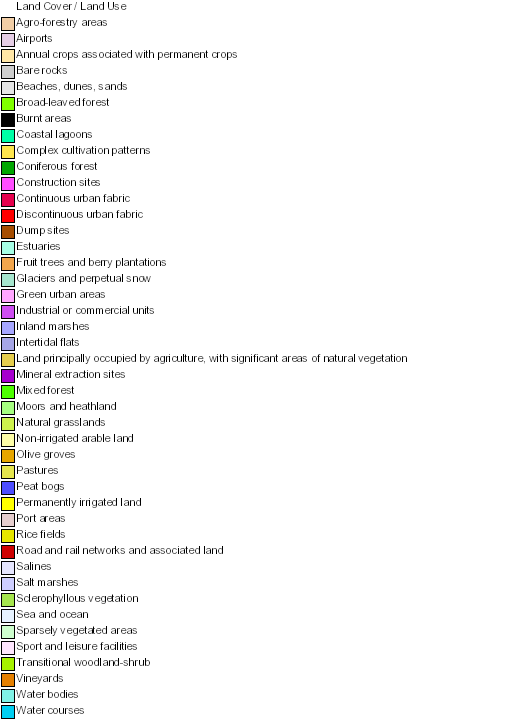
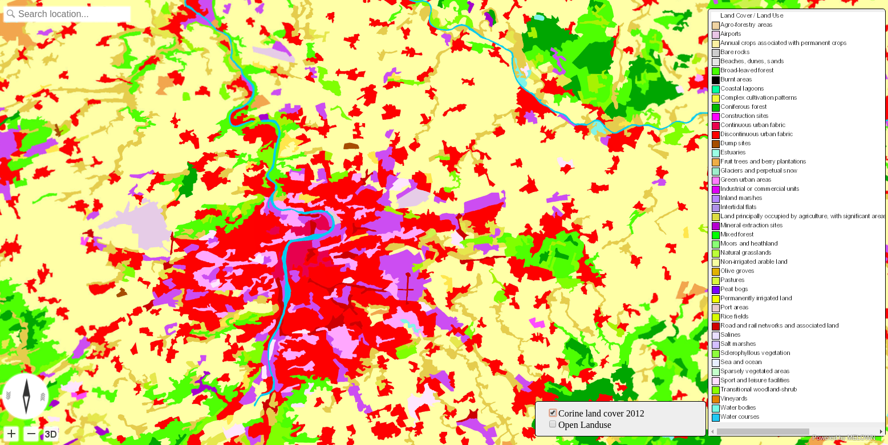
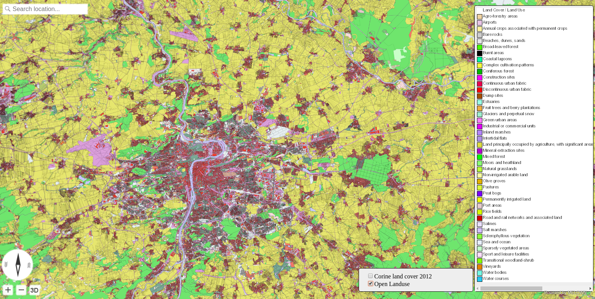

.. index::
    single: Corine

.. _corine-javascript:

===============================
Corine land cover frontend side
===============================

In this example, we are going to create front-end JavaScript app using the
:ref:`corine-example`. We are going to enrich the map with legend and a control
element to switch the two landuse layers.

HTML Page
---------

We need simple HTML web page with JavaScript included and ``
`` element for
the map.

.. literalinclude:: srcs/corine.html
   :lines: 7-9
   :language: html
   :linenos:

We also add some CSS sugar, for styling the layerswitcher, panel and legend div:

.. literalinclude:: srcs/corine.html
   :lines: 10-36
   :language: css
   :linenos:

At the end of the file, we add the legend ``div``

.. literalinclude:: srcs/corine.html
   :lines: 42-44
   :language: css
   :linenos:

Legend image
------------
You may know, that the `OGC WMS <http://opengeospatial.org/standards/wms>`_
supports ``GetLegendGraphic`` type of request. The legend image can be obtained
using following URL:  http://image.discomap.eea.europa.eu/arcgis/services/Corine/CLC2012/MapServer/WmsServer?request=GetLegendGraphic&version=1.3.0&format=image/png&layer=Corine%20Land%20Cover%202012%20raster

    
JavaScript code
---------------

The code is straightforward and can be downloaded from
:download:`srcs/corine.js`, you have to initialize the browser with two
parameters: 

#. Target ``
`` element ID
#. Map configuration JSON file

.. literalinclude:: srcs/corine.js
    :lines: 75-88

In the initializing function, ``addControl()`` function is called to create the layerswitcher panel in the map:

.. literalinclude:: srcs/corine.js
    :lines: 61-73

.. literalinclude:: srcs/corine.js
    :lines: 42-58

Once you open the app in the web browser, it should look like the following screenshots:

