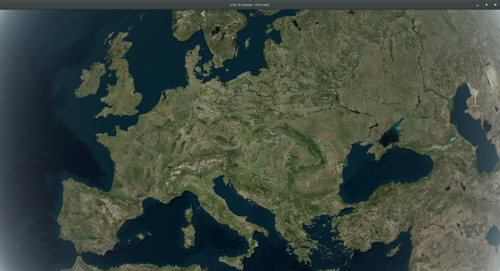

.. _vtsfrontend-cpp:

Introduction to VTS-Browser-CPP
-------------------------------

This guide shows how to build a simple C++ front-end application build on VTS.

  What we should have in the end.

The application will create a window and show a single map configuration.
You may navigate on the map with mouse.

This tutorial uses source code from `vts-browser-minimal <https://github.com/melowntech/vts-browser-cpp/wiki/examples-minimal>`_ example,
which is part of the git repository.

Dependencies
^^^^^^^^^^^^

VTS Browser
"""""""""""

The library is available as a package on some popular linux distributions.
Instructions to add the source-lists are at `OSS <https://cdn.melown.com/packages/>`_.
After that, install the developer files for the library and optionally the debug symbols.

.. code-block:: sh

  apt install libvts-browser-dev libvts-browser-dbg

If the package is not available for your distribution, you may build the library from source code.
See `Building <https://github.com/melowntech/vts-browser-cpp/blob/master/BUILDING.md>`_ for more information.
After that just install the library locally.

.. code-block:: sh

  sudo cmake --build . --target install

Source code for the library is available at `GitHub <https://github.com/melowntech/vts-browser-cpp>`_.

SDL
"""

SDL is portable library for window creation, OpenGL context creation and event handling.

For instructions on installation see `SDL <https://libsdl.org>`_.

.. note::
  We use SDL in this example to keep it simple.
  However, you are free to use the browser library with any OpenGL context, no matter where you get it.

Cmake
"""""

Cmake is platform-independent project configuration tool that generates platform (or IDE) specific project files.

For installation instructions see `Cmake <https://cmake.org>`_.

Building
^^^^^^^^

First, we write a simple cmake script called *CMakeLists.txt*.
It will search for the actual paths to all the required libraries.
Next it specifies to build an executable program called *vts-example*.
The program uses single source file called *main.cpp* and is linked with all the libraries.

*CMakeLists.txt*:

.. literalinclude:: srcs/frontend-cpp/CMakeLists.txt
   :language: cmake

You may download the file: :download:`srcs/frontend-cpp/CMakeLists.txt`.

Next, let cmake generate the platform specific build files (usually a makefile on linux).
This step is only done once.

Moreover, we do not want to clutter the directory with numerous temporary files,
therefore, we instruct cmake to build in a separate directory.

.. code-block:: sh

  mkdir build
  cd build
  cmake ..

After that, just call the following command every time you want to rebuild the application (from inside the *build* directory).

.. code:: sh

  cmake --build .

This cmake call will use the generated build files.
Alternatively, you may use them directly.

Source Code
^^^^^^^^^^^

*main.cpp*:

.. literalinclude:: srcs/frontend-cpp/main.cpp
   :language: c++
   :lines: 26-

You may download the source: :download:`srcs/frontend-cpp/main.cpp`.

Conclusion
^^^^^^^^^^

Complete documentation for the browser library is at `wiki <https://github.com/melowntech/vts-browser-cpp/wiki>`_.

