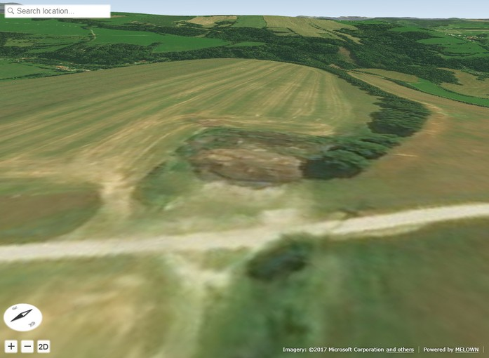

VTS Browser JS - Importing OBJ Models
=====================================

This tutorial provides a step by step guide how to import and visualize
sample OBJ models with `VTS Browser
JS <https://github.com/Melown/vts-browser-js>`__.

In detail we'll take a look how to display the VTS browser on a webpage. Next
we'll load some OBJ data and display them.

You can find the code and a `live demo <https://jsfiddle.net/uLqyjpu0/>`__ of
this tutorial on JSFiddle.

OBJ File format
~~~~~~~~~~~~~~~
OBJ (or .OBJ) is a geometry definition file format first developed by Wavefront
Technologies for its Advanced Visualizer animation package. The file format is
open and has been adopted by other 3D graphics application vendors. More about
obj file format can be found `here <http://geojson.org/>`__.

We have tested our importer on the models exported from `Blender <https://www.blender.org/>`__ 
and `SketchUp <https://www.sketchup.com/>`__. You should get good results with these programs.
Keep in mind that models should be exported with triangulated polygons and in case you are using
double side materials enable this option in your exporter (e.g. SketchUp).

VTS Browser JS
~~~~~~~~~~~~~~

In case you already know to display map with VTS Browser JS you can skip flowing
lines and continue with the `OBJ part <#importing-obj-files>`__ of the code.

The VTS Browser JS is a JavaScript WebGL rendering engine used and
developed by `Melown Technologies SE <http://melown.com>`__ as part of
the VTS 3D Technology Stack.

Embedding the browser
~~~~~~~~~~~~~~~~~~~~~~

To embed the VTS Browser into a webpage, add the necessary CSS and
JavaScript resources and create a ``div`` with an id like ``map-div``.

.. code:: html

    <!DOCTYPE html>
    <html lang="en">
      <head>
          <link rel="stylesheet" href="https://cdn.melown.com/libs/vtsjs/browser/v2/vts-browser.min.css"/>
          
      </head>
      <body>
         

         
      </body>
    </html>

Now that we've prepared our HTML structure we can add some JavaScript
code to make the browser run.

.. code:: javascript

    var browser = null;
    var renderer = null;
    var map = null;

    function startDemo() {
        browser = vts.browser('map-div', {
            map: 'https://cdn.melown.com/mario/store/melown2015/map-config/melown/VTS-Tutorial-map/mapConfig.json',
            position : [ 'obj', 15.3775623,50.675077, 'float', 0.00, -231.22, -25.55, 0.00, 101.83, 55.00 ]
        });

        //check whether browser is supported
        if (!browser) {
            console.log('Your web browser does not support WebGL');
            return;
        }

        //callback once is map config loaded
        browser.on('map-loaded', onMapLoaded);
    }

    function onMapLoaded() {
      // obj loading here
    }

    startDemo();

We created a map in place of the ``map-div`` and set the ``map`` parameter
to point to a map configuration we prepared in Melown Cloud for this purpose.
You can create your own map in `Melown Cloud <https://www.melown.com/cloud>`__. We set the
`position <https://github.com/Melown/vts-browser-js/wiki/VTS-Browser-Map-API#position>`__
to some nice place in the countryside. You can discover more about
browser configuration parameters in
`documentation <https://github.com/Melown/vts-browser-js/wiki/VTS-Browser-API#options>`__.

Once the map loads we can start with
importing a OBJ files. We achieve this by using the callback function
``onMapLoaded`` and registering it to listen for the ``map-loaded`` event.
You should now see the following:

   Initial image

Importing OBJ files
~~~~~~~~~~~~~~~~~~~

You need modelObj.js library for importing OBJ files. This library is part of the VTS Browser JS demos.

.. code:: html

    

Let's assume we have one OBJ file containing house and one OBJ file containing car. We place
following lines in the onMapLoaded function.

.. code:: javascript

    map = browser.map;   
    renderer = browser.renderer;

    carModel = new ModelOBJ(map, renderer, { path:'https://raw.githubusercontent.com/Melown/vts-browser-js/master/demos/meshes-obj-import/models/car-alpine/alpine.obj' });   
    houseModel = new ModelOBJ(map, renderer, { path:'https://raw.githubusercontent.com/Melown/vts-browser-js/master/demos/meshes-obj-import/models/modern-house/house.obj' });   

The map, renderer, carModel, houseModel are global variables, sow we can use them later.
The ModelOBJ(map, renderer, options) object loads OBJ file from provided ``path`` parameter.
There are other supported parameters:

=================  ===========  ================================
 Parameter          Default           Description
=================  ===========  ================================
optimize           true         Sets whether meshes with the same material are rendered together
\                               for better performance
textureFilter      trilinear    Sets filter used for textures. Defaul value is ``trilinear``.
\                               Other possible values are: ``linear``, ``nearest``.
fastTessellation   false        This option can be enabled when you are sure, that model contains
\                               only convex polygons with maximum number of 4 vertices. 
onLoaded           null         Callback when model is loaded. 
=================  ===========  ================================
   
   
How to setup rendering callback
~~~~~~~~~~~~~~~~~~~~~~~~~~~~~~~
   
We have to setup rendering callback for rendering custom models into the map. For that case we add following lines into the onMapLoaded function.

.. code:: javascript

        map.addRenderSlot('custom-models', onDrawModels, true);
        map.moveRenderSlotAfter('after-map-render', 'custom-models');

First line adds new render slot with ``custom-models`` id which will call onDrawModels function when rendering the map.
The second line tells that ``custom-models`` callback will be called after the map is rendered. You can read more
about render slots in the `documentation <https://github.com/Melown/vts-browser-js/wiki/VTS-Browser-Map-API#render-slots-methods>`__.
       
Rendering model
~~~~~~~~~~~~~~~

Rendering models is easy. Just add these line to the onDrawModels function:

.. code:: javascript

    function onDrawModels(renderChannel) {
        if (renderChannel != 'base') {
            return; //draw only in base channel
        }

        //draw models when all model resources are ready
        if (houseModel && houseModel.ready) {
            houseModel.draw({
                navCoords: [15.3772953, 50.6752052, 13.5],
                heightMode: 'float',
                rotation: [0,0,0],
                scale: [0.001, 0.001, 0.001],
                ambientLight: [90,90,90]

                //other possible value are:
                //depthOffset: [-50,0,0]   //when you need some zbuffer tolerance
                                           // you will probably only need to change first
                                           // value in the array
                //depthOnly: true          //for hit test implementation
            });
        }   

        if (carModel && carModel.ready) {
            carModel.draw({
                navCoords: [15.3771059, 50.6752981, 12.5],
                heightMode: 'float',
                rotation: [0,0,0],
                scale: [1, 1, 1],
                ambientLight: [90,90,90]
            });
        }   
    }

First lines check whether we are rendering ``base`` channel. The ``base`` channel means that we are
rendering color channel. There can be other channels like ``depth`` so we have to check that we are
rendering in to the right channel. Next line is testing that houseModel exists and whether it is ready
(all textures are loaded). When conditions are met, we draw the model. The draw function can have following parameters:
 
=================  ===========  ================================
 Parameter          Default           Description
=================  ===========  ================================
navCoords          null         world coorinates + height of model origin, 
\                               in most cases [long, lat, height]
heightMode         float        heigth mode, posible values are 'float' (height above terrain),
\                               'fix' (absolute height)
rotation           [0,0,0]      euler angles [yaw, pitch, roll] about model origin
\                               
scale              [1,1,1]      [scaleX, scaleY, scaleZ]
\
ambientLight       [90,90,90]   ambient light color [red, green, blue]
\
depthOnly          false        for the hit test implementation, when the 'depth' channel is
\                               rendered
depthOffset        [0,0,0]      [globalFactor, distanceFactor, tiltFactor] when you need some
\                               zbuffer tolerance, you will probably only need to change first
\								value in the array
=================  ===========  ================================

Note that you can change the model position, rotation and scale in every rendered frame, so you can also animate
models as you like.
				  
That's it for now, you've made it to the end :)

.. figure:: ./images/importobj-result.jpg
   :alt: Resulting map

   The resulting map.

You can check live demo on `JSFiddle <https://jsfiddle.net/uLqyjpu0/>`__.

