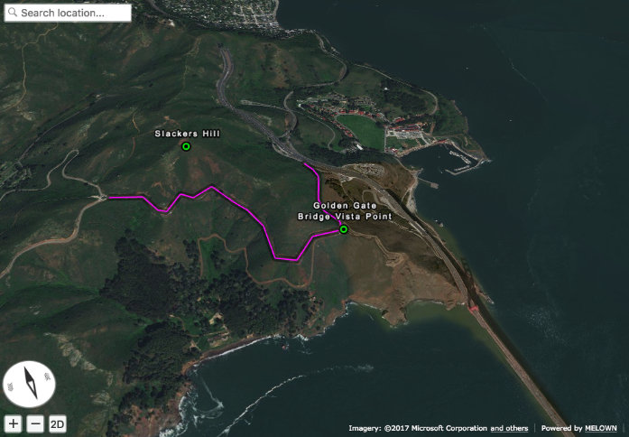

Importing GeoJSON with VTS Browser JS - Part II
===============================================

This tutorial shows how to import and visualize remote GeoJSON data
and how to programmatically modify geodata with Melown `VTS Browser
JS <https://github.com/Melown/vts-browser-js>`__.

This is the second part of our tutorial series about GeoJSON. At this
point you should be familiar with displaying GeoJSON data and applying basic
styling to them. If not, maybe you missed our `first
tutorial <//vtsdocs.melown.com/en/latest/tutorials/geojson.html>`__. We
highly recommend checking it out first, since this tutorial builds
on top of what we did previously.

You can find the code and a `live demo <https://jsfiddle.net/hd6k7q0f/>`__ of
this tutorial on JSFiddle.

Loading data from URL
~~~~~~~~~~~~~~~~~~~~~

Let's start with a reminder of the JavaScript code from the previous tutorial.

.. code:: javascript

    var browser = null;
    var renderer = null;
    var map = null;
    var geodata = null;
    var geojson = {
        "type": "FeatureCollection",
        "features": [
            {
                "type": "Feature",
                "geometry": {
                    "type": "Point",
                    "coordinates": [-122.48347, 37.82955],
                },
                "properties": {
                    "title": "Golden Gate Bridge Vista Point",
                }
            },
            {
                "type": "Feature",
                "properties": {},
                "geometry": {
                    "type": "LineString",
                    "coordinates": [
                        [-122.48369693756, 37.83381888486],
                        [-122.48344236083, 37.83317489144],
                        [-122.48335253015, 37.83270036637],
                        [-122.48361819152, 37.83205636317],
                        [-122.48404026031, 37.83114119107],
                        [-122.48404026031, 37.83049717427],
                        [-122.48348236083, 37.82992094395],
                        [-122.48356819152, 37.82954808664],
                        [-122.48507022857, 37.82944639795],
                        [-122.48610019683, 37.82880236636],
                        [-122.48695850372, 37.82931081282],
                        [-122.48700141906, 37.83080223556],
                        [-122.48751640319, 37.83168351665],
                        [-122.48803138732, 37.83215804826],
                        [-122.48888969421, 37.83297152392],
                        [-122.48987674713, 37.83263257682],
                        [-122.49043464660, 37.83293762928],
                        [-122.49125003814, 37.83242920781],
                        [-122.49163627624, 37.83256478721],
                        [-122.49223709106, 37.83337825839],
                        [-122.49378204345, 37.83368330777]
                    ]
                }
            }
        ]
    }

    function startDemo() {

        browser = vts.browser('map-div', {
            map: 'https://cdn.melown.com/mario/store/melown2015/map-config/melown/VTS-Tutorial-map/mapConfig.json',
            position : [ 'obj', -122.48443455025, 37.83071587047, 'float', 0.00, 19.04, -49.56, 0.00, 1946.45, 55.00 ]
        });

        if (!browser) {
            console.log('Your web browser does not support WebGL');
            return;
        }
        browser.on('map-loaded', onMapLoaded);
    }

    function onMapLoaded() {
        map = browser.map;
        geodata = map.createGeodata();
        geodata.importGeoJson(geojson);
        geodata.processHeights('node-by-precision', 62, onHeightsProcessed);
    }

    function onHeightsProcessed() {
        var style = {
            'constants': {
                '@icon-marker': ['icons', 6, 8, 18, 18]
            },

            'bitmaps': {
                'icons': 'http://maps.google.com/mapfiles/kml/shapes/placemark_circle.png'
            },

            "layers" : {
                "track-line" : {
                    "filter" : ["==", "#type", "line"],
                    "line": true,
                    "line-width" : 4,
                    "line-color": [255,0,255,255],
                    "zbuffer-offset" : [-0.5,0,0],
                    "z-index" : -1
                },

                "track-shadow" : {
                    "filter" : ["==", "#type", "line"],
                    "line": true,
                    "line-width" : 20,
                    "line-color": [0,0,0,120],
                    "zbuffer-offset" : [-0.5,0,0],
                    "hover-event" : true,
                    "advanced-hit" : true
                },

                "place" : {
                    "filter" : [ "==", "#type", "point"],
                    'icon': true,
                    'icon-source': '@icon-marker',
                    'icon-color': [0,255,0,255],
                    'icon-scale': 2,
                    'icon-origin': 'center-center',

                    "label": true,
                    "label-size": 19,
                    "label-source": "$title",
                    "label-offset": [0,-20],

                    "zbuffer-offset" : [-1,0,0]
                }
            }
        };
        var freeLayer = geodata.makeFreeLayer(style);
        map.addFreeLayer('geodatatest', freeLayer);
        var view = map.getView();
        view.freeLayers.geodatatest = {};
        map.setView(view);
    }

    startDemo();

To fetch a GeoJSON we need to edit the function ``onMapLoaded``.

.. code:: javascript

    function onMapLoaded() {
        map = browser.map;
        vts.utils.loadJSON('https://raw.githubusercontent.com/Melown/vts-browser-js/master/demos/geodata-geojson-import-from-url/jotunheimen_track.json', geoJsonLoaded);
    }

Our VTS stack comes with the utility function ``vts.utils.loadJSON()`` to
help you downloading a JSON. However, if you favor other ways of fetching the data there
is nothing stopping you.

.. code:: javascript

    function geoJsonLoaded(data) {
        geodata = map.createGeodata();
        geodata.importGeoJson(data);
        geodata.processHeights('node-by-precision', 62, onHeightProcessed);
    }

In the body of ``geoJsonLoaded()`` we can handle the received GeoJSON like
we did previously in ``onMapLoaded()``.

Extending existing data
~~~~~~~~~~~~~~~~~~~~~~~

VTS Browser provides an API to extend existing
`geodata <https://github.com/Melown/vts-browser-js/wiki/VTS-Browser-Map-API#geodata-creation>`__.
We'll demonstrate this by adding a new point and a line segment to our
data. Let's start with a point.

For this purpose,
`geodata <https://github.com/Melown/vts-browser-js/wiki/VTS-Browser-Map-API#geodata-creation>`__
provides the methods ``addPoint`` and ``addPointArray``, in case we want to add
multiple points at once. You can check the
`documentation <https://github.com/Melown/vts-browser-js/wiki/VTS-Browser-Map-API#geodata-methods>`__
to discover more.

.. code:: javascript

    geodata.addPoint(
        [-122.489622, 37.834831],
        'float',
        { title: 'Slackers Hill'},
        'hill-top'
    );

Here we defined a new point. The first argument is an array with point
coordinates. The third coordinate is assumed to be 0 if not specified.
The second argument corresponds to the height mode. We used height
mode ``float`` because we need the point to lie on the terrain. The third
argument represents properties. We use this to specify a title for our
new location. The last argument represents an id which we'll use to tell
the points appart. We add this snippet to
``geoJsonLoaded()`` function right after
``geodata.importGeoJson(data);``.

   Newly added point

Next we'll style the added point to distinguish it visually from other
points. Add the following new layer into ``style.layers``, right after
``place``.

.. code:: javascript

    'place-hill': {
        'inherit': 'place',
        'filter': ['all', ['==', '#type', 'point'], ['==', '#id', 'hill-top']],
        'icon-color': [255,0,0,255]
	}

In this case we use layer style inheritance. You can imagine that inheritance will copy all properties from defined layer style and these properties can be overwritten by newly defined properties. This is very useful when you want share properties for other style layer and define only those properties which differ. In this case we changed only ``filter`` and ``icon-color`` properties.
Notice that we filtered the new point via it's *type* and *id*. We have to also change filter in previously defined ``place`` layer style, because we have to prevent of rendering hill point twice.

.. code:: javascript

    "place" : {
        'filter' : ["all", ["==", "#type", "point"], ['!=', '#id', 'hill-top']],

		
.. figure:: ./geojson-part2-point-red.jpg
   :alt: Point with changed style

   Point with changed style

Adding line segment
~~~~~~~~~~~~~~~~~~~

As a next step we'll add a line segment via geodata API. We'll take
advantage of
``geodata.addLineString(coordinates, heightMode, properties, id)``.

.. code:: javascript

    geodata.addLineString([
        [-122.4937820, 37.833683],
        [-122.4944297, 37.834708],
        [-122.4936731, 37.835305],
        [-122.4929758, 37.835301],
        [-122.4924928, 37.835568],
        [-122.4922194, 37.836521],
        [-122.4915058, 37.836657],
        [-122.4910178, 37.836568],
        [-122.4905939, 37.836381],
        [-122.4898000, 37.836131],
        [-122.4894192, 37.835674],
        [-122.489622,  37.834831]
    ], 'float', null, 'track-to-hill');

We added a track up to Slacker Hill. Next we'll make it red again. You
should at this point have an idea how to achieve it yourself.

.. code:: javascript

    "track-line" : {
        "filter" : ['all', ['==', '#type', 'line'], ["!=", "#id", "track-to-hill"]],
        "line": true,
        "line-width" : 4,
        "line-color": [255,0,255,255],
        "zbuffer-offset" : [-0.5,0,0],
        "z-index" : -1
    },

    "track-extension" : {
        "filter" : ['all', ['==', '#type', 'line'], ["==", "#id", "track-to-hill"]],
        "line": true,
        "line-width" : 4,
        "line-color": [255,0,0,255],
        "zbuffer-offset" : [-0.5,0,0],
        "z-index" : -1
    }

We again refactored the previous layer style ``track-line`` to omit rendering of the newly added track on it's own. Then we added a new layer style ``track-extension`` for the newly added line segment.

   Added track

That's it, you've made it to the end again! You've learned how to
fetch a GeoJSON from a URL, add new points, lines and how to style them.

If you'd like to practice more, try to add a blue track descending from
Slackers Hill to the original track's start. You can obtain the track
coordinates
`here <https://mapy.cz/zakladni?vlastni-body&x=-122.4851648&y=37.8360597&z=16&ut=Nov%C3%BD%20bod&ut=Nov%C3%BD%20bod&ut=Nov%C3%BD%20bod&ut=Nov%C3%BD%20bod&ut=Nov%C3%BD%20bod&ut=Nov%C3%BD%20bod&ut=Nov%C3%BD%20bod&ut=Nov%C3%BD%20bod&ut=Nov%C3%BD%20bod&ut=Nov%C3%BD%20bod&ut=Nov%C3%BD%20bod&ut=Nov%C3%BD%20bod&ut=Nov%C3%BD%20bod&ut=Nov%C3%BD%20bod&ut=Nov%C3%BD%20bod&ut=Nov%C3%BD%20bod&ut=Nov%C3%BD%20bod&ut=Nov%C3%BD%20bod&ut=Nov%C3%BD%20bod&ut=Nov%C3%BD%20bod&ut=Nov%C3%BD%20bod&ut=Nov%C3%BD%20bod&ut=Nov%C3%BD%20bod&ut=Nov%C3%BD%20bod&ut=Nov%C3%BD%20bod&ut=Nov%C3%BD%20bod&ut=Nov%C3%BD%20bod&ut=Nov%C3%BD%20bod&ut=Nov%C3%BD%20bod&ut=Nov%C3%BD%20bod&ut=Nov%C3%BD%20bod&uc=oc3YzwTMRj6GWsIXXgfjdWnF0KCPjVIKjXrNN-0SGSWTGM1SJQNPNO2O8LL6dg62QJB2QQHENXGeR8FFUQGVQgB7GgDyQ1flaQQfeXgQ9fYmIngNjSDFAJxUoTnH3X8fh0MQSWQN0P&ud=Slacker%20Trail&ud=Slacker%20Trail&ud=Slacker%20Trail&ud=Slacker%20Trail&ud=Coastal%20Trail&ud=Coastal%20Trail&ud=Coastal%20Trail&ud=Coastal%20Trail&ud=Coastal%20Trail&ud=Coastal%20Trail&ud=Coastal%20Trail&ud=Coastal%20Trail&ud=Coastal%20Trail&ud=Coastal%20Trail&ud=Coastal%20Trail&ud=Coastal%20Trail&ud=Coastal%20Trail&ud=Coastal%20Trail&ud=Coastal%20Trail&ud=Coastal%20Trail&ud=Coastal%20Trail&ud=Coastal%20Trail&ud=Coastal%20Trail&ud=Coastal%20Trail&ud=Coastal%20Trail&ud=Coastal%20Trail&ud=Coastal%20Trail&ud=Coastal%20Trail&ud=Coastal%20Trail&ud=Coastal%20Trail&ud=Coastal%20Trail>`__.
