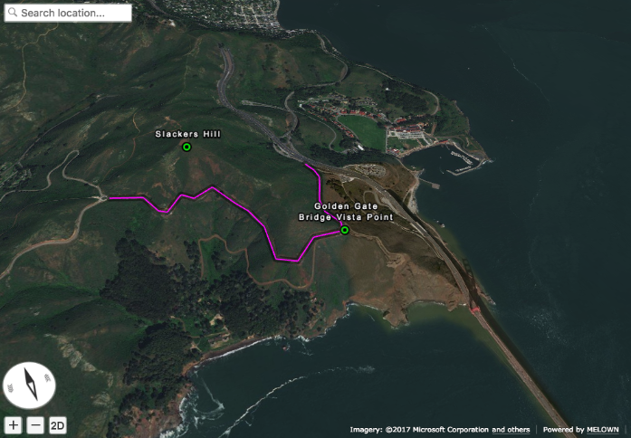
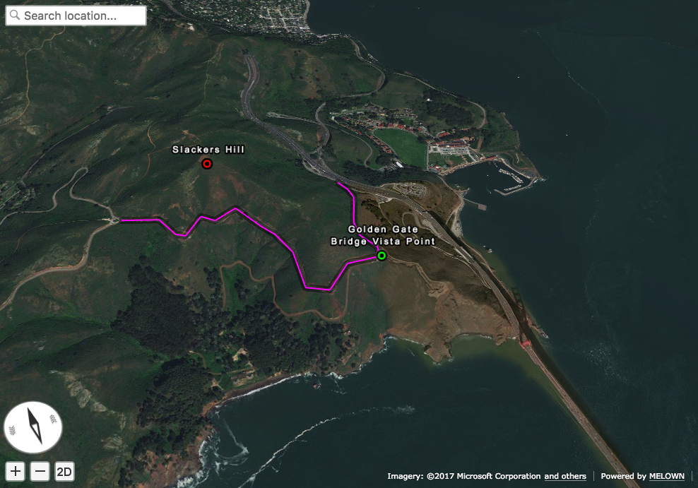

Import GeoJSON with Melown VTS Browser JS - Part II
===================================================

This tutorial showcases how to import and visualize GeoJSON data via url
and how to modify it programmatically afterwards.

This is the second part of our tutorial series about GeoJSON. At this
point you should be familiar how to display and apply basic styling to
GeoJSON data. If not maybe you missed our `first
tutorial <//vtsdocs.melown.com/en/latest/tutorials/geojson.html>`__. We
highly recommend to check it out first since current tutorial will build
on top of what we did previously.

Loading data via URL
~~~~~~~~~~~~~~~~~~~~

Let's start with reminder of the javascript code from previous tutorial.

.. code:: javascript

    var browser = null;
    var renderer = null;
    var map = null;
    var geodata = null;
    var geojson = { ... };

    function startDemo() {

        browser = vts.browser('map-div', {
            map: 'https://cdn.melown.com/mario/store/melown2015/map-config/melown/VTS-Tutorial-map/mapConfig.json',
            position : [ 'obj', -122.48443455025, 37.83071587047, 'float', 0.00, 19.04, -49.56, 0.00, 1946.45, 55.00 ]
        });

        if (!browser) {
            console.log('Your web browser does not support WebGL');
            return;
        }
        browser.on('map-loaded', onMapLoaded);
    }

    function onMapLoaded() {
        map = browser.map;
        geodata = map.createGeodata();
        geodata.importGeoJson(geojson);
        geodata.processHeights('node-by-precision', 62, onHeightsProcessed);
    }

    function onHeightsProcessed() {
        var style = {
            'constants': {
                '@icon-marker': ['icons', 6, 8, 18, 18]
            },
        
            'bitmaps': {
                'icons': 'http://maps.google.com/mapfiles/kml/shapes/placemark_circle.png'
            },

            "layers" : {
                "track-line" : {
                    "filter" : ["==", "#type", "line"],
                    "line": true,
                    "line-width" : 4,
                    "line-color": [255,0,255,255],
                    "zbuffer-offset" : [-0.5,0,0],
                    "z-index" : -1
                },

                "track-shadow" : {
                    "filter" : ["==", "#type", "line"],
                    "line": true,
                    "line-width" : 20,
                    "line-color": [0,0,0,120],
                    "zbuffer-offset" : [-0.5,0,0],
                    "hover-event" : true,
                    "advanced-hit" : true
                },

                "place" : {
                    "filter" : [ "==", "#type", "point"],
                    'icon': true,
                    'icon-source': '@icon-marker',
                    'icon-color': [0,255,0,255],
                    'icon-scale': 2,
                    'icon-origin': 'center-center',

                    "label": true,
                    "label-size": 19,
                    "label-source": "$title",
                    "label-offset": [0,-20],
                    
                    "zbuffer-offset" : [-1,0,0]
                }
            }
        };
        var freeLayer = geodata.makeFreeLayer(style);
        map.addFreeLayer('geodatatest', freeLayer);
        var view = map.getView();
        view.freeLayers.geodatatest = {};
        map.setView(view);
    }

    startDemo();

To fetch GeoJSON we need to edit ``onMapLoaded`` function.

.. code:: javascript

    function onMapLoaded() {
        map = browser.map;
        vts.utils.loadJSON('https://raw.githubusercontent.com/Melown/vts-browser-js/master/demos/geodata-geojson-import-from-url/jotunheimen_track.json', geoJsonLoaded);
    }

Our VTS stack comes with utility function ``vts.utils.loadJSON()`` to
help you with that. But if you favor other ways how to fetch data there
is nothing stopping you.

.. code:: javascript

    function geoJsonLoaded(data) {
        geodata = map.createGeodata();
        geodata.importGeoJson(data);
        geodata.processHeights('node-by-precision', 62, onHeightProcessed);
    }

In the body of ``geoJsonLoaded()`` we can handle received GeoJSON like
we did previously in ``onMapLoaded()``.

Extending existing data
~~~~~~~~~~~~~~~~~~~~~~~

VTS Browser provides API to extend current
`geodata <https://github.com/Melown/vts-browser-js/wiki/VTS-Browser-Map-API#geodata-creation>`__.
We'll demonstrate this by adding a new point and line segment to our
current data. Let's start with the point.

For this purpose
`geodata <https://github.com/Melown/vts-browser-js/wiki/VTS-Browser-Map-API#geodata-creation>`__
provides ``addPoints`` and ``addPointArray`` in case we want to add
multiple points at once. You can check the
`documentation <https://github.com/Melown/vts-browser-js/wiki/VTS-Browser-Map-API#geodata-methods>`__
to discover more.

.. code:: javascript

    geodata.addPoint(
        [-122.489622, 37.834831], 
        'float', 
        { title: 'Slackers Hill'},
        'hill-top'
    );

Here we defined new point. First argument corresponds to point
coordinates. Second argument corresponds to height mode. We used height
mode as ``float`` because we specified coordinates only in two
dimensions. Third argument represents properties. We use this to specify
title for our new location. Last argument we passed in represents id,
which we'll use to distinguish between points. We add this snippet to
``geoJsonLoaded()`` function right after
``geodata.importGeoJson(data);``.

   Newly added point

Next we'll style added point to distinguish it visually from other
point. Add following new layer into ``style.layers`` right after
``place``.

.. code:: javascript

    'place-hill': {
        'filter': ['all', ['==', '#type', 'point'], ['==', '#id', 'hill-top']],
        'icon': true,
        'icon-source': '@icon-marker',
        'icon-color': [0,255,0,255],
        'icon-scale': 2,
        'icon-origin': 'center-center',
        'icon-color': [255, 0, 0, 255],
        'zbuffer-offset' : [-4,0,0]
    }

Here we selected new point via it's *type* and *id*. We defined
properties to render similar icon as in previously. Only difference here
is different color and absence of label. Label will rendered due to
rules defined in ``place``. In addition to icon properties we have to
add ``zbuffer-offset`` to make red icon render above green one.

   Point with changed style

Adding line segment
~~~~~~~~~~~~~~~~~~~

As a next step we'll try to add line segment via geodata API. We'll take
advantage of
``geodata.addLineString(coordinates, heightMode, properties, id)``.

.. code:: javascript

    geodata.addLineString([
        [-122.4937820, 37.833683],
        [-122.4944297, 37.834708],
        [-122.4936731, 37.835305],
        [-122.4929758, 37.835301],
        [-122.4924928, 37.835568],
        [-122.4922194, 37.836521],
        [-122.4915058, 37.836657],
        [-122.4910178, 37.836568],
        [-122.4905939, 37.836381],
        [-122.4898000, 37.836131],
        [-122.4894192, 37.835674],
        [-122.489622,  37.834831]
    ], 'float', null, 'track-to-hill');

We added track up to Slacker Hill. Next we'll make it red again. You
should have at this point idea how to achieve it by yourself.

.. code:: javascript

    "track-extension" : {
        "filter" : ['all', ['==', '#type', 'line'], ["==", "#id", "track-to-hill"]],
        "line": true,
        "line-width" : 4,
        "line-color": [255,0,0,255],
        "zbuffer-offset" : [-0.5,0,0],
        "z-index" : -2
    }

It's important to add ``z-index`` that renders this part of track above
the current one.

   Added track

That's it you've managed it to the end again! You've learned how to
fetch GeoJSON from url, add new points, lines and how to style them.

If you'd like to practice more. Try to add blue track descending from
Slackers hill to original track's start. You can obtain track
coordinates
`here <https://mapy.cz/zakladni?vlastni-body&x=-122.4851648&y=37.8360597&z=16&ut=Nov%C3%BD%20bod&ut=Nov%C3%BD%20bod&ut=Nov%C3%BD%20bod&ut=Nov%C3%BD%20bod&ut=Nov%C3%BD%20bod&ut=Nov%C3%BD%20bod&ut=Nov%C3%BD%20bod&ut=Nov%C3%BD%20bod&ut=Nov%C3%BD%20bod&ut=Nov%C3%BD%20bod&ut=Nov%C3%BD%20bod&ut=Nov%C3%BD%20bod&ut=Nov%C3%BD%20bod&ut=Nov%C3%BD%20bod&ut=Nov%C3%BD%20bod&ut=Nov%C3%BD%20bod&ut=Nov%C3%BD%20bod&ut=Nov%C3%BD%20bod&ut=Nov%C3%BD%20bod&ut=Nov%C3%BD%20bod&ut=Nov%C3%BD%20bod&ut=Nov%C3%BD%20bod&ut=Nov%C3%BD%20bod&ut=Nov%C3%BD%20bod&ut=Nov%C3%BD%20bod&ut=Nov%C3%BD%20bod&ut=Nov%C3%BD%20bod&ut=Nov%C3%BD%20bod&ut=Nov%C3%BD%20bod&ut=Nov%C3%BD%20bod&ut=Nov%C3%BD%20bod&uc=oc3YzwTMRj6GWsIXXgfjdWnF0KCPjVIKjXrNN-0SGSWTGM1SJQNPNO2O8LL6dg62QJB2QQHENXGeR8FFUQGVQgB7GgDyQ1flaQQfeXgQ9fYmIngNjSDFAJxUoTnH3X8fh0MQSWQN0P&ud=Slacker%20Trail&ud=Slacker%20Trail&ud=Slacker%20Trail&ud=Slacker%20Trail&ud=Coastal%20Trail&ud=Coastal%20Trail&ud=Coastal%20Trail&ud=Coastal%20Trail&ud=Coastal%20Trail&ud=Coastal%20Trail&ud=Coastal%20Trail&ud=Coastal%20Trail&ud=Coastal%20Trail&ud=Coastal%20Trail&ud=Coastal%20Trail&ud=Coastal%20Trail&ud=Coastal%20Trail&ud=Coastal%20Trail&ud=Coastal%20Trail&ud=Coastal%20Trail&ud=Coastal%20Trail&ud=Coastal%20Trail&ud=Coastal%20Trail&ud=Coastal%20Trail&ud=Coastal%20Trail&ud=Coastal%20Trail&ud=Coastal%20Trail&ud=Coastal%20Trail&ud=Coastal%20Trail&ud=Coastal%20Trail&ud=Coastal%20Trail>`__.
