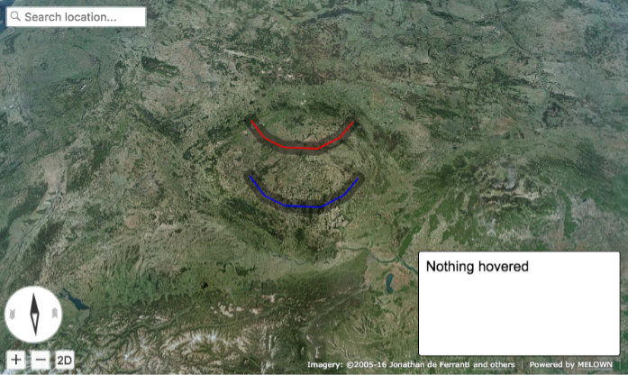
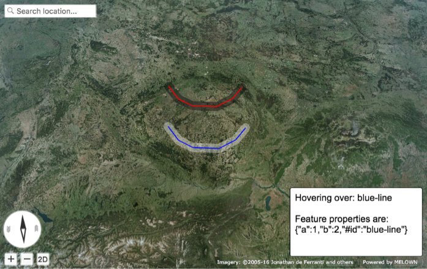

VTS Browser JS - Geodata: Hover events
======================================

This tutorial will show you how to handle geodata hover events with
Melown `VTS Browser
JS <https://github.com/Melown/vts-browser-js>`__.

As a prerequisite you should be able to display GeoJSON with
Melown VTS Browser. If you don't know how to do that or you need a reminder
check our previous tutorials
(`part1 <//vtsdocs.melown.com/en/latest/tutorials/geojson.html>`__,
`part2 <//vtsdocs.melown.com/en/latest/tutorials/geojson-part2.html>`__)
on this topic.

You can check live demo and source code of this tutorial
`here <https://jsfiddle.net/qn0cjLbd/>`__.

Preparing base data
-------------------

First, we need some geodata on which we shall listen for hover events.
We'll start by displaying red a and blue line on our map.

.. code:: javascript

    var browser = null;
    var renderer = null;
    var map = null;
    var geodata = null;
    var statusDiv = null;

    function startDemo() {
        browser = vts.browser('map-div', {
            map: 'https://cdn.melown.com/mario/store/melown2015/map-config/melown/VTS-Tutorial-map/mapConfig.json',
            position : [ 'obj', 15.096869, 49.3843590, 'float', 0.00, 2.70, -77.86, 0.00, 692772.54, 55.00 ]
        });
        renderer = browser.renderer;
        browser.on('map-loaded', onMapLoaded);
    };

    function onMapLoaded() {
        map = browser.map;
        geodata = map.createGeodata();
        
        //add line to geodata with id = 'blue-line'
        geodata.addLineString([
            [13.4836691, 49.6285568, 0],
            [13.8559398, 49.2926023, 0],
            [14.3590684, 49.1136598, 0],
            [15.2561336, 49.0637509, 0],
            [15.8564221, 49.2444548, 0],
            [16.2429312, 49.5161402, 0]
        ], 'float', { a : 1, b : 2 }, 'blue-line');

        //add line to geodata with id = 'red-line'
        geodata.addLineString([
            [13.4836691, 50.6285568, 0],
            [13.8559398, 50.2926023, 0],
            [14.3590684, 50.1136598, 0],
            [15.2561336, 50.0637509, 0],
            [15.8564221, 50.2444548, 0],
            [16.2429312, 50.5161402, 0]
        ], 'float', { a : 4, b : 5 }, 'red-line');
        
        geodata.processHeights('heightmap-by-precision', 62, onHeightProcessed);
    }

    function onHeightProcessed() {

        var style = {
            'constants': {
                '@icon-marker': ['icons', 6, 8, 18, 18]
            },
        
            'bitmaps': {
                'icons': 'http://maps.google.com/mapfiles/kml/shapes/placemark_circle.png'
            },

            "layers" : {
                "some-red-line" : {
                    "filter" : ["==", "#id", "red-line"],
                    "line": true,
                    "line-width" : 4,
                    "line-color": [255,0,0,255],
                    "zbuffer-offset" : [-5,0,0],
                    "z-index" : -1
                },

                "some-blue-line" : {
                    "filter" : ["==", "#id", "blue-line"],
                    "line": true,
                    "line-width" : 4,
                    "line-color": [0,0,255,255],
                    "zbuffer-offset" : [-5,0,0],
                },

                "line-shadow" : {
                    "line": true,
                    "line-width" : 40,
                    "line-color": [0,0,0,100],
                    "zbuffer-offset" : [-5,0,0]
                }
            }
        };

        //make free layer
        var freeLayer = geodata.makeFreeLayer(style);

        //add free layer to the map
        map.addFreeLayer('geodatatest', freeLayer);
        var view = map.getView();
        view.freeLayers.geodatatest = {};
        map.setView(view);
    }

    startDemo();

.. figure:: ./geojson-part3-lines.jpg
   :alt: Red and blue lines

   Red and blue lines.

Adding UI to display hover state
--------------------------------

Now we'll add a ui element that will
display information about hovered state. Expand ``startDemo`` function in
the following way:

.. code:: javascript

    function startDemo(){
        browser = vts.browser(...) // omitted for simplicity
        
        var panel = browser.ui.addControl('status-panel',
            '
' +
                'Hovering over: nothing' +
            '
');

        
        statusDiv = panel.getElement('status-div');
        browser.on('map-loaded', onMapLoaded);
    }

We added new ``div`` with id ``status-div`` and assigned it to variable
``statusDiv``. We are using our``getElement()`` to make sure we get the
right element in case more applications are embedded in the same page.

Next, add some styling to new component:

.. code:: javascript

     #status-div {
          font-family: Arial, 'Helvetica Neue', Helvetica, sans-serif;
          position: absolute;
          right: 12px;
          bottom: 30px;
          width: 288px;
          height: 150px;
          padding: 10px;
          background: #fff;
          border: 1px solid #000000;
          border-radius: 4px;
          font-size: 20px;
    }

   Added status-div element

Hover events
------------

To enable hover events generation for geodata we need to add
``hover-event:true`` property to style layer. We'll use
``line-shadow`` in our case.

.. code:: javascript

    var style = {
        ...
        "line-shadow" : {
            "line": true,
            "line-width" : 40,
            "line-color": [0,0,0,100],
            "zbuffer-offset" : [-5,0,0],
            "hover-event": true // enables generation of hover events
        }
    }

To listen to hover events we need to update ``startDemo`` function again
with following:

.. code:: javascript

    //add mouse down callback
    browser.ui.getMapElement().on('mousemove', onMouseMove);
    browser.ui.getMapElement().on('mouseleave', onMouseLeave);

    //geodata events listeners
    browser.on('geo-feature-enter', onFeatureEnter);
    browser.on('geo-feature-leave', onFeatureLeave);

We added several new callback methods. Let's implement them now. First
we need to propagate hover to browser element in ``onMouseMove``
function.

.. code:: javascript

    function onMouseMove(event) {
        if (map) {
            var coords = event.getMouseCoords();
            map.hover(coords[0], coords[1], true);
        }
    }

First we obtain canvas coordinates and inform the map we are
hovering above given coordinates.

We also have to cancel hovering manually when the cursor leaves the map element, 
otherwise hover state will hang permanently. We do this in
``onMouseLeave`` function.

.. code:: javascript

    function onMouseLeave(event) {
        if (map) {
            var coords = event.getMouseCoords();
            map.hover(coords[0], coords[1], false);
        }
    };

Now we are propagating mouse movements into browser. Next we'll implement their
handling. We only need to listen to ``geo-feature-enter`` and ``geo-feature-leave``.
There is another hover event ``geo-feature-hover`` emitted every time mouse moves
when over a feature. This is handy if we need to do different things when hovering 
over different parts of the feature but it is unnecessary to use in our case.

First let's implement ``onFeatureEnter`` to display above which geo feature we are
hovering and list it's properties inside ``statusDiv`` element.

.. code:: javascript

    function onFeatureEnter(event) {
        statusDiv.setHtml('Hovering over: ' + event.feature['#id'] + '  ' +
                          'Feature properties are: ' + JSON.stringify(event.feature) );
    }

When leaving the feature, we udpdate ``statusDiv`` to its original state.

.. code:: javascript

    function onFeatureLeave(event) {
        statusDiv.setHtml('Hovering over: nothing');
    }

.. figure:: ./geojson-part3-hover-box.jpg
   :alt: Status box with information about feature

   Status box with information about feature

Hover effect
------------

Next let's add a glowing effect to shadow when we are hovering above a line. We can
achieve this by adding a style layer `line-glow`` with the glow and adding ``hover-layer: "line-glow"``
to ``line-shadow`` which generates the hover events.

.. code:: javascript

    var style = {
      ...
      "line-shadow" : {
          "line": true,
          "line-width" : 40,
          "line-color": [0,0,0,100],
          "zbuffer-offset" : [-5,0,0],
          "hover-event" : true,
          "hover-layer" : "line-glow"
      },
      "line-glow" : {
          "filter" : ["skip"],
          "line": true,
          "line-width" : 40,
          "line-color": [255,255,255,100],
          "zbuffer-offset" : [-5,0,0],
          "hover-event" : true
      }
    }

If you did everything correctly you should see the similar outcome if you
hover over the blue line.

   Feature glowing effect

That's it you've successfully made it to the end of the tutorial.
