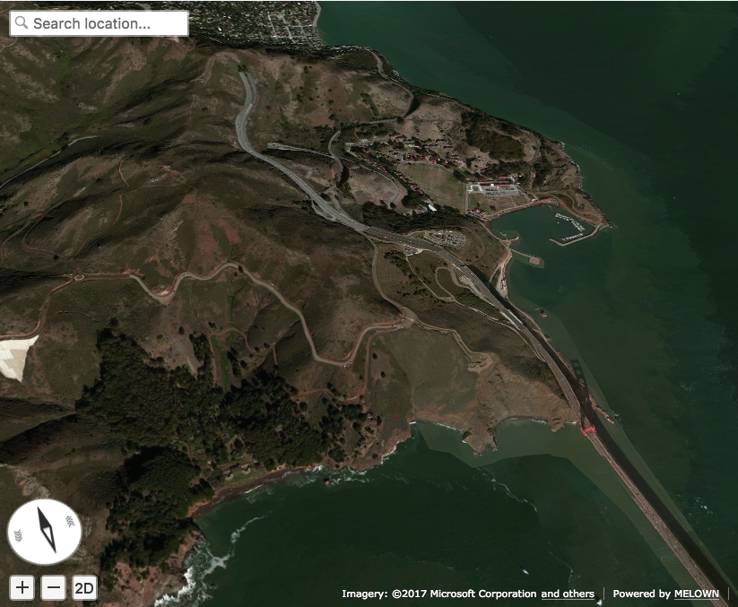

Importing GeoJSON with VTS Browser JS
=====================================

This tutorial provides a step by step guide how to import and visualize
sample GeoJSON data with `VTS Browser
JS <https://github.com/Melown/vts-browser-js>`__.

In detail we'll take a look how to display the VTS browser on a webpage. Next
we'll load some GeoJSON data and display them. And finally we'll take a
sneak peek into the possibilities of visual style customization.

You can find the code and a `live demo <https://jsfiddle.net/1xf3bxz9/>`__ of
this tutorial on JSFiddle.

GeoJSON
~~~~~~~

GeoJSON is an open standard format designed for representing simple
geographical features, along with their non-spatial attributes, based on
JavaScript Object Notation. You can explore more
`here <http://geojson.org/>`__.

VTS Browser JS
~~~~~~~~~~~~~~

The VTS Browser JS is a JavaScript WebGL rendering engine used and
developed by `Melown Technologies SE <http://melown.com>`__ as part of
the VTS 3D map streaming and rendering stack.

Displaying the browser
~~~~~~~~~~~~~~~~~~~~~~

To display the VTS Browser, add the necessary CSS and
JavaScript resources and create a ``div`` with an id like ``map-div``.

.. code:: html

    <!DOCTYPE html>
    <html lang="en">
      <head>
          <link rel="stylesheet" href="https://cdn.melown.com/libs/vtsjs/browser/v2/vts-browser.min.css"/>
          
      </head>
      <body>
         

         
      </body>
    </html>

Now that we've prepared our HTML structure we can add some JavaScript
code to make the browser run.

.. code:: javascript

    var browser = null;
    var renderer = null;
    var map = null;
    var geodata = null;

    function startDemo() {
        browser = vts.browser('map-div', {
            map: 'https://cdn.melown.com/mario/store/melown2015/map-config/melown/VTS-Tutorial-map/mapConfig.json',
            position : [ 'obj', -122.48443455025, 37.83071587047, 'float', 0.00, 19.04, -49.56, 0.00, 1946.45, 55.00 ]
        });

        //check whether browser is supported
        if (!browser) {
            console.log('Your web browser does not support WebGL');
            return;
        }

        //callback once is map config loaded
        browser.on('map-loaded', onMapLoaded);
    }

    function onMapLoaded() {
      // geojson loading here
    }

    startDemo();

We created a map in place of the ``map-div`` and set the path to the ``map``
that will be displayed. You can create your own map in `Melown
Cloud <https://www.melown.com/cloud>`__. We set the
`position <https://github.com/Melown/vts-browser-js/wiki/VTS-Browser-Map-API#position>`__
to San Francisco Golden Bridge. You can discover more about
browser configuration parameters in
`documentation <https://github.com/Melown/vts-browser-js/wiki/VTS-Browser-Map-API#definition-of-view>`__.

It is necessary to wait for the map to be loaded and then we can start with
importing a GeoJSON. We achieve this by using the callback function
``onMapLoaded`` and registering it to listen for the ``map-loaded`` event.
You should now see the following:

   Initial image

Adding GeoJSON data
~~~~~~~~~~~~~~~~~~~

Let's assume we have the following GeoJSON data containing a sample trek
trough Golden Gate Bridge Vista Point.

.. code:: javascript

    var json = {
        "type": "FeatureCollection",
        "features": [
            {
                "type": "Feature",
                "geometry": {
                    "type": "Point",
                    "coordinates": [-122.48347, 37.82955],
                },
                "properties": {
                    "title": "Golden Gate Bridge Vista Point",
                }
            },
            {
                "type": "Feature",
                "properties": {},
                "geometry": {
                    "type": "LineString",
                    "coordinates": [
                        [-122.48369693756, 37.83381888486],
                        [-122.48344236083, 37.83317489144],
                        [-122.48335253015, 37.83270036637],
                        [-122.48361819152, 37.83205636317],
                        [-122.48404026031, 37.83114119107],
                        [-122.48404026031, 37.83049717427],
                        [-122.48348236083, 37.82992094395],
                        [-122.48356819152, 37.82954808664],
                        [-122.48507022857, 37.82944639795],
                        [-122.48610019683, 37.82880236636],
                        [-122.48695850372, 37.82931081282],
                        [-122.48700141906, 37.83080223556],
                        [-122.48751640319, 37.83168351665],
                        [-122.48803138732, 37.83215804826],
                        [-122.48888969421, 37.83297152392],
                        [-122.48987674713, 37.83263257682],
                        [-122.49043464660, 37.83293762928],
                        [-122.49125003814, 37.83242920781],
                        [-122.49163627624, 37.83256478721],
                        [-122.49223709106, 37.83337825839],
                        [-122.49378204345, 37.83368330777]
                    ]
                }
            }
        ]
    }

The data contains two features. One point and one line represented by a list
of coordinates. In addition to geometry representation every feature can
have custom properties such as a title as in the current example. We'll
take advantage of this later in the tutorial.

To load the data into the browser we need to implement the ``onMapLoaded()``
function mentioned earlier:

.. code:: javascript

    function onMapLoaded() {
        map = browser.map;
        
        // create geodata object
        geodata = map.createGeodata();

        // import GeoJSON data
        geodata.importGeoJson(json);

        // this function is needed only when 'float' heights are used
        // in case you use data with 'fix' height only then you can
        // skip this function and call makeFreeLayer directly
        geodata.processHeights('node-by-precision', 62, onHeightsProcessed);
    }

We create a ``geodata`` object with ``map.createGeodata()`` that we can 
use to import a GeoJSON with ``geodata.importGeoJson(json)``.

VTS Browser currently **does not support** importing **polygons**
as a feature type.

Notice that the data doesn't contain height information. Therefore in
order to display our data correctly together with the terrain we need
to process it. That's why ``geodata.processHeights(...)`` is called.

When using data with a fixed height, processing heights can be skipped.

.. code:: javascript

    function onHeightsProcessed() {

        var style = {
            // add your style here
        };

        // make free layer
        var freeLayer = geodata.makeFreeLayer(style);

        // add free layer to the map
        map.addFreeLayer('geodatatest', freeLayer);

        // add free layer to the list of free layers
        // which will be rendered on the map
        let view = map.getView();
        view.freeLayers.geodatatest = {};
        map.setView(view);
    }

The function ``onHeightsProcessed()`` creates a free layer out of the GeoJSON
data and adds our custom style to it. Now you have all the data rendered,
but it's still invisible because we need to first add some styles to
the newly created layers.

Basic styling
~~~~~~~~~~~~~

Let's start with a really basic one. We'll connect our point with violet
line. To do so we'll change the style object to following:

::

    var style = {
        layers: {
            "track-line" : {
                "filter" : ["==", "#type", "line"],
                "line": true,
                "line-width" : 4,
                "line-color": [255,0,255,255]
            }
        }
    };

.. figure:: ./geojson-basic.png
   :alt: Basic styling

   Basic styling

``style`` now contains property ``layers`` which is works as container
component for all layers we want to add to map. Direct children of
``layers`` can have totally arbitrary names. In example above I've added
one layer group and named it ``track-line``. Layer group can have
multiple properties you can check them
`here <https://github.com/Melown/vts-browser-js/wiki/VTS-Geodata-Format#layers-structure>`__.
Most important one is ``filter``.

Filter used to select features from geojson to which we want to apply
set of display rules described in current group. In current example we
are applying display rules to all lines. This filter selects everything
from features where type equals line. With ``"line":true`` we tell that
we want to display current feature as a line. ``line-width`` denominates
line width. And finally we set line color to violet with ``line-color``
which accepts RGBA values as array.

You can find definitive documentation for styles
`here <https://github.com/Melown/vts-browser-js/wiki/VTS-Geodata-Format#geo-layer-styles-structure>`__.

Advanced styling
~~~~~~~~~~~~~~~~

You can notice that added line dives under the surface. This happens due
to imprecise interpolation of line height. We can fix this by adding
``zbuffer-offset`` to ``track-line`` layer. Try to add
``"zbuffer-offset": [-0.5, 0, 0]`` and see the difference.

.. figure:: ./geojson-zbuffer.png
   :alt: Displayed track with ``zbuffer-offset``

   Displayed track with ``zbuffer-offset``

Now we'll improve line's visual style by adding shadow to it.

.. code:: javascript

    var style = {
        layers: {
            "track-line" : {
                "filter" : ["==", "#type", "line"],
                "line": true,
                "line-width" : 4,
                "line-color": [255,0,255,255],
                "zbuffer-offset" : [-0.5,0,0],
                "z-index" : -1
            },
            "track-shadow" : {
                "filter" : ["==", "#type", "line"],
                "line": true,
                "line-width" : 20,
                "line-color": [0,0,0,120],
                "zbuffer-offset" : [-0.5,0,0],
            }
        }
    };

.. figure:: ./geojson-track-shadow.png
   :alt: Added track shadow

   Added track shadow

Okay so far we have managed to visualize feature of type line. But if we
go back to our sample GeoJSON data we'll notice that it contains feature
of type point as well. We'll focus to visualize that one now.

We'll visualize the place with green circle and it's title displayed
above it.

.. code:: javascript

    var style = {
        "constants": {
            "@icon-marker": ['icons', 6, 8, 18, 18]
        },
        "bitmaps": {
            "icons": 'http://maps.google.com/mapfiles/kml/shapes/placemark_circle.png'
        },
        "layers": {
             "track-line": { ...},
             "track-shadow": { ... },
         
             // add new style for point
             "place" : {
                    "filter":["==", "#type", "point"],
                    
                    "icon": true,
                    "icon-source": '@icon-marker',
                    "icon-color": [0,255,0,255],
                    "icon-scale": 2,
                    "icon-origin": 'center-center',
                    
                    "label": true,
                    "label-size": 19,
                    "label-source": "$title",
                    "label-offset": [0,-20],
                    "zbuffer-offset" : [-1,0,0]
              }
    }

I've added 2 new properties to ``style``. The ``bitmap.icons`` defines
url with resource to overlay icon. In ``constants`` we can define
variables that can be reused trough whole style object. Here we define
constant ``@icon-marker`` and select rectangle out of ``icons`` png.
First two numbers in array define top left corner and last two numbers
bottom right corner in image coordinates.

We've also added new layer group ``place`` to ``layers``. Notice that
now we have used different ``filter`` to select all points instead. For
``icon-source`` we have used defined constant. Notice that for
``label-source`` we used ``$title``. This tells layer group to search
for value defined in GeoJSON feature properties. Rest of group
properties should be self-explanatory.

.. figure:: ./geojson-track-point.png
   :alt: Track with point

   Track with point

Thats it for now, you've made it to the end :)

In the `next
tutorial <http://vtsdocs.melown.com/en/latest/tutorials/geojson-part2.html>`__
we'll have a look at the loading from url and extend the track.
