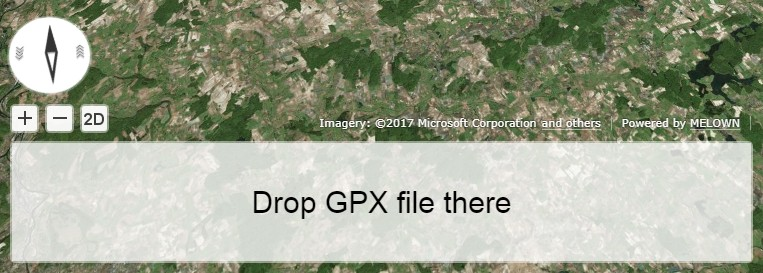
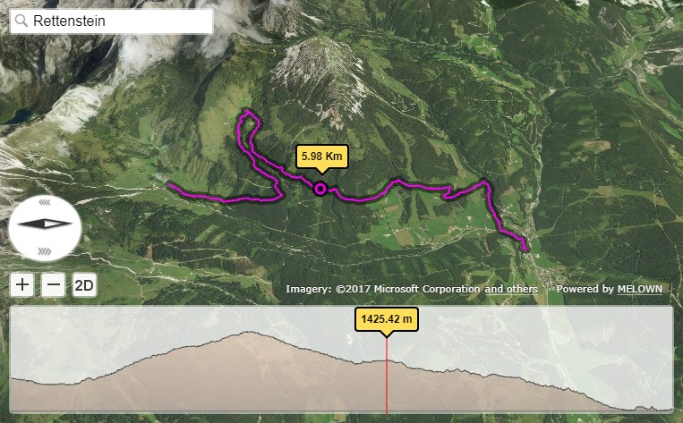

.. _mars-peaks-valleys:

The GPX Tracks Viewer
-----------------------------

Do you want display and explore the GPX tracks in beautiful 3D map? Me too. The VTS-Browser-JS is great solution for this task. Just take a look at `live demo <https://jsfiddle.net/bz05rczw/show/>`_ in JSFiddle. Are you curious how is it done? I will try to explain it at following lines.

The GPX File Format
"""""""""""""""""""

The GPX, or GPS Exchange Format, is an XML schema designed as a common GPS data format for software applications. It can be used to describe waypoints, tracks, and routes. The format is open and can be used without the need to pay license fees. Location data (and optionally elevation, time, and other information) is stored in tags and can be interchanged between GPS devices and software. More information about GPX format can be found `here <https://en.wikipedia.org/wiki/GPS_Exchange_Format>`_ or `here <http://www.topografix.com/GPX/1/1/>`_ .

Displaying the Map
""""""""""""""""""

So how do I display 3D map? With `VTS-Browser-JS <https://github.com/Melown/vts-browser-js/wiki>`_ library it is `easy task <https://jsfiddle.net/a5rh6vnh/2/>`_.

::

    var browser = vts.browser('map-div', {
        map: 'https://cdn.melown.com/mario/store/melown2015/map-config/melown/VTS-Tutorial-Map-4/mapConfig.json'
    });

This function creates map in the HTML DOM element with id 'map-div'. The parameter 'map' sets URL path to the map which will be displayed. You can create your own map by `Melown Cloud <https://www.melown.com/>`_ or you can host you own map server which is by the way also open source.

.. image:: gpx-viewer-map.jpg

Adding New Panel to the Map Browser
"""""""""""""""""""""""""""""""""""

Most simple way how to add new UI controls to the map browser is to use `UI API <https://github.com/Melown/vts-browser-js/wiki/VTS-Browser-UI-API>`_ . 

::

    var profilePanel = browser.ui.addControl('profile-panel',
        '
' +
            '
' +
                '<canvas id="profile-canvas" class="profile-canvas">' +
                '</canvas>' + 
            '
' + 
        '
');

Position and style of the new control is set by CSS:

:: 

    .profile-div {
        font-family: Arial, 'Helvetica Neue', Helvetica, sans-serif;
        position: absolute;
        left: 10px;
        right: 10px;
        bottom: 10px;
        height: 122px;
        background-color: rgba(255,255,255,0.47);
        border-radius: 5px;
    }

And so on. The DOM elements can accessed following way:

::

    canvas = profilePanel.getElement('profile-canvas');
    canvas.on('mousemove', onCanvasHover);
    canvasCtx = canvas.getElement().getContext("2d");

The DOM elements are wrapped by UI library which makes work with elements easier. In case you want access original element use getElement method. Another simple examples where is used UI API can be found `here <https://jsfiddle.net/2sdyfekd/1/>`_ or `here <https://jsfiddle.net/xeef5s4r/>`_ .

There is one trick by which you can move existing controls little bit higher.

::

    browser.ui.getControl('credits').getElement('vts-credits').setStyle('bottom', '134px');
    browser.ui.getControl('space').getElement('vts-space').setStyle('bottom', '140px');
    browser.ui.getControl('zoom').getElement('vts-zoom-plus').setStyle('bottom', '140px');
    browser.ui.getControl('zoom').getElement('vts-zoom-minus').setStyle('bottom', '140px');
    browser.ui.getControl('compass').getElement('vts-compass').setStyle('bottom', '170px');

Loading GPX file
""""""""""""""""

In our demo you can just drop GPX file into the map or created canvas panel and loading magic happens. How is it done? In previous section we have created new panel. Now we add event listeners to this panel. 

::

    canvas.on('dragover', onDragover);
    canvas.on('drop', onDrop);

The dragover event is needed to prevent default browser behavior for dropping files:

::

    function onDragover(event) {
        var e = event.event;
        e.stopPropagation();
        e.preventDefault();
        e.dataTransfer.dropEffect = 'copy';
    };

The drop event provides us dropped file. We read this file and parse it as XML file.

::

    function onDrop(event) {
        var e = event.event;
        e.stopPropagation();
        e.preventDefault();

        var files = e.dataTransfer.files;

        for (var i = 0; i < files.length; i++) {
            var reader = new FileReader();

            reader.onloadend = function (event) { 
                var parser = new DOMParser();
                var data = parser.parseFromString(event.target.result, 'text/xml');
                loadGPX(data); 
            };

            reader.readAsText(files[i], 'text/plain');            
        }
    }

Once is XML file loaded. Then we can extract features by `DOM methods <https://www.w3schools.com/jsref/dom_obj_all.asp>`_ like getElementsByTagName etc. according to format `specification <http://www.topografix.com/GPX/1/1/>`_ .

Displaying the Geodata
""""""""""""""""""""""

Now we have data and how to display them on the map. For this purpose we can use `Geodata API <https://github.com/Melown/vts-browser-js/wiki/VTS-Browser-Map-API#geodata-creation>`_ . First we create geodata object.

::

    geodata = map.createGeodata();

Now we can add some points. Note that we are using 'float' height which define how much is point above terrain. In case we have elevation data then we can use 'fix' height with no relation to the terrain. The point can be also provided by its properties which can be accessed by `geodata styles <https://github.com/Melown/vts-browser-js/wiki/VTS-Geodata-Format#geo-layer-styles-structure>`_. 

:: 

    geodata.addPoint([14.3836691, 50.0485568, 500], 'float', { 'name' : 'Nice place'  });

Similarly we can add line string. Note that we have added line string with id 'some-path'. We will need that later for extracting geometry.

::

    geodata.addLineString([
        [13.4836691, 49.6285568, 0],
        [13.8559398, 49.2926023, 0],
        [14.3590684, 49.1136598, 0],
        [15.2561336, 49.0637509, 0],
        [15.8564221, 49.2444548, 0],
        [16.2429312, 49.5161402, 0]
    ], 'float', null, 'some-path');

Once we added all features to the geodata we can convert 'float' heights to 'fix' height. This process can take some time because terrain data have to loaded. For conversion is used following asynchronous function. In case you used 'fix' height you do not have to call this function.

::

    geodata.processHeights('heightmap-by-precision', 1, onHeightProcessed);

The second function parameter sets desired resolution of heightmap from which are heights read. Value represents size of height sample in meters. 

Once we have geodata ready we can create free layer. But before that we have to define its style. You can image free layer as map layer with vector features. These vector features can styled with geodata styles. Each style has set of inner layers which will be rendered. Which feature will be rendered with which style layer is determined by style layer filter. When filter condition is fulfilled then feature is rendered with layer style. Note that style layer 'track-shadow' has properties 'hover-event' = true and 'advanced-hit' = true. The hovering events will be explained later.

::

    var style = {
        "layers" : {
            "track-line" : {
                "filter" : ["==", "#type", "line"],
                "line": true,
                "line-width" : 4,
                "line-color": [255,0,255,255],
                "zbuffer-offset" : [-5,0,0],
                "z-index" : -1
            },

            "track-shadow" : {
                "filter" : ["==", "#type", "line"],
                "line": true,
                "line-width" : 20,
                "line-color": [0,0,0,120],
                "zbuffer-offset" : [-5,0,0],
                "hover-event" : true,
                "advanced-hit" : true
            },

            "way-points" : {
                "filter" : ["==", "#type", "point"],
                "point": true,
                "point-radius" : 20,
                "point-color": [0,255,255,255],              
                "zbuffer-offset" : [-5,0,0]
            },

        }
    };

Now we can create free layer and add that layer to the map. The map will keep free layer under id 'gpxgeodata'.

::

    var freeLayer = geodata.makeFreeLayer(style);
    map.addFreeLayer('gpxgeodata', freeLayer);

We have added free layer to the map, but that does not mean that free layer will be displayed. To make that happen we have to include free layer to current map view;

::

    var view = map.getView();
    view.freeLayers.gpxgeodata = {};

Simple example which shows how to display geodata can be found `here <https://jsfiddle.net/c8xez624/>`_ .

How to Center Map Position to the Track
"""""""""""""""""""""""""""""""""""""""

What we need to do is to find center coordinates of all track points. For this purpose we have to extract track coordinates. This is important step because extracted coordinates will be in the right coordinate system (physical SRS). Keep in mind that we can extract track geometry only after heights are processed (method processHeights was called). The geodata feature with id 'some-path' is searched and its geometry exacted.

::

    lineGeometry = geodata.extractGeometry('some-path');

Total number of line segments is returned by this method:

::

    totalElements = lineGeometry.getElements();

Particular line segment is returned by this method:

::

    lineSegment = lineGeometry.geometry.getElement(lineSegmentIndex);

Line segments points:

::

    p1 = lineSegment[0];   
    p2 = lineSegment[1];   

Now we find average coordinates of all line points and convert that coordinates to navigation SRS. In this case we can ignore resulting height and set that height to zero. 

::

    navCoords = vts.proj4(physicalSrsDef, navigationSrsDef, midPoint);
    navCoords[2] = 0;

We have center coordinates, but we have to also zoom appropriately. For that purpose we have to find right view extent. Most simple way is following. Imagine line which goes from the center coordinates. This line is perpendicular to the ground. Now we find most distant track point for that line. We multiple this distance by two and that is it. Now we can set new map position:

::

    var pos = map.getPosition();
    pos.setCoords(navCoords);
    pos.setOrientation([0, -70, 0]);
    pos.setViewExtent(viewExtent);
    map.setPosition(pos);

The Hit Test with Displayed Track
"""""""""""""""""""""""""""""""""

Track is displayed. Now we want to know whether is cursor hovering over the track. It is easy task. Do you remember when add property 'hover-event' = true to he 'track-shadow' style layer? Now we have to only listen to these events:

::

    browser.on('geo-feature-hover', onFeatureHover);

But these events will be generated only when we keep informing the map about current cursor position by calling 'hover' method. This gives you absolute control over generation of hover events.

::

    mapElement.on('mousemove', onMouseMove);
    mapElement.on('mouseleave', onMouseLeave);

    ...

    function onMouseLeave(event) {
        var coords = event.getMouseCoords();
        map.hover(coords[0], coords[1], false);
    };

    function onMouseMove(event) {
        var coords = event.getMouseCoords();
        usedMouseCoords = coords;
        map.hover(coords[0], coords[1], true);
    }

You are probably curious about the third parameter in the 'hover' method. We need to generate hover events even in case that cursor does not move. That is what that parameter does when its value is 'true'. When cursor leaves the map we use that parameter with value 'false' to stop generating hover events.

Now we have callback function onFeatureHover which is called when cursor hovers over the track. What is next? We have to figure out which part of the track is hovered. The function onFeatureHover is called with event parameter which contains information about hovered feature. This information contains property with name 'element' which is index of hovered line segment. The hover events contains 'element' property only when style layer of that feature contains property 'advanced-hit' = true. So we know when we hovering over the track and we also know over which line segment we are hovering. To get precise location and distance of the cursor on the track we use getRelationToCanvasPoint method which return information about where is cursor located on line segment. This information contains distance property which has values from 0 (line segment start) to 1 (line segment end). We multiply this value with line segment length (obtained by getPathLengthToElement method) add that value to the total path length to segment (also obtained by getPathLengthToElement). When we know total distance to the point on the track then we can get coordinates of this point by the getPathPoint method. We do not need to use this function to get these coordinates because method getRelationToCanvasPoint returns these coordinates, but this is sort of double check.

::

    function onFeatureHover(event) {
        lineSegment = event.element;

        var res = lineGeometry.getRelationToCanvasPoint(lineSegment, usedMouseCoords[0], usedMouseCoords[1]);
        var lineSegmentInfo = lineGeometry.getPathLengthToElement(lineSegment);

        pathDistance = lineSegmentInfo.lengthToElement + (lineSegmentInfo.elementLengh * vts.math.clamp(res.distance, 0, 1)); 
        linePoint = lineGeometry.getPathPoint(pathDistance);

        setProfilePointer(linePoint);
        map.redraw();
    }

Simple example with related hover events can be found `here <https://jsfiddle.net/n0L0o8ca/>`_ .

Displaying Dynamic Features on the Map
""""""""""""""""""""""""""""""""""""""

The geodata are very good at displaying static content. But when it comes to the rendering of dynamic features we can use combination of HTLM elements and `rendering API <https://github.com/Melown/vts-browser-js/wiki/VTS-Browser-Renderer-API>`_ 

We will start with HTML part fist. The HTML elements are very good at displaying info boxes .. etc. So why not use it for this purpose. To keep things organized we create new UI control which will hold HTML element.

:: 

    var infoPointers = browser.ui.addControl('info-pointers',
        '
' +
        '
');

    distancePointer = infoPointers.getElement('distance-div');

Now we can modify element style to move it to desired screen coordinates:

:: 

    distancePointer.setStyle('left', screenX + 'px');
    distancePointer.setStyle('top', screenY + 'px');

How we get screen coordinates? We already know coordinates in the physical SRS, so we just need to convert then to screen coordinates.

:: 

    var screenCoords = map.convertCoordsFromPhysToCanvas(linePoint);

The HTML elements are great but they can be slow when you draw a lot of them. Another disadvantage of the HTML elements is that they do not respect depth buffer of displayed map. Which means that when some feature is behind building or hill it will be still visible. In these cases we can use `rendering API <https://github.com/Melown/vts-browser-js/wiki/VTS-Browser-Renderer-API>`_ 

First thing we need to do is setup rendering callback. This callback is called when map is ready for rendering additional content.

::

    map.addRenderSlot('custom-render', onCustomRender, true);
    map.moveRenderSlotAfter('after-map-render', 'custom-render');

Once is callback called then we can draw icon of the track point.

::

    function onCustomRender() {

        renderer.drawImage({
            rect : [screenX, screenY, ImageWidht, ImageHeight],
            texture : pointTexture,
            color : [255,0,255,255],
            depth : screenZ,
            depthTest : false,
            blend : true
            });
    }

Simple example showing how to render dynamic features can be found `here <https://jsfiddle.net/ec2gh95a/>`_ .

Displaying the Track Height Profile
"""""""""""""""""""""""""""""""""""

How do we get height profile of the track? We are able to get track geometry in physical SRS. From that geometry we can get length of each line segment and total length of all line segments together. Next thing are heights for each track point. We are able to do that by converting point coordinates from physical SRS to public SRS. So we collect heights of all track points and together with line segment lengths we can plot track height profile.

