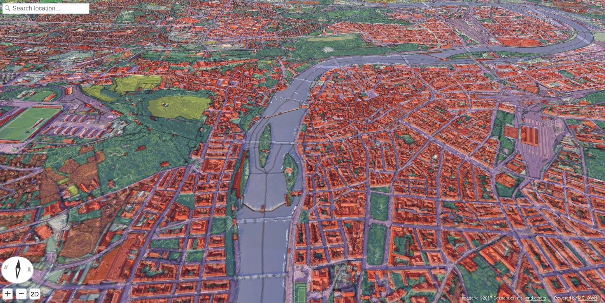
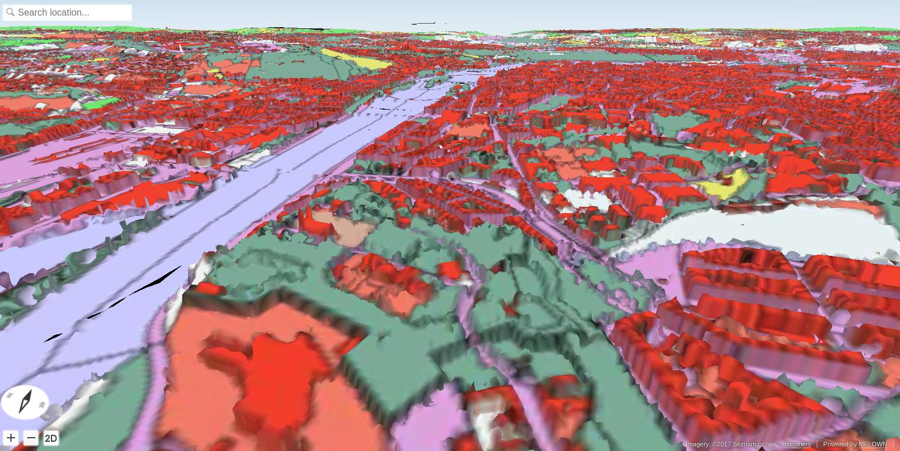

.. _landuse-wms-3d:

Land Use: Open Landuse Maps over 3D Data
----------------------------------------

In this tutorial we combine 3D data of Czech cities and the Corine Land Cover
/ Open Landuse datasets from the :ref:`landuse-wms-dem` tutorial.

.. note:: Czech Cities 3D is a proprietary dataset, provided by `Melown Technologies <https://melown.com>`_. Please contact Melown Technologies in order to get access to this dataset.

Prerequisities
^^^^^^^^^^^^^^
  
#. This tutorial expects that you have already set up your VTS backend, as
   described in :ref:`setting-vts-backend`.
#. It is assumed that your Mapproxy resources are set up and that your Mapproxy
   instance is up and running, just as shown in the tutorial :ref:`landuse-wms-dem`.
#. It is also expected that you start with a clean VTS installation (the
   Storage is empty).

Filling the storage
^^^^^^^^^^^^^^^^^^^

To work with static True3D data and/or fuse various surfaces together, we must
add them to the storage. The storage is administered by the tool ``vts`` that
takes care of adding tilesets to the storage and their subsequent fusion. In our case,
there are no other datasets in the Storage so there will be no fusion and the operation
will be instantaneous.

Now we are ready to add our cities 3D tileset as a remote tileset to the 
Storage. This means that the tileset will not be physically copied into 
the Storage - which is useful for large tilesets like this one - 
but the tiles will be downloaded on demand from a URL specified in the 
``vts --add`` command.

.. code-block:: bash

  vts /var/vts/store/stage.melown2015 --add \
      --tileset http://[SERVER]/store/melown2015/stage/tilesets/melown-cities-cz --bottom
      

Creating a storage view
"""""""""""""""""""""""

As the final step we need to create a :ref:`storage-view` that
combines tilesets from our storage and a free and a bound layer from the mapproxy.

Go to ``/var/vts/store/map-config`` directory and create the file ``cities`` with the
following content.

.. literalinclude:: projects/corine/cities

For a commented configuration file, take a look at the :ref:`cadastre-raster-vector-3d`
example.

.. code-block:: bash

  cd /var/vts/store/map-config
  vts --map-config cities

If everything is all right, a large JSON with client side map configuration will
be printed.::

        {
            "boundLayers" : 
            {
                "urbanatlas" : "//localhost:3070/melown2015/tms/openlanduse/urbanatlas/boundlayer.json"
            },
            "credits" : 
            {
                "seznamcz" : 
                {
                    "id" : 103,
                    "notice" : "{copy}{Y} Seznam.cz, a.s."
                }, 
        ...

Now, you can go to http://127.0.0.1:8070/store/melown2015/map-config/cities :

  The result of our configuration. Corine DEM as a **free layer** with texture from Open Landuse service 
  with 50% transparency, layed over textured 3D cities.

  Another option how to display the same data: Urban atlas used as **bound layer** for 3D cities.

