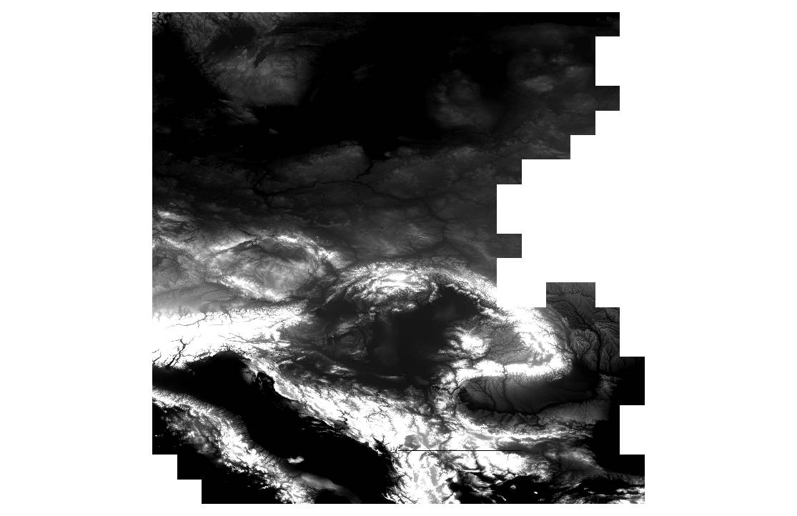
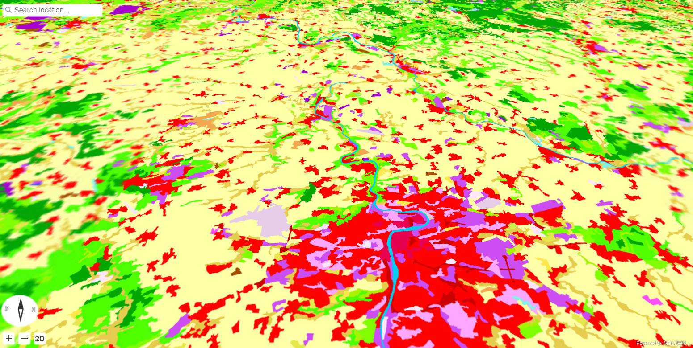

.. index::
    single: Corine
    single: WMS
    single: tutorial
    single: example

.. _landuse-wms-dem:

Land Use: Copernicus DEM with Urbanatlas and Corine Land Cover WMS
------------------------------------------------------------------

In this example, a standard cartography map (Urban atlas) is laid over a digital
elevation model for better representation of the data in space.

.. note:: We assume you have set up your environment as described in
    :ref:`setting-vts-backend`.

Setting up mapproxy resources
^^^^^^^^^^^^^^^^^^^^^^^^^^^^^

For this step, the most important locations are ``/var/vts/mapproxy/datasets/`` where all inputs for mapproxy are stored and
``/etc/vts/mapproxy/resource.json`` where you will place configuration snippet for each mapproxy resource.

During resource preparation it is advisable to turn off the mapproxy, so that you have time to correct mistakes in your
configuration:

.. code-block:: bash

  sudo /etc/init.d/vts-backend-mapproxy stop

As the whole vts-backend runs under the vts user, it is advisable to switch to the vts user so all files are created with the right privileges and ownership.

.. code-block:: bash

  sudo -iu vts

Preparing workspace
^^^^^^^^^^^^^^^^^^^

First we create the project directory::

    mkdir -p /var/vts/mapproxy/datasets/openlanduse

Input DEM data
^^^^^^^^^^^^^^
The `Copernicus programme <http://www.copernicus.eu>`_ publishes `Digital
Elevation Model over Europe (EU-DEM)
<https://www.eea.europa.eu/data-and-maps/data/eu-dem>`_. The
EU-DEM is a 3D raster dataset with elevations captured at 1 arc second postings
(2.78E-4 degrees) or about every 30 meters.

Data can be downloaded from `EU-DEM
<https://www.eea.europa.eu/data-and-maps/data/eu-dem#tab-original-data>`_ page. In
this example we are going to use the CEE (central and east Europe)
region:

* eudem_dem_5deg_n40e010.tif
* eudem_dem_5deg_n40e015.tif
* eudem_dem_5deg_n40e020.tif
* eudem_dem_5deg_n40e025.tif
* eudem_dem_5deg_n45e010.tif
* eudem_dem_5deg_n45e015.tif
* eudem_dem_5deg_n45e020.tif
* eudem_dem_5deg_n45e025.tif
* eudem_dem_5deg_n50e010.tif
* eudem_dem_5deg_n50e015.tif
* eudem_dem_5deg_n50e020.tif
* eudem_dem_5deg_n50e025.tif
* eudem_dem_5deg_n55e010.tif
* eudem_dem_5deg_n55e015.tif
* eudem_dem_5deg_n55e020.tif
* eudem_dem_5deg_n55e025.tif

You should download the data you need and save them in the
``/var/vts/mapproxy/datasets/openlanduse/copernicus/rasters`` directory (do not
forget to ``mkdir -p
/var/vts/mapproxy/datasets/openlanduse/copernicus/rasters``).

Input Open landuse data
^^^^^^^^^^^^^^^^^^^^^^^
`Open Land-Use Map <http://sdi4apps.eu/open_land_use/>`_ is a composite map that
is intended to create detailed
land-use maps of various regions based on certain pan-European datasets such as
CORINE Landcover, UrbanAtlas enriched by available regional data.

Data are published as `OGC WMS <http://opengeospatial.org/standards/wms>`_
services.

Setting up DEM dataset
^^^^^^^^^^^^^^^^^^^^^^

The first thing you need to do after downloading the data is to create a virtual
raster with the help of GDAL::

    cd /var/vts/mapproxy/datasets/openlanduse/copernicus/rasters
    ls

    eudem_dem_5deg_n40e010.tif  eudem_dem_5deg_n45e020.tif  eudem_dem_5deg_n55e010.tif
    eudem_dem_5deg_n40e015.tif  eudem_dem_5deg_n45e025.tif  eudem_dem_5deg_n55e015.tif
    eudem_dem_5deg_n40e020.tif  eudem_dem_5deg_n50e010.tif  eudem_dem_5deg_n55e020.tif
    eudem_dem_5deg_n40e025.tif  eudem_dem_5deg_n50e015.tif  eudem_dem_5deg_n55e025.tif
    eudem_dem_5deg_n45e010.tif  eudem_dem_5deg_n50e020.tif
    eudem_dem_5deg_n45e015.tif  eudem_dem_5deg_n50e025.tif

Let's create the virtual dataset::

    gdalbuildvrt eudem_dem.vrt *.tif

And have a look at the data in QGIS

.. note:: In this example, we are going to process a major part of Europe. This is
    usually very time and resources demanding operation. For some simple
    project, make sure your dataset is reasonably sized, e.g., just one country.
    For "cutting out" just country borders, use ``gdalwarp``::

        gdalwarp -cutline COUNTRY.shp -crop_to_cutline -dstalpha eudem_dem.vrt eudem_COUNTRY.tiff

Next, we have to create virtual overviews::

    cd /var/vts/mapproxy/datasets/openlanduse/
    mkdir copernicus-dem
    generatevrtwo copernicus/rasters/eudem_dem.vrt copernicus-dem/elev --tileSize 1024x1024 --resampling dem
    generatevrtwo copernicus/rasters/eudem_dem.vrt copernicus-dem/elev.min --tileSize 1024x1024 --resampling min
    generatevrtwo copernicus/rasters/eudem_dem.vrt copernicus-dem/elev.max --tileSize 1024x1024 --resampling max

And as a final step, links named ``dem``, ``dem.min`` and ``dem.max`` need to
be created::

    cd /var/vts/mapproxy/datasets/openlanduse/copernicus-dem
    ln -s elev.max/dataset dem.max
    ln -s elev.min/dataset dem.min
    ln -s elev/dataset dem

And the last preparation step is to create a basic metainformation about tiles - tileindex.
For this, we first need to know tile extents of the input dataset::

    cd /var/vts/mapproxy/datasets/openlanduse/
    mapproxy-calipers copernicus-dem/dem melown2015

    2017-08-08 14:43:57 I3 [28036(main)]: [mapproxy-calipers] Config:
        dataset = "/home/jachym/src/melown/projects/openlanduse/datasets/corine/copernicus-dem/dem"
        referenceFrame = melown2015
     {main.cpp:configure():158}
    gsd: 24.8558
    range<pseudomerc>: 7,15 15/8742,5480:9050,5657
    range: 7,15 34,21:35,22
    position: obj,15.474967,49.803826,float,0.000000,0.000000,-90.000000,0.000000,649246.827847,55.000000

Now we can run ``mapproxy-tiling`` to calculate the tileindex for our input data. Use your own numbers
from ``range`` line of mapproxy-calipers output::

    mapproxy-tiling copernicus-dem --referenceFrame melown2015 --lodRange 7,15 --tileRange 34,21:35,22

.. note:: This step can take a very long time, in order to get all the tiles
        calculated.

Setting up Urban atlas dataset
^^^^^^^^^^^^^^^^^^^^^^^^^^^^^^

We are going to rely on the OGC WMS, maintained  by `European Environment Agency <https://www.eea.europa.eu/>`_. The service URL is ``http://image.discomap.eea.europa.eu/arcgis/services/Corine/CLC2012/MapServer/WmsServer``. We use `GDAL <http://gdal.org>`_ to generate the file needed for MapProxy input::

    cd /var/vts/mapproxy/datasets/openlanduse/
    gdalinfo "WMS:http://image.discomap.eea.europa.eu/arcgis/services/Corine/CLC2012/MapServer/WmsServer"

        Driver: WMS/OGC Web Map Service
        Files: none associated
        Size is 512, 512
        Coordinate System is `'
        Subdatasets:
          SUBDATASET_1_NAME=WMS:http://image.discomap.eea.europa.eu/arcgis/services/Corine/CLC2012/MapServer/WmsServer?SERVICE=WMS&VERSION=1.1.1&REQUEST=GetMap&LAYERS=Corine%20Land%20Cover%202012%20raster&SRS=EPSG:4326&BBOX=-81.765523,-29.197624,94.141697,72.664410
          SUBDATASET_1_DESC=Corine Land Cover 2012 raster
          SUBDATASET_2_NAME=WMS:http://image.discomap.eea.europa.eu/arcgis/services/Corine/CLC2012/MapServer/WmsServer?SERVICE=WMS&VERSION=1.1.1&REQUEST=GetMap&LAYERS=Corine%20Land%20Cover%202012%20vector&SRS=EPSG:4326&BBOX=-81.231079,-29.121654,93.489511,72.123059
          SUBDATASET_2_DESC=Corine Land Cover 2012 vector
        Corner Coordinates:
        Upper Left  (    0.0,    0.0)
        Lower Left  (    0.0,  512.0)
        Upper Right (  512.0,    0.0)
        Lower Right (  512.0,  512.0)
        Center      (  256.0,  256.0)

We can see there are two subdatasets in the WMS - the ``Corine Land Cover 2012
raster`` and the ``Corine Land Cover 2012 vector``. Raster layer is used until
some scale level, then vectors are used, therefore we need to generate an XML containing
both subdatasets. We will take the first one as a base for our
XML template file::

    gdal_translate -of WMS "WMS:http://image.discomap.eea.europa.eu/arcgis/services/Corine/CLC2012/MapServer/WmsServer?SERVICE=WMS&VERSION=1.1.1&REQUEST=GetMap&LAYERS=Corine%20Land%20Cover%202012%20vector&SRS=EPSG:4326&BBOX=-81.231079,-29.121654,93.489511,72.123059" corine-landcover.xml

In the file :download:`projects/corine/corine-landcover.xml`, only the ``Corine
Land Cover 2012 vector`` is stored. Let's open it with a text editor and add the
``raster`` layer too. The result should look similar to this:

.. literalinclude:: projects/corine/corine-landcover.xml
    :linenos:
    :lineno-start: 4
    :lines: 4-6

Note the ``<Layer>`` element, where both ``raster`` and ``vector`` layers are
listed.

Having the file in our hand, we can finally configure our datasets.

Configuring Open landuse layer
^^^^^^^^^^^^^^^^^^^^^^^^^^^^^^
We shall use the same approach for the Open Landuse layer. The input URL is
http://gis.lesprojekt.cz/cgi-bin/mapserv?map=/home/dima/maps/olu/european_openlandusemap.map
(provided by `SDI4Apps <http://sdi4apps.eu/>`_ project). We will use SUBDATASET_2, Open Land-Use Map, the
layer name is ``olu``.
The final XML can be downloaded :download:`projects/corine/openlanduse.xml`.

Configuring resources
^^^^^^^^^^^^^^^^^^^^^

We can now edit the ``/etc/vts/mapproxy/resources.json`` file containing the DEM and Corine
Land Cover datasets. Don't forget to use ``mapproxy-calipers`` to obtain the tile ranges.

.. literalinclude:: projects/corine/resources.json

Alternatively, you can download the complete configuration
:download:`projects/corine/resources.json` and just replace your ``resources.json`` with it.

Running Mapproxy
^^^^^^^^^^^^^^^^
Mapproxy can be started again using::

    sudo /etc/init.d/vts-backend-mapproxy start

And we should obtain a result similar to the following picture, at
http://127.0.0.1:8070/mapproxy/melown2015/surface/openlanduse/dem/

Next steps
^^^^^^^^^^
Follow :ref:`vtsjs-landuse` frontend tutorial to learn how to add a legend to the
landuse map.
