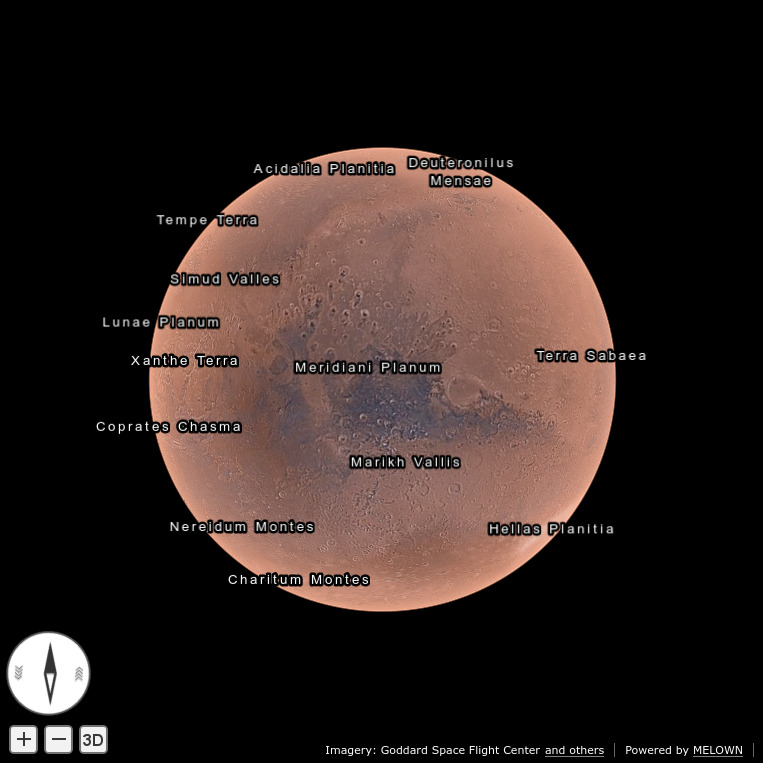

.. _mars-peaks-and-valleys-searchable-nomenclature:

Mars Peaks and Valleys Part 2: Searchable Nomenclature
------------------------------------------------------

In our :doc:`first Mars tutorial <mars-peaks-and-valleys>`, you used `VTS 3D geospatial software stack <https://melown.com/products/vts>`_ to  stream an interactive, browseable map of Mars from your own system using public domain data sources. That was fun.

But wait a minute - is your virtual Mars model a real *map*? A map should have labels, so that aliens (YOU in this case) can use it to get around. After all, Mars is one of the best researched and documented bodies in the solar system so its nomenclature is readily available. And by the long standing standard of digital cartography, a map nomenclature should be searchable.

Right on. In following this tutorial, you are going to turn your 3D model of Mars into a real map, complete with labels and search functionality.

Preparation
"""""""""""
As a prerequisite, you should complete our :doc:`first Mars tutorial <mars-peaks-and-valleys>`.

For search functionality, you need to have Node.js 8.x and PM2 process manager installed on your system. Run

::

    $ node --version 

to check your Node.js version. If the version you see is bellow 8.x or if you lack a Node.JS environment completely, run the following commands::

    $ curl -sL https://deb.nodesource.com/setup_8.x -o nodesource_setup.sh
    $ sudo bash nodesource_setup.sh
    $ sudo apt-get install nodejs
    $ sudo npm install -g pm2

Make sure you use the ``vts`` system user for data manipulation commands in the rest of this tutorial::

    $ sudo -iu vts

The Labels
""""""""""
In creating your Mars 3D map you heavily relied on VTS mapproxy and on its ability to stream 2D map tiles and 3D VTS surfaces based on DEMs. Now we will make use of another mapproxy feature: the ability to convert geographic features to VTS geodata free layers.

Your Mars labels will be based on offcial `IAU nomenclature <https://planetarynames.wr.usgs.gov/Page/MARS/target>`_, available as an ESRI shapefile. Download and unzip it to your mapproxy data directory::

    $ cd && wget http://planetarynames.wr.usgs.gov/shapefiles/MARS_nomenclature.zip
    $ cd mapproxy/datasets/mars-case-study
    $ unzip ~/MARS_nomenclature.zip
 
Create a resource configuration file at ``/etc/vts/mapproxy/mars-case-study.d/iau-mars-nomenclature.json`` with the following contents::

    [{
        "group": "mars-case-study",
        "id": "iau-mars-nomenclature",
        "comment": "IAU MARS Nomenclature (MDIM 2.1)",
        "driver": "geodata-vector",
        "type": "geodata",
        "definition": {
            "dataset": "mars-case-study/MARS_nomenclature.shp",
            "demDataset": "mars-case-study/mars-mola-dem",
            "displaySize": 2048,
            "mode": "auto",
            "styleUrl": "file:mars-case-study/iau-mars-nomenclature.style",
            "introspection": {
                "surface": {
                    "group": "mars-case-study",
                    "id": "mars-mola-dem"
                },
                "browserOptions": {}
            }
        },
        "referenceFrames": {
            "mars-qsc": {
                "lodRange": [1,1],
                "tileRange": [[0,0], [1,1]]
            }
        },
        "registry": {
            "credits": {
                "usgs-asc": {
                    "id": 8,
                    "notice" : "USGS Astrogeology Science Center"
                },
                "iau": {
                    "id": 202,
                    "notice": "International Astronomical Union (IAU)"
                }
            }
        },
        "credits": ["iau","usgs-asc"]
    }]

In VTS terminology, you've created a monolithic geodata free layer definition. Among other things, it defines the path to the feature dataset (``definition.dataset``) and elevation DEM (``definition.demDataset``). 

Geodata free layers are stylable, in a manner remotely resembling CSS. The style file is referenced in the above resource definition (``definition.styleUrl``). The file does not exist yet. Fix this by putting the following into ``~/mapproxy/datasets/mars-case-study/iau-mars-nomenclature.style``::

    {
        "layers": {
            "point-labels": {
            "filter": ["<=","$diameter",2],
            "label": true,
            "label-size": 20,
            "zbuffer-offset": [-1,0,0],
            "culling": 90,
            "visibility-abs": [0,120000]
            },
            "labels-size0": {
                "filter": [">","$diameter",2],
                "label": true,
                "label-size": 20,
                "zbuffer-offset": [-1,0,0],
                "culling": 90,
                "visibility-rel": [{"str2num":"$diameter"}, 1000, 0.08, 0.8]
            }
        }  
    }

VTS Mapproxy will process this configuration automatically within five minutes. If you do not feel like waiting run

::

    sudo /etc/init.d/vts-backend-mapproxy force-update 

All right now. Point your browser to

::

    http://<your server>:8070/mapproxy/mars-qsc/geodata/mars-case-study/iau-mars-nomenclature/

Here is what you should see:

If you're into the VTS fineprint, here is a bit of styling tricks you've just used: the ``diameter`` property from the IAU feature dataset (which contains the feature size in kilometers) in conjunction with the "visibility-abs" and "visibility-rel" layer properties makes sure that labels are visible either 1.) when they are bigger than two kilometers and occupy more then 8 percent and less than 80 percent of the current vertical view extent, or 2.) they are smaller than two kilometers and the vertical view extent is less than 120 kilometers. 

Also, the streamable map you've just created is a fine example of the VTS mapproxy introspection capabilities. Your map combines four different resources: 1.) the nomenclature, which you've just defined, 2.) its style, 3.) the terrain (which the labels refer to in their introspection) and 4.) the orthomosaic (which the terrain refers to in its own introspection). Yes, introspection is quite powerful - but in the next section, we will move on to VTS storage views to give our map even more functionality.

Search
""""""

Search interfaces for maps go by the fancy name of *geocoding*, though if you want to sound even fancier, you might speak of `*areocoding* <https://en.wiktionary.org/wiki/areo->`_ in this particular case. 

Your search interface will make use of the same nomenclature file you've downloaded in the first part of this tutorial. You will use `togs <https://npmjs.org/togs>`_, a simiple nodescript, to turn this shapefile into a search server VTS clients can talk to.

Install togs as follows::

    $ npm install togs

Togs configuration file is located at ``$(npm root)/togs/conf/togs.conf``. Add the following snippet to it::

    [interface.mars]
    dataset = /var/vts/mapproxy/datasets/mars-case-study/MARS_nomenclature.shp
    idProperty = link
    searchExpand = true
    searchBool = AND
    searchExclude = ^center.*|diameter$
    iauBoundingBox = true
    class = place 
    type = region
    displayName = {name}, {quad_name} 
    addressRegion = {name}
    addressState = {quad_name}

Start togs via pm2 process manager::

    $ pm2 start $(npm root)/.bin/togs

and do

::
    $ curl http://localhost:8100/mars?q=Chasma&format=json&limit=1

to test that togs is up and running. The output will be a single-element JSON array, familiar to everyone used to working with Nominatim. 

You might want to make sure that togs survives the reboot of your server. To do that, perform

::
    $ pm2 startup systemd

and run the last line of the output as superuser.

To make your Mars website aware of your brand new search API, go back to the mapproxy resource you created in the earlier part of this tutorial. Open ``/etc/vts/mapproxy/mars-case-study.d/iau-mars-nomenclature.json``, find the ``browserOptions`` object, and modify it as follows::

    "browserOptions": {
        "controlSearchSrs": "+proj=longlat +a=3396190 +b=3376200 +no_defs",
        "controlSearchUrl": "http://<your-server>:8100/mars?q={value}&format=json&limit=20"
    }

To make VTS mapproxy instantly aware of your changes, do

::

    sudo /etc/init.d/vts-backend-mapproxy force-update 

Go back to your website at

::

http://<your server>:8070/mapproxy/mars-qsc/geodata/mars-case-study/iau-mars-nomenclature/

If all went well, your map will now include a search window:

.. image:: mars-peaks-and-valleys-search-window.jpg

That's it! Your own Mars website has now all officially known place labels, indexed and searchable. Search for the characteristic Mars features (*chaos*, *chasma*, or *mons*, *crater*), or simply fool around with the interface. 

VTS has some more yet uncovered features to offer which will make your Mars website even more interesting. We shall explore those in some of our next tutorials.

 

