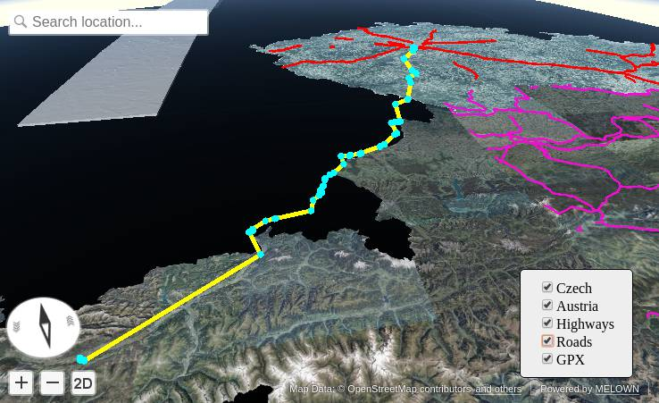

============================
Fancy VTS-Browser-JS example
============================

In this example, we are going to add some fancy controls and custom vector data
layer.

.. note:: This example assumes, you are on your own computer, having e.g. Apache
        web server at hand. It should be usable also on OSGeo-Live distribution.

.. note:: We shall now bring our :ref:`srtm-example` to life. Please make sure, you have
        VTS-Mapproxy up and running, serving the data and come back to continue with
        this client once you do so. Make sure
        http://localhost:3070/melown2015/surface/melown/dem/ is up and running

        Do not forget to setup the Apache proxy server, so the Mapproxy is
        accesibla via standard port 80.

HTML Page
---------

You as shown in the :ref:`wmts-app` example, first we add 2 files to your web
page, the CSS file and the ``VTS-Browser-JS`` library (minified version). We
also add jQuery for further usage.

.. literalinclude:: srcs/wmts-app-fancy.html
   :lines: 7-10
   :language: html
   :linenos:

Then, target ``
`` element has to be set

.. literalinclude:: srcs/wmts-app-fancy.html
   :lines: 25-26
   :language: html
   :linenos:

And finally, the final JavaScript Application will be add to in separated file

.. literalinclude:: srcs/wmts-app-fancy.html
   :lines: 27
   :language: html
   :linenos:

One more things: since we are adding custom layerswitcher control, we have to
add some CSS styles to the page:

.. literalinclude:: srcs/wmts-app-fancy.html
   :lines: 12-20
   :language: html
   :linenos:

You can download :download:`srcs/wmts-app-fancy.html` and test the file at your
server.

JavaScript Code
---------------

The code is more complicated than in previous examples. We start with the
browser initialization, using:

#. Target ``
`` element ID
#. Map configuration JSON file

.. literalinclude:: srcs/wmts-app-fancy.js
    :lines: 149-163

The ``mapCofig.json`` file is the same as in the previous example. Note also,
that we are overriding the default ``view`` parameter - leaving just surface,
but ``boundLayers`` and ``freeLayers`` are gone.

We also do initialiaze ``Control`` object 

.. literalinclude:: srcs/wmts-app-fancy.js
    :lines: 136-147
    
and bound ``map-loaded`` event.

.. literalinclude:: srcs/wmts-app-fancy.js
    :lines: 129-131

Next, we add GPX layers - it will contain mixed geometry of ``LineString`` and
``Point`` data. Data are already downloaded using jQuery, we just parse them and
add them to the map. The GPX files is :download:`srcs/prague-insbruck.gpx`
downloadable too.

.. literalinclude:: srcs/wmts-app-fancy.js
    :lines: 94-124

The layerswitcher switchingg function is modifying the ``view`` attribute of
``browser.map`` object. You can have a look in `the documentation <https://github.com/Melown/vts-browser-js/wiki/VTS-Browser-Map-API#definition-of-view>`_ as well
as at our `mapConfig.json <http://localhost/melown2015/surface/melown/dem/mapConfig.json>`_ file.
As for the styling, we are using similar vector style syntax, as used by `MapBox
<https://www.mapbox.com/mapbox-gl-js/style-spec/>`_. Check you `full
documentation <https://github.com/Melown/vts-browser-js/wiki/VTS-Geodata-Format#geo-layer-styles-structure>`_.

.. literalinclude:: srcs/wmts-app-fancy.js
    :lines: 21-56

You can download :download:`srcs/wmts-app-fancy.js` the file for further changes.

And also you should be able to visit `our example
<../../_downloads/wmts-app-fancy.html>`_ and it should be working.

